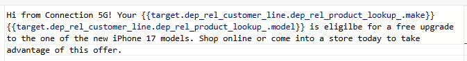
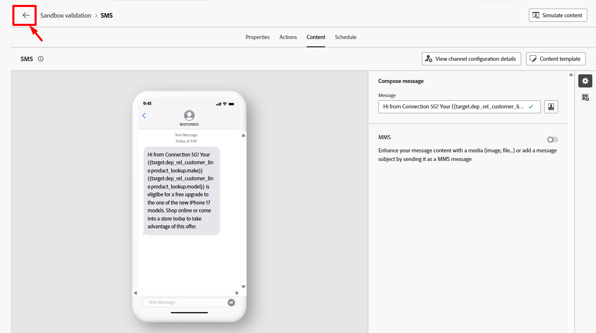

# SMS erstellen

## Ziel

In den nächsten Schritten werden Sie eine SEHR einfache SMS-Nachricht verfassen.  Sie werden sehen, wie Sie ganz einfach Inhalte auf EXTREM einfacher Ebene hinzufügen und die Nachricht basierend auf den Daten im relationalen Speicher personalisieren können.


## Navigieren zum Inhalt

Klicken Sie auf **Schaltfläche** Inhalt bearbeiten“ oder navigieren Sie direkt zur Registerkarte **Inhalt**


## Erstellen der Nachricht

1. Klicken Sie auf die Schaltfläche **Personalization**, um Ihre Nachricht zu erstellen.

   Schaltfläche 

   >[!NOTE]
   >
   >Die Option „Zauberstab“ verwendet KI, um eine Nachricht zu schreiben. Schau es dir an, wenn du möchtest, aber wir werden es in diesem Labor nicht behandeln.


2. Kopieren Sie den unten stehenden Text und fügen Sie ihn in den Textkörper der SMS-Nachricht ein.

   ```none
   Hi from Connection 5G! Your phone_make phone_model is eligible for a free upgrade to one of the new iPhone 17 models. Shop online or come into a store today to take advantage of this offer.
   ```

   >[!NOTE]
   >
   >Stellen Sie sicher, dass Sie im Nachrichten **Editor den** auf „Ein“ setzen.  Sie finden sie im unteren rechten Bereich des Fensters.


3. Aktualisieren Sie die beiden unten stehenden Felder in der Nachricht **phone\_make** und **phone\_model** mithilfe der Option **Target-Attribute** in der linken Leiste.  Wenn Sie fertig sind, sollte Ihre Nachricht mit dem Screenshot übereinstimmen.

   

   >[!NOTE]
   >
   >Warum tust du das?  Nun, Sie möchten die Nachricht mit dem Telefonhersteller und -modell des Kunden personalisieren, und diese Informationen befinden sich in der Kundenzeilentabelle im relationalen Speicher.  Dies zeigt, wie Sie Daten aus orchestrierten Kampagnen verwenden können, um Nachrichten zu personalisieren.


4. Klicken Sie im Editor **Validieren**, stellen Sie sicher, dass keine Validierungsfehler vorliegen, und klicken Sie ggf. auf die Schaltfläche **Speichern**

   


5. Klicken Sie auf den **Rückwärtspfeil (\&lt;-)**, um zur Workflow-Arbeitsfläche zurückzukehren.




## Zusammenfassung

Sie haben soeben eine Nachricht erstellt und sind jetzt hoffentlich etwas besser mit der Funktionsweise des Nachrichten-Editors vertraut.  Denken Sie daran, dass Sie mit Daten aus dem relationalen Speicher personalisieren können, aber Sie können auch mit Daten aus dem Echtzeit-Kundenprofil personalisieren!

>[!NOTE]
>
>Wenn Sie die Echtzeit-Kundenprofilattribute verwenden, um Nachrichten in orchestrierten Kampagnen zu personalisieren, denken Sie einfach daran, dass sie aus dem Profil-Snapshot-Datensatz im Data Lake abgerufen werden, damit Attribute bis zu 24 Stunden alt sein können. Der Profil-Schnappschuss wird nur einmal täglich nach dem täglichen Batch-Segmentierungsauftrag aktualisiert.
