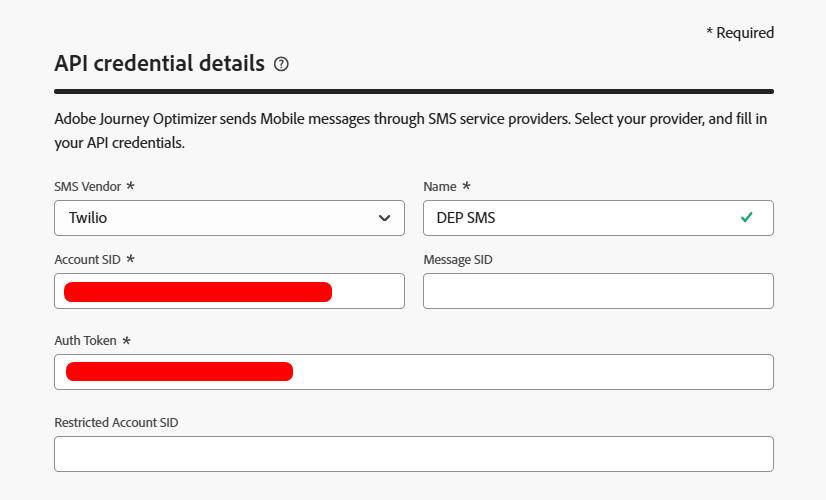
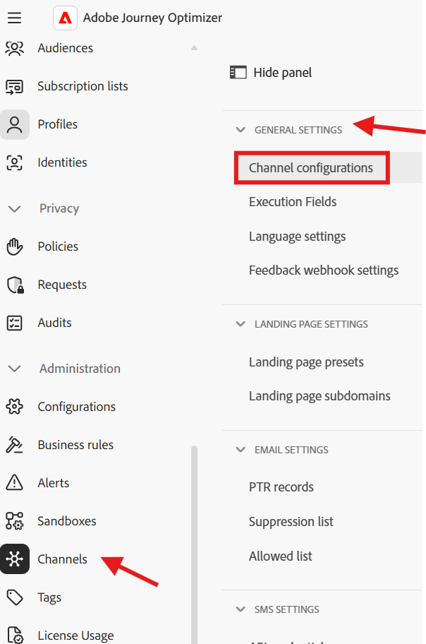
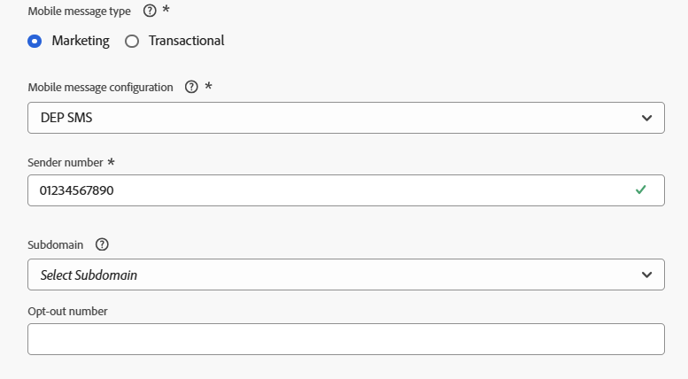
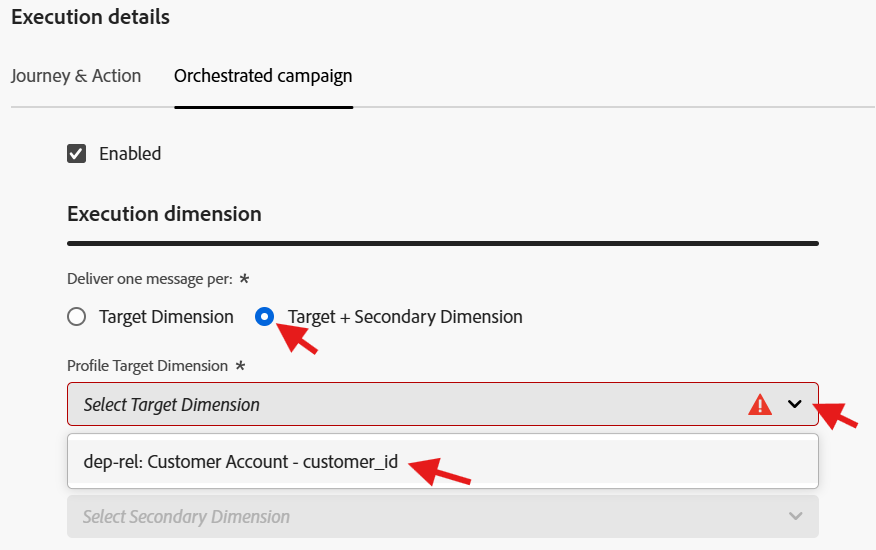
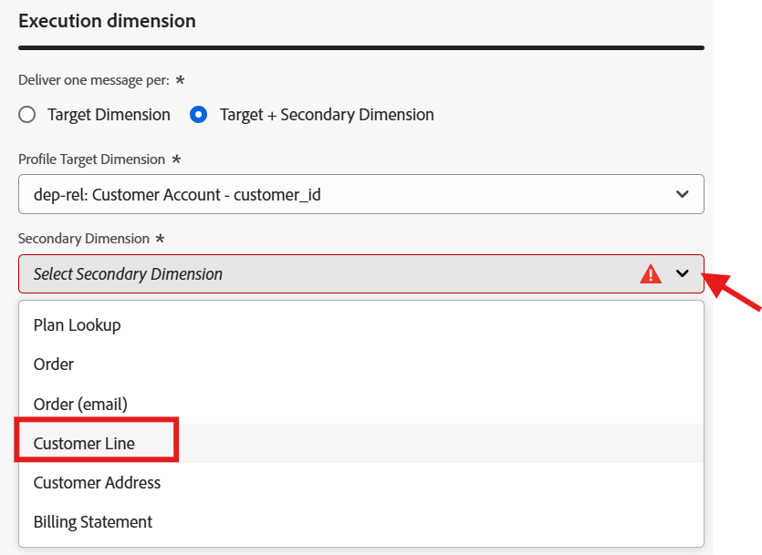
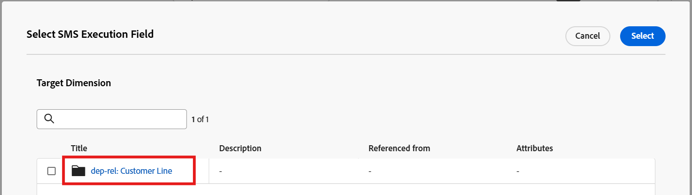
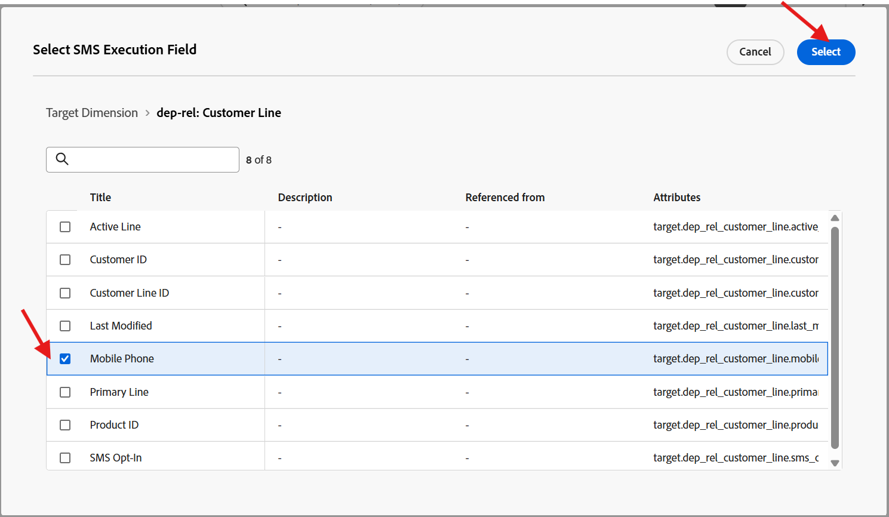

# SMS-Kanal konfigurieren

## Ziel

In den nächsten Schritten werden Sie den SMS-Kanal konfigurieren. Dies ist erforderlich, damit Sie beim späteren Aufbau Ihrer Kampagne Nachrichten an einzelne Zeileninhaber senden können.

## Zu Kanälen navigieren

1. Navigieren Sie in Adobe Journey Optimizer zum Menü **Administration** > **Kanäle** .
1. Wählen Sie **SMS-Einstellungen** → **API-** aus.
1. Klicken Sie **API-Anmeldedaten erstellen**.

## Definieren der SMS-API-Anmeldeinformationen

Sie erstellen zunächst den API-Connector, den AJO zum Senden ausgehender SMS-Anfragen verwendet.

1. Wählen Sie unter SMS-Anbieter **Twilio**.
1. Geben Sie die folgenden API-Zugangsdaten mithilfe Ihres eigenen [Twilio-Testkontos](https://www.twilio.com/try-twilio) ein:
   - **name:** `DEP SMS`
   - **Konto-SID:** in Ihrem Twilio Console-Dashboard gefunden
   - **Authentifizierungs-Token:** in Ihrem Twilio Console-Dashboard gefunden (klicken Sie auf **Anzeigen** um es anzuzeigen)
1. Klicken Sie **Senden**, um die API-Anmeldedaten zu registrieren

>[!NOTE]
>
>Sie benötigen ein kostenloses Twilio-Testkonto mit einer verifizierten Telefonnummer, bevor Sie mit diesem Schritt beginnen. Melden Sie sich bei [twilio.com/try-twilio](https://www.twilio.com/try-twilio) an und suchen Sie dann Ihre Konto-SID und Ihr Authentifizierungs-Token im Twilio Console-Dashboard.

## SMS-Kanalkonfiguration erstellen

Jetzt ordnen Sie diese API-Anmeldeinformationen einer Kanalkonfiguration zu, die Journey und Kampagnen verwenden können.

1. Navigieren Sie zu **Kanäle** → **Allgemeine Einstellungen** → **Kanalkonfigurationen**.

&#x200B;2. Klicken Sie **Kanalkonfiguration erstellen**.

&#x200B;3. Füllen Sie die Einstellungen für die SMS-Kanalkonfiguration mit den folgenden Werten aus:
   - **name:** `Relational-SMS-Multi-Entity`
   - **channel:** `Mobile Message`
   - **Marketing-Aktion:** `SMS Targeting`

&#x200B;> [!NOTE]
>
>Wenn Sie einen Fehler erhalten, der besagt, dass der Benutzer nicht über die Berechtigung verfügt, ignorieren Sie diese und fahren Sie fort.

## SMS-Einstellungen

Bei Auswahl von Kanal als mobile Nachricht wird ein neuer Abschnitt mit dem Namen SMS-Einstellungen angezeigt. Füllen Sie sie mit den folgenden Details aus:

- **Nachrichtentyp für Mobilgeräte:** `Marketing`
- **Mobile-Nachrichtenkonfiguration:** `DEP SMS`
- **Absendernummer:** `01234567890`
- **Subdomain:** `leave blank`
- **Opt-out-Nummer:** `leave blank`

## Ausführungsdetails

1. Klicken Sie unter Ausführungsdetails auf die Registerkarte **Orchestrierte Kampagne**

&#x200B;2. Stellen Sie sicher **dass das Kontrollkästchen** Aktiviert“ aktiviert ist

&#x200B;3. Stellen Sie als Nächstes unter dem Unterabschnitt **Ausführungsdimension** sicher, dass Folgendes wie folgt eingerichtet ist:
   - **Versand am:** `Target + Secondary Dimension`
   - **Profile Target Dimension:** `dep-rel: Customer Account - customer_id`
   - **Sekundäre Dimension:** `Customer Line`

>[!NOTE]
>
>Dies bedeutet, dass orchestrierte Kampagnen beim Senden von Nachrichten eine Nachricht pro Datensatz senden sollten, die mit der Profil-Target-Dimension übereinstimmt.

&#x200B;4. Wählen Sie unter der Überschrift Ausführungsadresse das Optionsfeld für **Sekundäre Dimension** und klicken Sie dann auf die Schaltfläche Bearbeiten im Feld **SMS-Ausführung**

&#x200B;5. Klicken Sie im Popup-Fenster in das Schema **dep-rel: Customer Line** und wählen Sie **Mobiltelefon** aus.

&#x200B;6. Bestätigen Sie, dass der Abschnitt der endgültigen Ausführungsdetails unten übereinstimmt

## Einreichen und Überprüfen

1. Sie können auf die Schaltfläche **Senden** klicken, um die Konfiguration abzuschließen und eine Erfolgsmeldung anzuzeigen

&#x200B;2. Stellen Sie auf der Inventarseite „Kanalkonfigurationen“ sicher, dass der Status als **Aktiv** angezeigt wird, bevor Sie fortfahren

>[!CAUTION]
>
>Warten Sie, bis der Status **Aktiv** wechselt, da ansonsten zukünftige Laborschritte für Sie kläglich fehlschlagen

&#x200B;3. Wenn der Status Aktiv wird, sind Sie fertig!

>[!TIP]
>
>🚀 Booyah! Ihr SMS-Kanal ist jetzt live und einsatzbereit!

## Zusammenfassung

Sie haben jetzt gesehen, wie Sie einen SMS-Kanal erfolgreich konfigurieren können.  Beachten Sie, dass es sich um eine API-basierte SMS handelt, sodass sie je nach Anbieter alternative Authentifizierungsmethoden verwenden können.

Weitere Informationen finden [&#x200B; (hier](https://experienceleague.adobe.com/de/docs/journey-optimizer/using/channels/sms/configure-sms/sms-configuration) wenn Sie Interesse haben.
