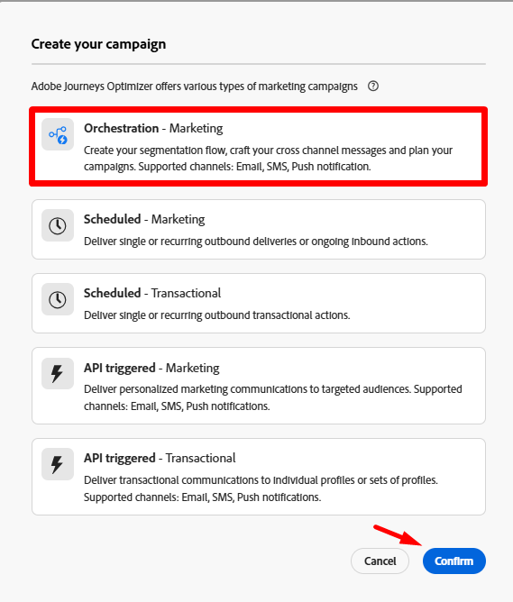

# Erstellen einer orchestrierten Kampagne

## Ziel

Im nächsten Schritt erstellen Sie die Shell einer orchestrierten Kampagne (keine Aktivitäten), die den Ausgangspunkt für jede Kampagne darstellt.

## Zu Kampagnen navigieren

1. Stellen Sie zunächst sicher, dass Sie sich in der Adobe Journey Optimizer-Anwendung befinden, indem Sie die Anwendung in der Apps-Schublade oben rechts im Browser auswählen

   

2. Wählen Sie in der linken Navigationsleiste die Option **Kampagnen**
3. Klicken Sie dann oben **auf** Schaltfläche Kampagne erstellen .

   

4. Wählen Sie in dem angezeigten Modal **Orchestrierung - Marketing** und klicken Sie auf **Bestätigen**

## Kampagneneinstellungen

1. Füllen Sie die erforderlichen Kampagnenmetadaten mit den folgenden Informationen aus:
   - **Name** —> `Flagship Phone Launch`
   - **Beschreibung** —> *leer lassen*
   - **Zusammenführungsrichtlinie** —> `Default Timebased`
   - **Tags** —> *leer lassen*

   Danach sollte der Bildschirm wie folgt aussehen.

   

2. Klicken Sie auf **Speichern**, um fortzufahren.

## Grundlegendes zur Planung

Sie sollten unmittelbar auf der Workflow-Arbeitsfläche landen, nachdem Sie Ihre Kampagne erstellt haben.  Beachten Sie, dass oben rechts eine Planungsoption angezeigt wird, wie oft dieser Workflow für Ihre Kampagne ausgeführt werden soll.

Der Standardwert ist immer auf **So bald wie möglich** festgelegt. Für diese Übung verwenden wir die Standardeinstellung, es stehen jedoch viele weitere Optionen zur Verfügung.

## Zusammenfassung

Sie haben jetzt gesehen, wie Sie eine orchestrierte Kampagne erstellen, und die allgemeinen Optionen, die Ihnen bei der Planung zur Verfügung stehen.
