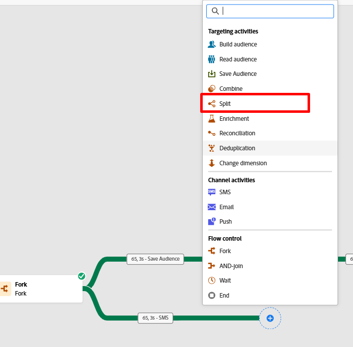
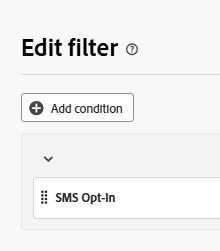
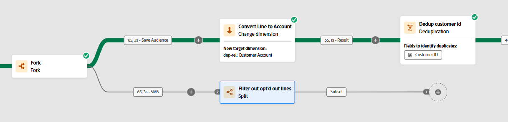
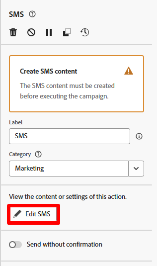
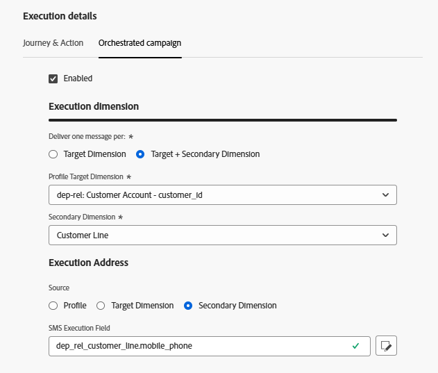
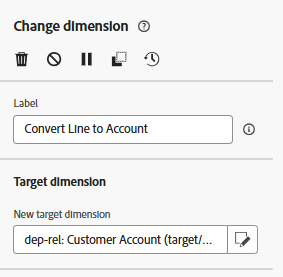

# Zeilen filtern

## Ziel

In den nächsten Schritten werden Sie alle Zeilen herausfiltern, die aufgrund ihrer Abmeldung auf Zeilenebene tatsächlich nicht mit einer SMS-Nachricht angesprochen werden dürfen.  Sie können sich hier nicht auf die Profilzustimmung verlassen, da dies ein Ziel auf Zeilenebene ist.

## Aufspaltungsaktivität einrichten

1. Klicken Sie auf das Symbol **+** in der unteren Transition der Aktivität Verzweigung und wählen Sie im Popup die Aktivität **Aufspaltung** aus.

2. Aktualisieren Sie in der rechten Leiste die Bezeichnung , sodass sie Folgendes angibt: `Filter out opt'd out lines`

3. Erweitern Sie in der rechten Leiste den Abschnitt **Standardsegment** und klicken Sie auf die Schaltfläche **Filter erstellen**

4. Fügen Sie eine Bedingung hinzu, um sicherzustellen, dass Sie alle Kundenzeilen entfernen, die vom SMS-Messaging abgemeldet wurden, und klicken Sie dann auf **Bestätigen**.

>[!NOTE]
>
>Sie müssen herausfinden, wie Sie die Bedingung erstellen, aber das Endergebnis stimmt mit dem obigen Screenshot überein.  Du hast das!

5. Klicken Sie auf die Schaltfläche Speichern oben rechts, um Ihre Arbeit zu speichern.  Ihre Arbeitsfläche sieht nun wie folgt aus\…

## Hinzufügen der SMS-Aktivität

1. Klicken Sie auf der Workflow-Arbeitsfläche nach der hinzugefügten Aufspaltungsbedingung auf das Symbol **+** und wählen Sie die **SMS-Aktivität**

2. Klicken Sie in der rechten Leiste auf die Schaltfläche SMS bearbeiten , um mit der Konfiguration der SMS-Nachricht zu beginnen

3. Klicken Sie oben in der Navigationsleiste auf das Menüelement Aktionen und wählen Sie dann aus der Dropdown-Liste SMS-Konfiguration den zuvor erstellten Kanal aus.

>[!CAUTION]
>
>Oh nein 🫨!  Warum gibt es keine Ergebnisse?  Haben Sie Ihren SMS-Kanal nicht bereits eingerichtet?  Ist das Produkt kaputt?
>
>AUSFLIPPEN!!!!!!!!!

## Ausbruchsmoment

Die Transition der Verzweigung hat derzeit eine Zielgruppendimension der Kundenzeile (d. h. auf welche Tabelle sich das aktuelle Ergebnis im relationalen Speicher bezieht).  Bei orchestrierten Kampagnen ist es jedoch einzigartig, dass Sie sich zum Versandzeitpunkt immer wieder beim Echtzeit-Kundenprofil anmelden, sodass Versand- und Tracking-Informationen aus Nachrichten einem Profil zugeordnet werden.  Dieser Join wurde für Sie aus der Tabelle des Kundenkontos vorkonfiguriert.

Die Kanalkonfiguration für SMS wurde bereits vorab für Sie eingerichtet und sieht derzeit so aus…

**So liest du das:**

- Versand einer Nachricht pro Zieldimension (d. h. Kundenkonto) auf der Anzahl der zugehörigen Datensätze, die in der sekundären Dimension (d. h. Kundenzeile) gefunden wurden
- Jeden SMS-Versand unter Verwendung der in der sekundären Dimension (d. h. „Kundenzeile„) enthaltenen Mobiltelefonnummer ausführen

Diese einzigartige Möglichkeit, viele Nachrichten an ein Profil zu senden, ist eine der Hauptfunktionen von Orchestrierten Kampagnen, die es von Journey unterscheidet.

Wie bringt man das hier zum Laufen?  Dimensionsänderung hinzufügen 😀

## Dimensionsänderung hinzufügen

1. Klicken Sie auf die Schaltfläche Zurück im Bildschirm zur SMS-Bearbeitung

2. Klicken Sie auf der Workflow-Arbeitsfläche zwischen den **- und SMS-Aktivitäten auf das** Symbol **+** und wählen Sie **Dimension ändern** aus.

3. Aktualisieren Sie rechts die Dimensionsänderung mit den folgenden Informationen:
   - **label:** `Convert Line to Account`
   - **Neue Zielgruppendimension:**`dep-rel: Customer Account`

4. Klicken Sie auf **Speichern** oben rechts auf der Arbeitsfläche, um Ihre Arbeit zu speichern. Wenn Sie fertig sind, sieht Ihr Workflow jetzt wie folgt aus…

## SMS-Nachrichtenkonfiguration

Nachdem Sie den Workflow behoben haben, konfigurieren Sie die SMS neu.

1. Klicken Sie auf die SMS-Aktivität in der Workflow-Arbeitsfläche und klicken Sie dann in der linken Leiste auf die Schaltfläche **SMS bearbeiten**.

>[!NOTE]
>
>Das Laden dieses Bildschirms dauert eine Weile.  Ich weiß, dass es nervig ist, glauben Sie mir, dass es repariert wird

2. Klicken Sie in der oberen Navigationsleiste auf den **Aktionen** und wählen Sie dann aus der Dropdown-Liste SMS-Konfiguration den zuvor erstellten Kanal aus.

>[!TIP]
>
>Fühlt sich gut an, 😮‍💨 es nicht

## Zusammenfassung

Sie haben es durch dieses geschafft und hoffentlich zwei sehr wichtige Dinge gelernt:

1. Ihre Zielgruppendimension für die endgültigen Ergebnisse muss mit der Kanalkonfiguration übereinstimmen, die Sie verwenden möchten
1. Die Aktivität Dimensionsänderung wird wahrscheinlich Ihr bester Freund dafür werden, dass dies geschieht
