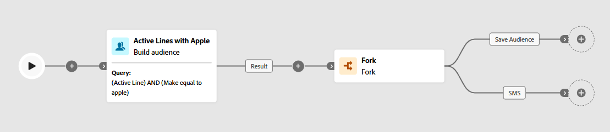

# Ergebnis verzweigen

## Ziel

Dieser Schritt ist einfach, da Sie nur eine Aktivität Verzweigung hinzufügen möchten, sodass Sie das Ergebnis duplizieren können, um in zukünftigen Schritten zwei verschiedene Dinge damit zu tun:

1. Die Zielgruppe für andere zur Verwendung für Werbe- oder Cross-Channel-Zwecke speichern
1. SMS-Nachrichten an die einzelnen Zeilen senden.

## Verzweigung erstellen

1. Klicken Sie auf der Workflow-Arbeitsfläche auf das Symbol **+** **&#x200B;**&#x200B;nach der Aktivität Zielgruppe aufbauen und wählen Sie die Aktivität **Verzweigung**

   

2. Aktualisieren Sie die Namen der einzelnen Transitionen im Formular, indem Sie auf die Transition klicken und dann die Namen wie unten beschrieben zuweisen:
   - **Oben** —> `Save Audience`
   - **Bottom** —> `SMS`

   

   Wenn Sie fertig sind, sollte Ihre Arbeitsfläche nun wie folgt aussehen…

   

   >[!NOTE]
   >
   >Eine Verzweigung dupliziert im Wesentlichen das Ergebnis der vorherigen Aktivität in zwei unabhängige Verzweigungen

3. Klicken **oben** der Workflow-Arbeitsfläche auf „Speichern“.

>[!TIP]
>
>Das war ziemlich schwierig, nicht 😁

## Zusammenfassung

Nun, Sie haben eine Verzweigung des Ergebnisses erstellt (d. h. das Duplizieren des Ergebnisses), mit der Sie eine Verzweigung klar angeben können, um eine Zielgruppe speichern zu verarbeiten, während die andere für den SMS-Versand verwendet werden kann.

>[!NOTE]
>
>Sie müssen Formulare verwenden, insbesondere wenn Sie die Zielgruppe speichern möchten, da die Aktivität „Zielgruppe speichern“ nicht zulässt, dass Aktivitäten ihr folgen.
