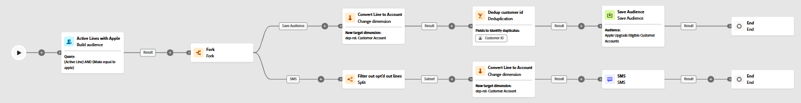
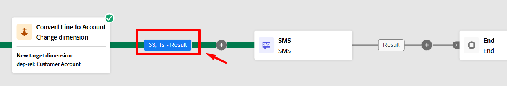
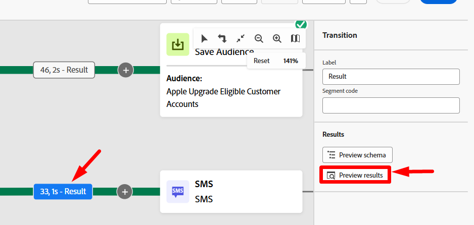
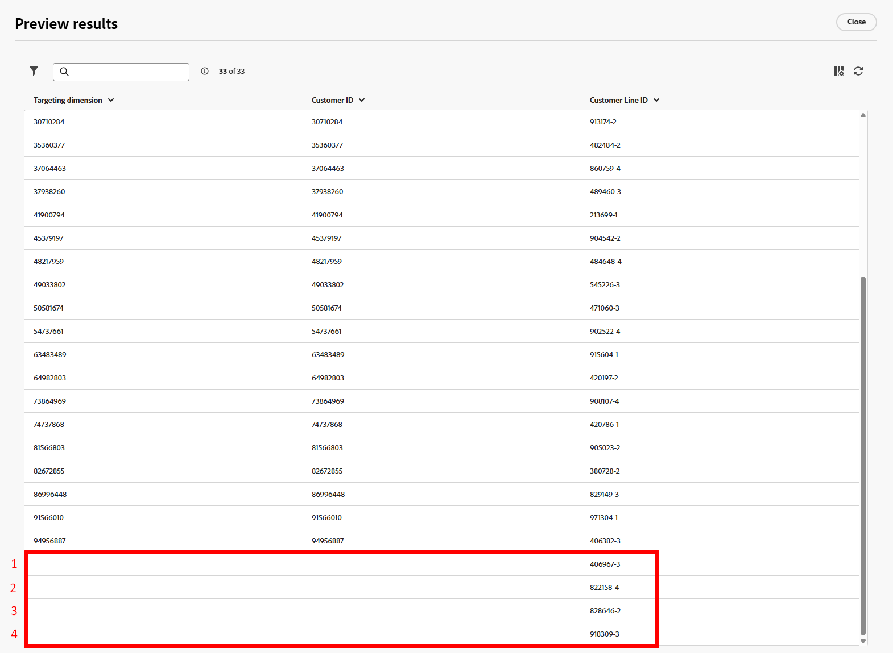

# Workflow ausführen

## Ziel

In den nächsten Schritten erfahren Sie, wie Sie Ihren Workflow und insbesondere Ihre SMS-Aktivität mit dem Testmodus testen können.

## Workflow überprüfen

1. Wenn Sie fertig sind, sieht der endgültige Workflow etwa wie folgt aus. Überprüfen Sie, ob alles gut aussieht. Sie sehen:

2. Wenn Sie Ihren Workflow noch nicht angehalten haben, klicken Sie auf die Schaltfläche **Stoppen** oben rechts.

>[!NOTE]
>
>Optional können Sie versuchen, auf die Schaltfläche Neu starten zu klicken, aber es ist wahrscheinlich, dass ein Fehler angezeigt wird, da Sie Aktivitäten hinzugefügt haben, nachdem der Workflow erstellt wurde, und sein Cache nicht mehr gültig ist.

3. Klicken Sie anschließend auf **Start**, um den Workflow durchgehend auszuführen und zu testen

4. Überprüfen Sie das Ergebnis, das in die SMS-Aktivität eingeht, indem Sie auf **Ergebnis** klicken (es gibt zwei Ergebnisse, verwenden Sie also das linke wie unten gezeigt) und dann in der linken Leiste auf die Schaltfläche **Vorschau der Ergebnisse** klicken.

5. Es werden **33 Datensätze angezeigt** und die Zielgruppendimension entspricht der Kunden-ID (dem Join-Schlüssel, falls Sie dem Profil beitreten möchten)

## Testen der SMS-Aktivität

1. Schließen Sie das vorherige Fenster, klicken Sie auf die **SMS-Aktivität** und klicken Sie dann auf die Schaltfläche **Test ausführen** in der rechten Leiste

2. Fast sofort wird eine neue Schaltfläche mit der Bezeichnung **Bericht anzeigen** angezeigt.  Klicken Sie auf **Bericht anzeigen**, um den Bericht anzuzeigen.

>[!NOTE]
>
>Dieser Bildschirm wird zunächst nicht ausgefüllt, da die Ausführung des Testlaufs einige Zeit in Anspruch nimmt. Möglicherweise müssen Sie einige Male aktualisieren, bevor Ergebnisse angezeigt werden.

3. Wenn Sie Ergebnisse erhalten, sehen Sie, dass 100 % angesprochen wurden!

*Moment, eine Minute … das eingehende Ergebnis war 33 Datensätze, also wohin ging die 4?*

4. Gehen Sie zurück zur Workflow-Arbeitsfläche und klicken Sie auf die Transition **Ergebnis** , die in die SMS-Aktivität eintritt, und klicken Sie dann auf **Vorschau der Ergebnisse** in der rechten Leiste.

5. Scrollen Sie im Bildschirm Ergebnisse in der Vorschau ganz nach unten in der Tabelle, und Sie werden feststellen, dass **4 Datensätze** eine **leere Zielgruppendimension“**.

## Erklärung

Folgendes ist passiert.

- Sie hatten 33 Kundenzeilen, die eine SMS-Nachricht senden sollten
- Nach der Dimensionsänderung hatte Aktivität 4 dieser Kundenzeilen kein Kundenkonto zugeordnet
- Für die Verknüpfung mit dem Echtzeit-Kundenprofil ist eine Kunden-ID erforderlich. Da es in diesen vier Datensätzen keine gibt, gibt es keine Möglichkeit, ein Profil im laufenden Betrieb zu suchen oder ein neues zu erstellen

Ergebnis —> Orchestrierte Kampagnen löscht diese vier Datensätze bei der Nachrichtenausführung

>[!NOTE]
>
>Es gibt eine Verbesserung, die dazu beiträgt, dieses Problem auf zwei Arten zu beheben:
>
>1. Sicherstellen, dass ein Ausschlussprotokoll für Datensätze erstellt wird, denen beim Versand eine Zielgruppendimension fehlt
>2. Aktualisieren Sie die Aktivität Dimensionsänderung , um einen inneren Join im Vergleich zu einem externen Join durchzuführen, bei dem diese 4 Datensätze im Voraus abgelegt werden.

>[!TIP]
>
>Herzlichen Glückwunsch! Sie sind jetzt offiziell zertifiziert, Ihre eigenen orchestrierten Kampagnen zu entfesseln und Nachrichten in die Welt zu senden - verantwortungsvoll, wie wir hoffen. Gehen Sie weiter und vermarkten Sie wie ein majestätischer digitaler Zauberer!

## Workflow veröffentlichen

Das machen Sie nicht im Labor, aber für den Kontext hier ist, was zum Zeitpunkt der Veröffentlichung passiert:

1. Planung wird aktiviert, wenn für die Kampagne ein Zeitplan festgelegt wurde
1. Audience-Aktivitäten speichern : Erstellen Sie die Audience Shell in im Audience Portal und die qualifizierten Profile beginnen mit der Aufnahme
1. Die Ausführung der Nachricht beginnt für die erste Nachrichtenaktivität im Workflow
   - Profilsuchen erfolgen für die Momentaufnahme des Profils
     - Übereinstimmende Profile berücksichtigen die im Profil gefundene Zustimmung
     - Nicht übereinstimmende Profile werden spontan erstellt
   - Versandlogs werden in der `AJO Message Feedback Event Dataset` erstellt
