# Zielgruppe speichern

## Ziel

In den nächsten Schritten speichern Sie die von Ihnen erstellte Zielgruppe wieder im Zielgruppenportal, damit andere Lösungen in Adobe Experience Platform und seinen Anwendungen sie für ihre eigenen Anwendungsfälle nutzen können.

## Ändern der Dimension

1. Klicken Sie auf der Workflow-Arbeitsfläche auf das Symbol **+** **** in der Verzweigung **Audience speichern** und wählen Sie in der Liste der Aktivitäten die Aktivität **Dimensionsänderung** aus

   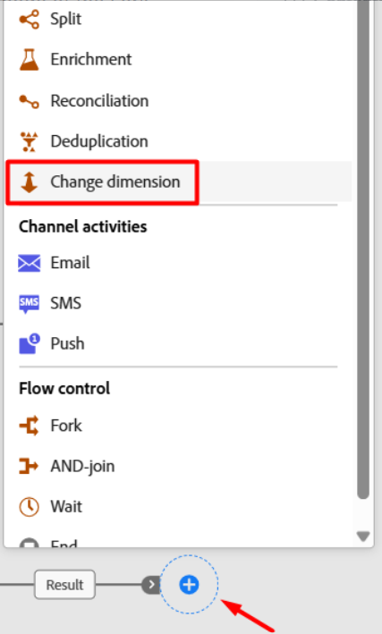

2. Aktualisieren Sie die Eigenschaften der Dimensionsänderung wie unten beschrieben:
   - **label:** `Convert Line to Account`
   - **Neue Zielgruppendimension:** `dep-rel: Customer Account`

   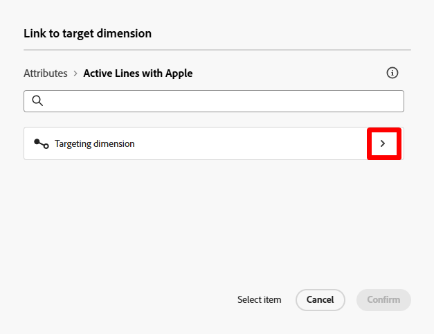

   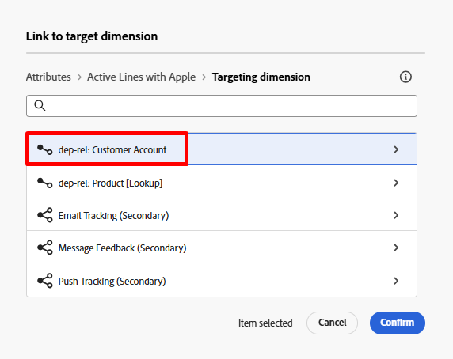

   >[!NOTE]
   >
   >**Warum tust du das, was du fragst?**  Denken Sie daran, dass Sie für die Verknüpfung mit dem Echtzeit-Kundenprofil (in dem Sie Zielgruppen speichern) das konfigurierte Profil-Zielgruppen-Mapping verwenden müssen, das nur aus dem Schema dep-rel: Kundenkonto verknüpft ist.

3. Wenn Sie fertig sind, sieht Ihre Arbeitsfläche so aus.  Speichern Sie Ihre Arbeit!

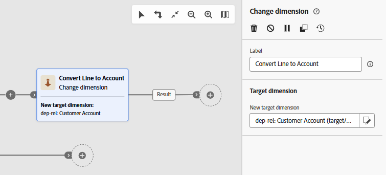

## Ergebnis deduplizieren

1. Klicken Sie auf das **+** **Symbol** nach der Aktivität Dimensionsänderung und wählen Sie in der Liste der Aktivitäten die Aktivität **Deduplizierung** aus

   

2. Aktualisieren Sie die Bezeichnung der Aktivität Deduplizierung auf `Dedup customer id`

   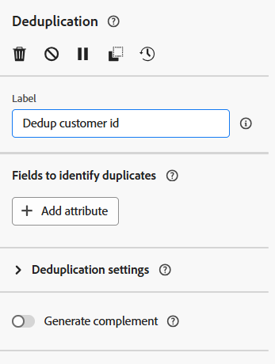

3. Klicken Sie nun auf die Schaltfläche **+ Attribut** und wählen Sie das Feld aus dem Schema mit dem Titel **Kunden-ID**

   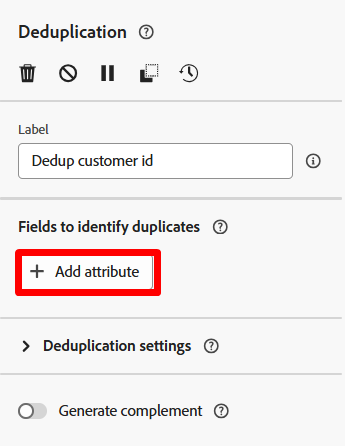

   

4. Stellen Sie unter den Deduplizierungseinstellungen sicher, dass Sie Folgendes festgelegt haben:
   - **Beizubehaltende Duplikate:** `1`
   - **Deduplizierungsmethode:** `Random selection`

   

   >[!NOTE]
   >
   >Die anderen Optionen für die Deduplizierung ermöglichen es Ihnen, Ihre eigene benutzerdefinierte Logik anzugeben.  In den meisten Fällen erfolgt die Deduplizierung mit dem Primärschlüssel der Tabelle.

5. Wenn Sie fertig sind, sieht Ihre Arbeitsfläche wie folgt aus. Klicken Sie auf **Speichern** oben rechts, bevor Sie fortfahren.

## Audience-Aktivität zum Speichern hinzufügen

1. Klicken Sie auf das Symbol **+** nach der Aktivität Deduplizierung und wählen Sie die Aktivität **Zielgruppe speichern** aus

   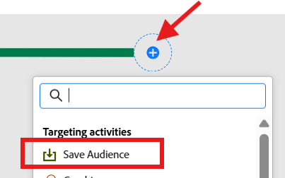

2. Legen Sie in der rechten Leiste die Eigenschaften der Aktivität auf Folgendes fest:
   - **Zielgruppentitel**: `Apple Upgrade Eligible Customer Accounts`
   - **Feld für die Profilzuordnung**: `dep-rel: Customer Account - customer id`

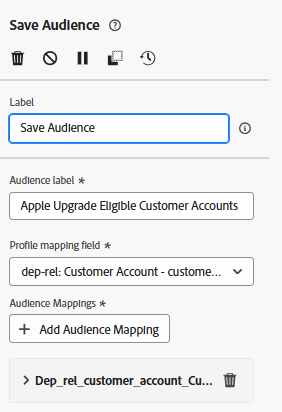

>[!NOTE]
>
>Das Feld „Profilzuordnung“ wurde zuvor eingerichtet, damit der relationale Store mit dem Echtzeit-Kundenprofil verknüpft werden kann.  Das Profil wurde als Kundenkontoebene modelliert, sodass Sie die Zielgruppe im selben Profil speichern möchten.  Daher ist die Änderungsdimension und die Deduplizierung erforderlich.

## Zielgruppen-Feldzuordnungen

Standardmäßig wird der Primärschlüssel der Zielgruppendimension (d. h. Kunden-ID) der Audience als Feld hinzugefügt. Sie können dies sehen, wenn Sie rechts schauen und das Feld erweitern.  Zwei Dinge zu beachten:

- **Source-Zielgruppenfeld** —> bezieht sich auf das Feld aus dem relationalen Schema
- **Target-Zielgruppenfeld** —> Der Name des Felds, das beim Speichern der Zielgruppe erstellt wird

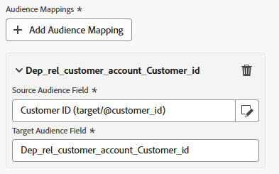

>[!NOTE]
>
>Beachten Sie, wie schrecklich das Feld Zielgruppe `Dep_rel_customer_account_Customer_id` heißt.  Sie sollten dies immer ändern, um es für einen Marketing-Experten lesbarer zu machen, keine Ausreden.

## Standard-Zielgruppenfeld korrigieren

1. Benennen Sie das Feld Standard-Zielgruppe in **Kunde\_ID** um, wie unten dargestellt:

   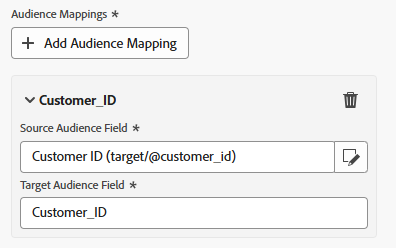

   >[!TIP]
   >
   >Jetzt haben Sie einen für Menschen lesbaren Feldnamen 🎉

2. Klicken Sie auf **Starten**, um Ihren Workflow auszuführen. Ihr Workflow sieht nun wie folgt aus und Sie sehen die Zahlen wie folgt:
   - Zielgruppe erstellen: `65`
   - Zeile in Konto konvertieren: `65`
   - Dedup-Kunden-ID: `46`

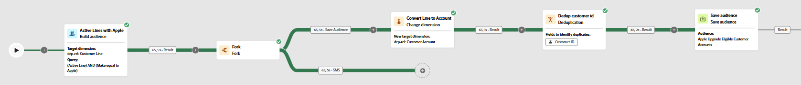

>[!NOTE]
>
>Die Audience-Speicherung erstellt die Audience nur, wenn der Workflow veröffentlicht wird, nicht erst, wenn er einfach gestartet wird. Wenn die Zielgruppe erstellt wird, enthält sie alle Attribute, die Sie ihr hinzugefügt haben, und wird beim nächsten geplanten täglichen Durchlauf des Segmentierungs-Service-Auftrags dem Echtzeit-Kundenprofil hinzugefügt.

>[!CAUTION]
>
>VERÖFFENTLICHEN SIE DEN WORKFLOW NICHT!

## Challenge

Was passiert, wenn Sie die Zielgruppe vor dem Speichern nicht deduplizieren?  Werden alle 65 Datensätze oder nur die 46 gespeichert?

## Antwort

Die Zielgruppe speichert alle 65 Datensätze, aber eine Aktivität Zielgruppe lesen dedupliziert sie beim Import basierend auf der Join-Bedingung 😁

## Zusammenfassung

Sie sollten jetzt gut verstehen, wie die Zielgruppe „Speichern“ funktioniert und warum Deduplizierung wichtig ist.  Denken Sie daran, dass Sie immer das Profilzielgruppen-Mapping definieren müssen, da die Daten des relationalen Speichers wissen müssen, wie sie mit dem Echtzeit-Kundenprofil verknüpft werden.  Die Profilzielzuordnung ist die Join-Bedingung 🙂
