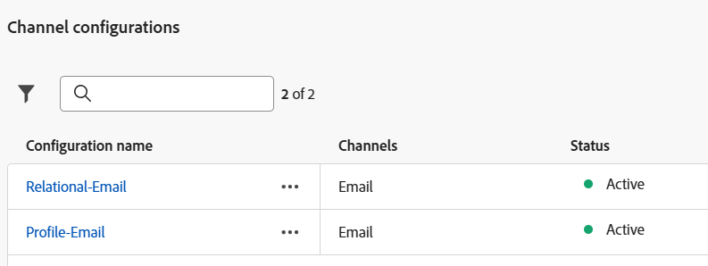
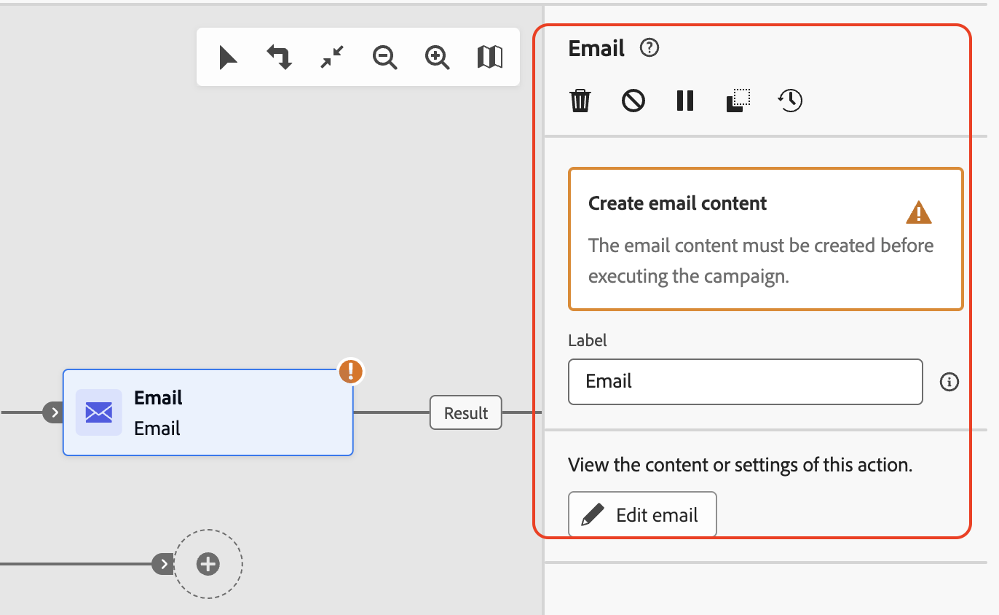
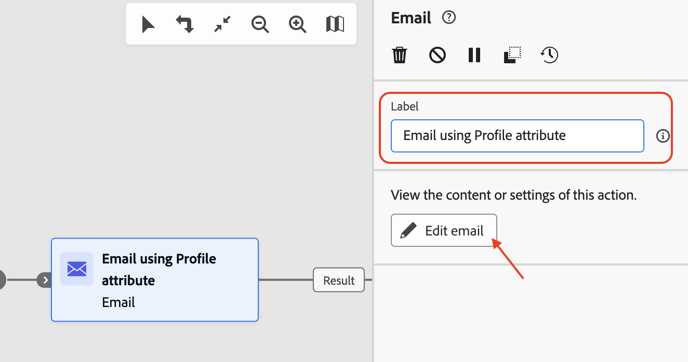
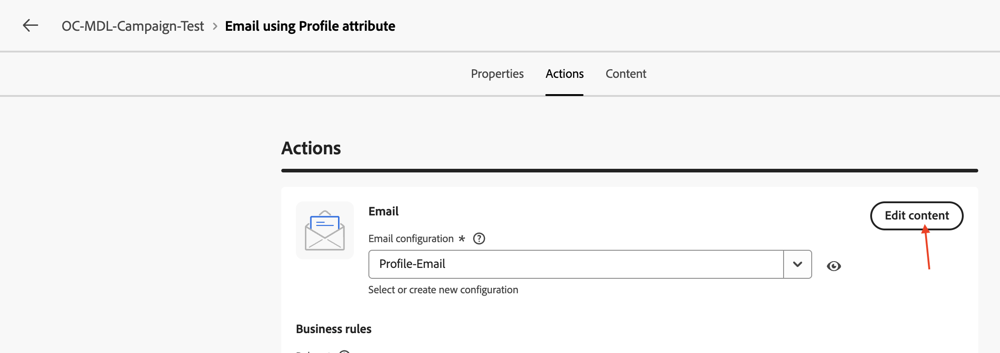
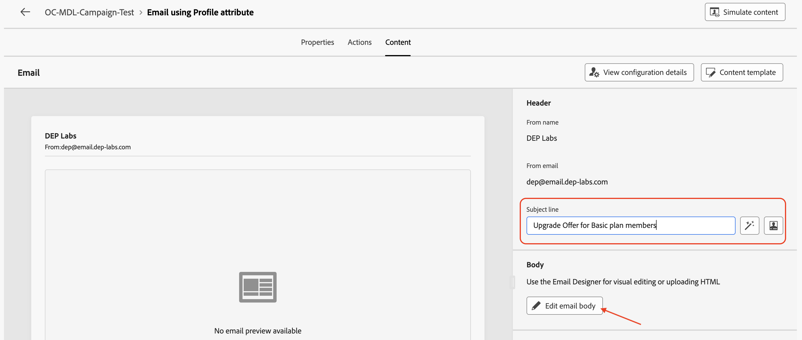
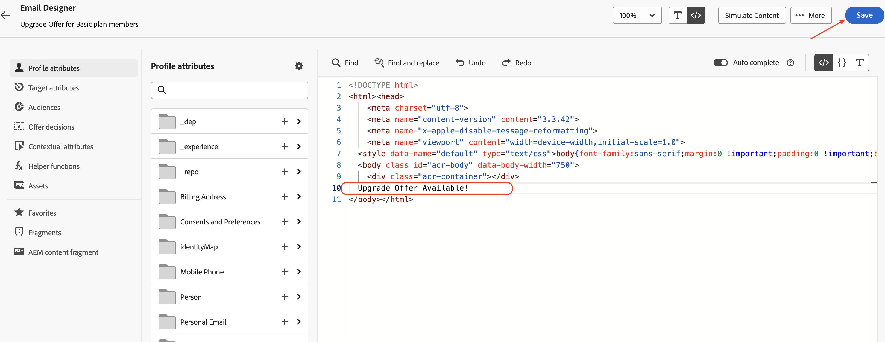
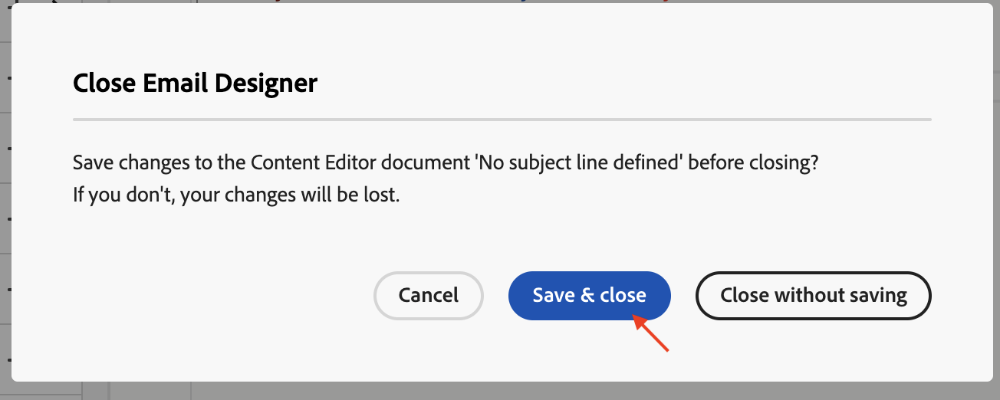
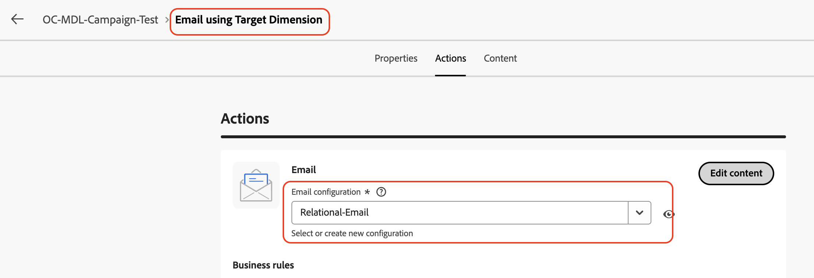

# E-Mail-Aktivitäten hinzufügen

## Ziel

In den nächsten Schritten fügen Sie den beiden Verzweigungen der Aktivität Verzweigung über die Kampagne zwei E-Mail-Aktivitäten hinzu. Sie konfigurieren die beiden E-Mail-Aktivitäten für die Verwendung der zuvor erstellten E-Mail-Kanäle. Schließlich fügen Sie jeder dieser E-Mail-Aktivitäten auch eine grundlegende E-Mail-Einrichtung (Betreff und Text) hinzu.

>[!CAUTION]
>
>Bevor Sie fortfahren, müssen Sie sicherstellen, dass Ihre beiden E-Mail-Kanal-Konfigurationen in ihrem Status Aktiv angezeigt werden.
>
>

## E-Mail-Aktivität der obersten Verzweigung hinzufügen

1. Klicken Sie auf das **+** des oberen Flusses und wählen Sie **E-Mail** aus den **Kanalaktivitäten**

   

   Der Detailbereich **E** Mail“ wird geöffnet

   

2. Benennen Sie die Bezeichnung für die Aktivität **E-Mail mit**) um **E-Mail** und klicken Sie auf **E-Mail bearbeiten**. Beachten Sie, dass die Erstellung des E-Mail-Textkörpers nur zu Testzwecken dient

   

3. Wählen Sie die Registerkarte **Aktionen** und aus der Dropdown-Liste die Option **Profil-E-Mail** Kanalkonfiguration aus

   

4. Klicken Sie anschließend auf **Inhalt bearbeiten** um Testinhalte hinzuzufügen

   

5. Geben Sie eine **Betreffzeile** ein („Upgrade-Angebot für Mitglieder des Standardplans„) und klicken Sie auf die Schaltfläche **E-Mail-Textkörper bearbeiten**.

   

6. Es gibt viele Optionen. Wählen Sie für diesen Test die Option **Eigenen Code erstellen** HTML aus

   

7. Fügen Sie in **E-Mail-**-Designer&quot; die Testzeile „Upgrade-Angebot verfügbar!“ ein. direkt vor den `</body></html>` Tags wie abgebildet und klicken Sie auf **Speichern**

   

8. Warten Sie, bis die Bestätigungsmeldung unten rechts angezeigt wird

   

9. Klicken Sie auf den **Linkspfeil** neben **E-Mail-Designer**, um den Vorgang zu beenden

   

10. Ein Bestätigungsdialogfeld wird angezeigt, klicken Sie auf die Schaltfläche **Speichern und schließen**.

1. Überprüfen Sie die E-Mail-Eigenschaften und -Aktionen einschließlich des Texts, der zum E-Mail-Textkörper hinzugefügt wurde. Klicken Sie auf den **Pfeil nach links**, um zur Kampagnen-Arbeitsfläche zurückzukehren

## Hinzufügen der E-Mail-Aktivität der unteren Verzweigung

Zurück auf der Kampagnen-Arbeitsfläche, klicken Sie auf das **+** des unteren Flusses und wählen Sie **E-Mail** aus den **Kanalaktivitäten**. Führen Sie dieselben Schritte wie oben aus (Schritte 2 bis 11), mit Ausnahme der folgenden:

- Benennen Sie die Bezeichnung für die Aktivität **E-Mail** in **E-Mail über Target** um.
- Wählen Sie in den E-Mail-Einstellungen die **Relational-Email** E-Mail-Kanalkonfiguration aus

## Zusammenfassung

Sie haben jetzt gesehen, wie Sie die E-Mail-Aktivitäten mit den E-Mail-Kanälen konfigurieren. Jede Aktivität wurde dann mit einem sehr einfachen E-Mail-Betreff und -Textkörper konfiguriert. Als Nächstes wird die gesamte Kampagne getestet.
