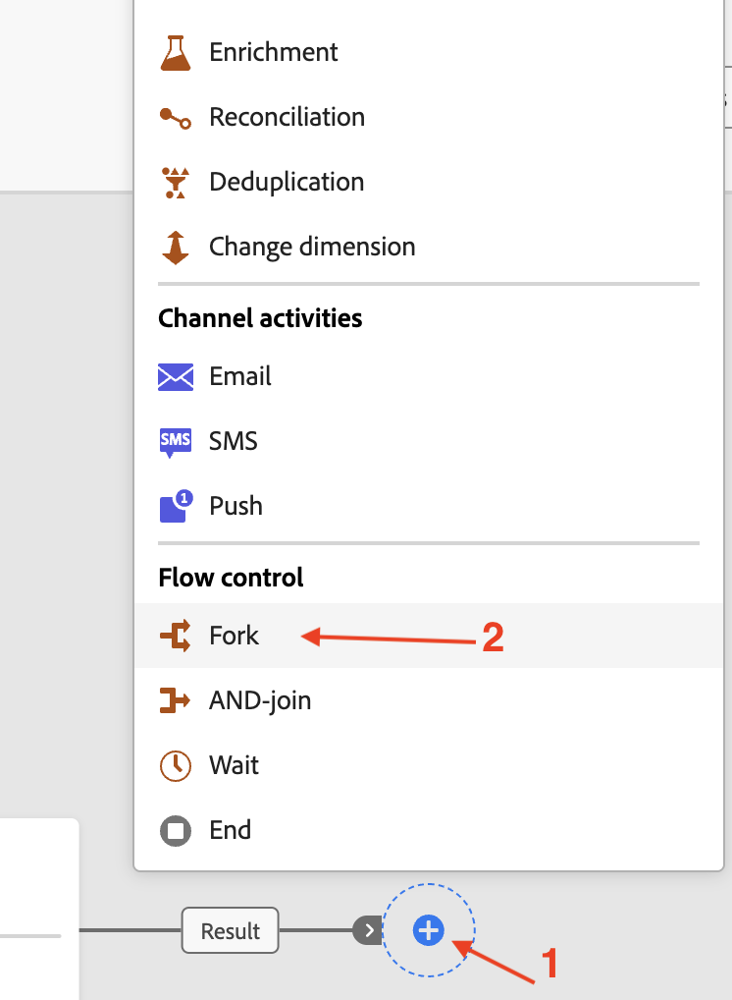

# Aktivität „Verzweigung hinzufügen“

## Ziel

Im nächsten Schritt fügen Sie der Kampagne die Aktivität Verzweigung hinzu und erstellen identische Verzweigungen der Daten.

## Aktivität „Verzweigung“

Die Arbeitsfläche mit dem konfigurierten **Zielgruppe aufbauen** wird angezeigt. Klicken Sie auf **+** am Ende des Flusses und fügen Sie eine Aktivität **Verzweigung** aus dem Abschnitt Fluss-Steuerung hinzu

>[!NOTE]
>
>Standardmäßig erstellt eine Aktivität Verzweigung immer zwei Verzweigungen

## Zusammenfassung

Sie haben jetzt gesehen, wie einfach es ist, die Aktivität Verzweigung auf der Kampagnen-Arbeitsfläche zu verwenden, um identische Verzweigungen derselben Daten zu erstellen, die in fließen. Die Verzweigungen der Aktivität Verzweigung werden im nächsten Schritt verwendet.

Weitere Informationen finden [ (hier](https://experienceleague.adobe.com/en/docs/journey-optimizer/using/campaigns/orchestrated-campaigns/design-campaigns/fork) wenn Sie Interesse haben.
