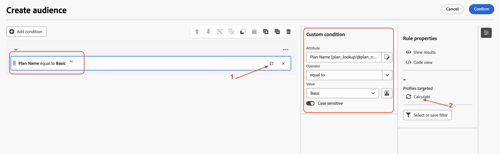

# Erstellen einer Zielgruppe

## Ziel

In den nächsten Schritten erstellen Sie eine Audience aus dem relationalen Schema, indem Sie die richtige Zielgruppendimension auswählen und die entsprechenden Bedingungen festlegen. Sie werden auch die Option Aktualisieren verwenden, um die erwartete Anzahl der Zeilen zu überprüfen.

## Zielgruppe erstellen

1. Nachdem die Kampagne gerendert wurde, klicken Sie auf das **+** auf der Arbeitsfläche, um das Optionsmenü zu öffnen, und wählen Sie dann **Zielgruppe erstellen** aus den **Targeting-Aktivitäten**

2. Die **Zielgruppe aufbauen** öffnet den Detailbereich auf der rechten Seite und klicken auf das Suchsymbol, um die **Zielgruppendimension“**.

3. Wählen Sie `dep-rel: Customer Account` aus der Liste aus und klicken Sie auf **Bestätigen**

4. Nachdem die **Zielgruppendimension** konfiguriert wurde, klicken Sie auf Zielgruppe erstellen , um den Prozess der Erstellung der Zielgruppe aus dem relationalen Schema zu starten

5. Der Bereich Details der Zielgruppe erstellen wird geöffnet. Klicken Sie auf **Bedingung hinzufügen**

6. Scrollen Sie nach unten und erweitern Sie die `dep-rel: Plan Lookup`, indem Sie neben **>** klicken

7. Wählen Sie `dep-rel: Plan Name` und klicken Sie auf **Bestätigen**

8. Belassen Sie im Bedienfeld Benutzerdefinierte Bedingung den Operator als „gleich“ und wählen Sie für Wert die Option Allgemein aus der Dropdown-Liste.

>[!NOTE]
>
>Beachten Sie, dass alle für die ausgewählte Spalte verfügbaren eindeutigen Werte in der Dropdown-Liste angezeigt werden, was die Erstellung der benutzerdefinierten Bedingungen erleichtert.

9. Klicken Sie bei konfigurierter benutzerdefinierter Bedingung auf das Aktualisierungssymbol, um die Anzahl zu berechnen und anzuzeigen. Es gibt zwei Stellen, an denen Sie die Ergebnisse berechnen können

>[!NOTE]
>
>Der Aktualisierungsvorgang bewertet die Bedingung anhand der relationalen Daten und zeigt die erwarteten Ergebnisse an. Dieser Vorgang dauert in der Regel nur wenige Sekunden und ist äußerst nützlich, um die Kriterien anzupassen und sicherzustellen, dass er den Erwartungen entspricht.

10. Die Anzahl (**38**) gibt die Anzahl der Zeilen im relationalen Speicher an, die der angegebenen Bedingung entsprechen. Klicken Sie auf **Bestätigen**, um den Bereich **Zielgruppe erstellen** zu verlassen

>[!NOTE]
>
>Weitere Informationen finden Sie unter dem Abschnitt Regeleigenschaften . Klicken Sie auf **Ergebnisse anzeigen**, um die tatsächlichen Ergebnisse anzuzeigen. Verwenden Sie die **Code-Ansicht**, um die ausgeführte Abfrage anzuzeigen.

## Zusammenfassung

Sie haben jetzt gesehen, wie einfach es ist, die Aktivität Zielgruppe aufbauen in der Kampagne zu verwenden, indem Sie die richtige Zielgruppendimension aus dem relationalen Schema auswählen. Anschließend haben Sie eine Bedingung hinzugefügt, um die Kriterien für die Zielgruppenerstellung zu verfeinern, und die Option „Aktualisieren“ verwendet, um die erwartete Anzahl von Zeilen zu überprüfen.

Weitere Informationen finden [ (hier](https://experienceleague.adobe.com/en/docs/journey-optimizer/using/campaigns/orchestrated-campaigns/design-campaigns/build-audience) wenn Sie Interesse haben.
