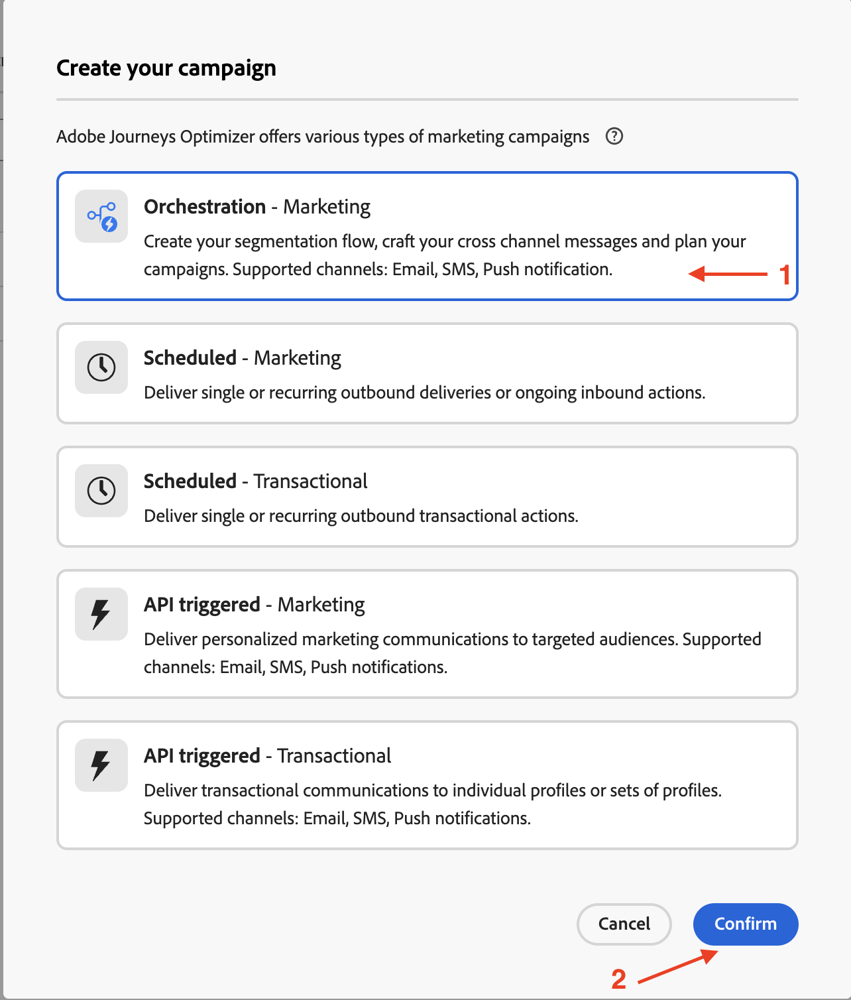
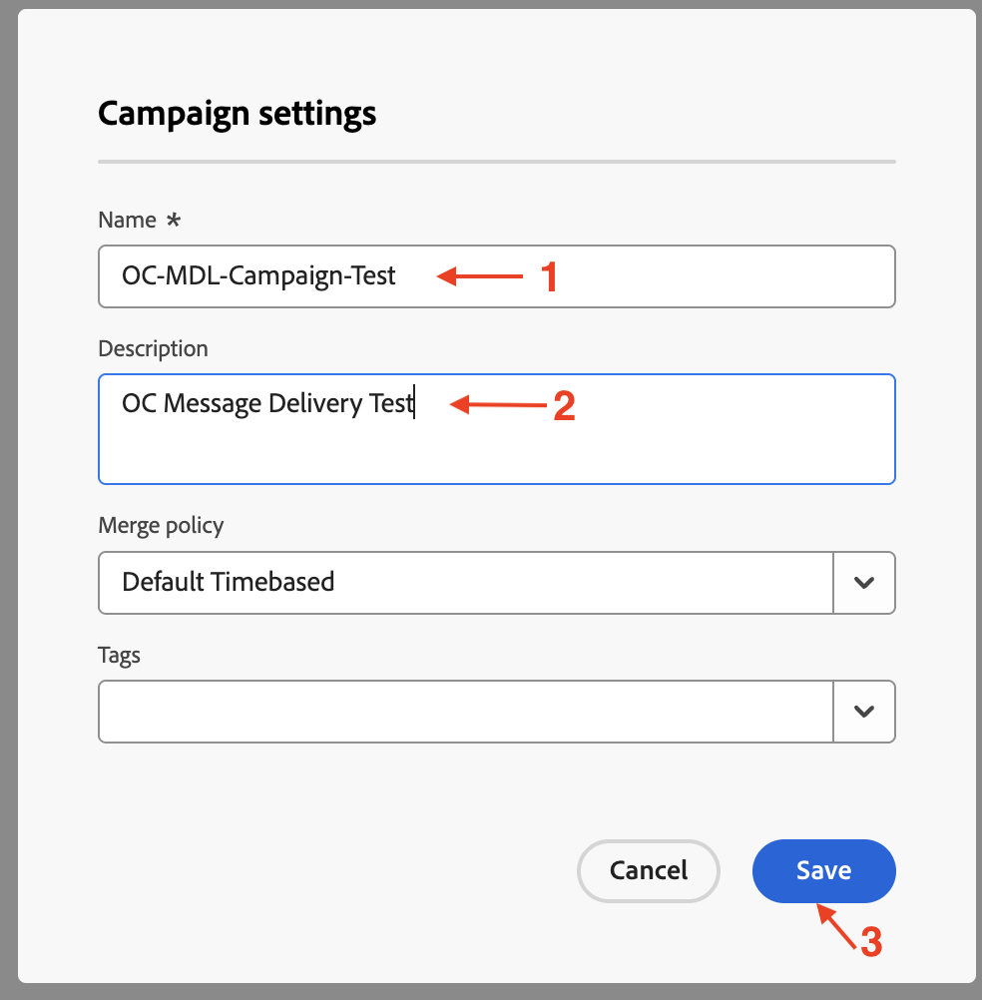
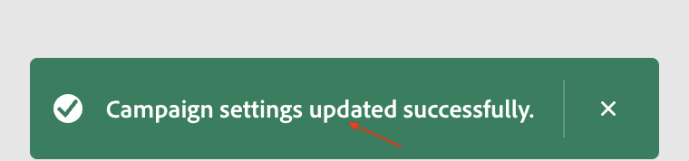

# Erstellen einer Kampagne

## Ziel

In den nächsten Schritten beginnen Sie mit der Erstellung einer orchestrierten Kampagne.

## Kampagne erstellen

1. Klicken Sie in der linken Seitenleiste auf **Kampagnen**

2. Klicken Sie auf **Kampagne erstellen**

3. Wählen Sie **Orchestrierung - Marketing** und klicken Sie auf **Bestätigen**

4. Geben Sie unten Kampagnendetails an und klicken Sie dann auf **Speichern** wenn Sie fertig sind
   - **name:** `OC-MDL-Campaign-Test`
   - **Beschreibung:** `OC Message Delivery Test`

5. Warten Sie auf die Bestätigungsmeldung, bevor Sie fortfahren

## Zusammenfassung

Sie haben eine orchestrierte Kampagne mit allen konfigurierten grundlegenden Einstellungen erstellt, die in den nächsten Schritten verwendet werden.
