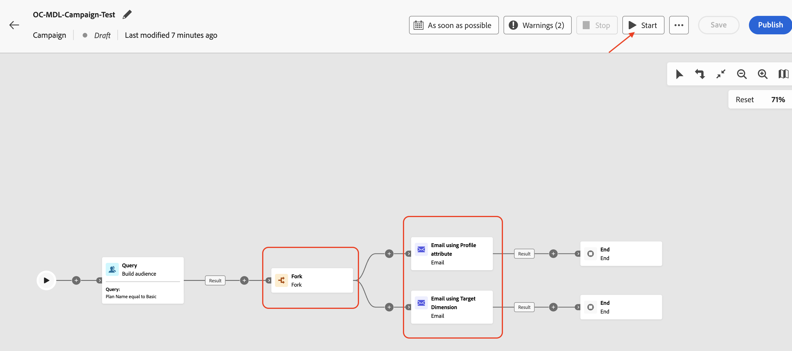
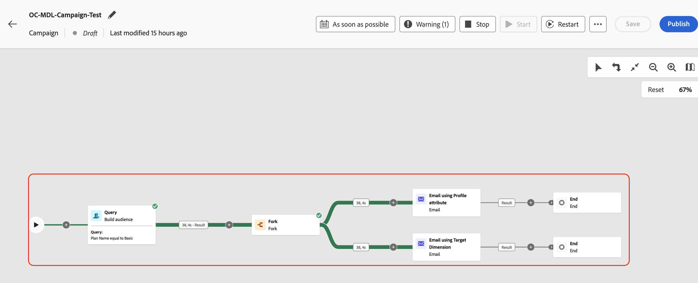
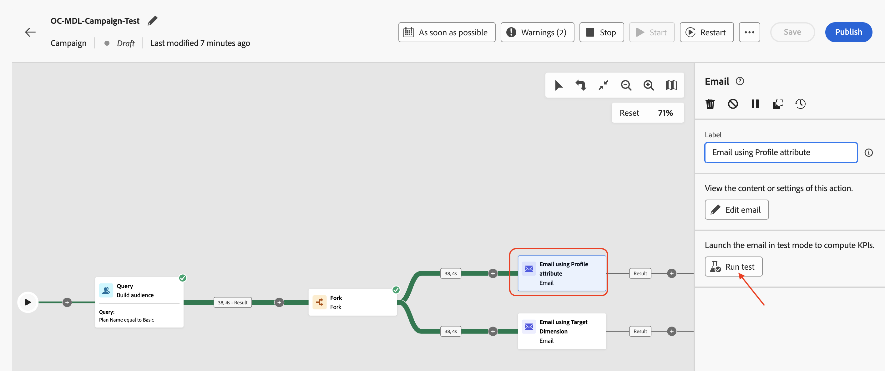
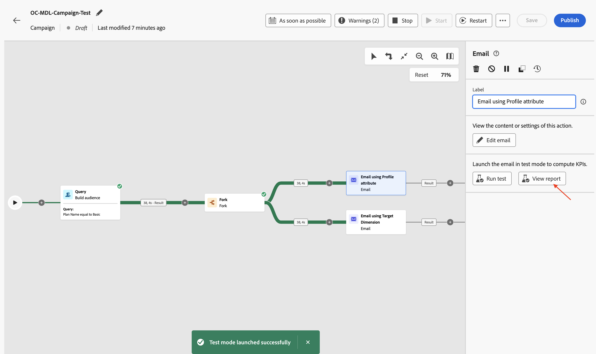
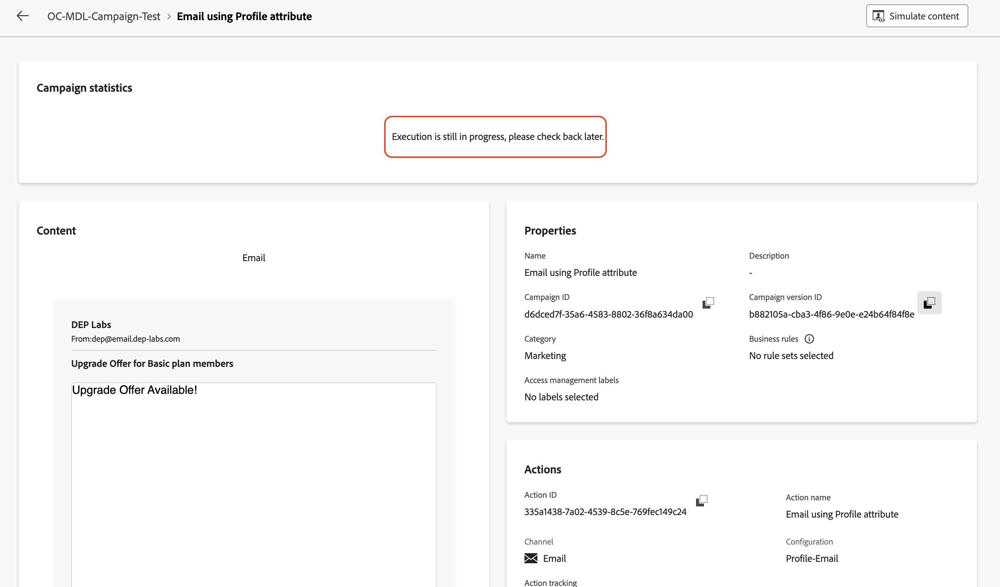
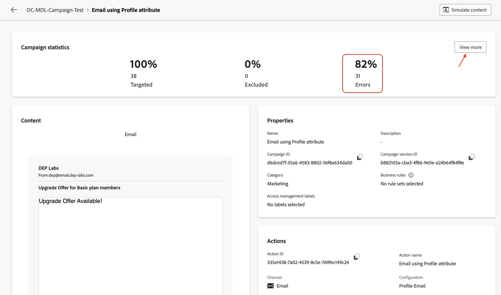
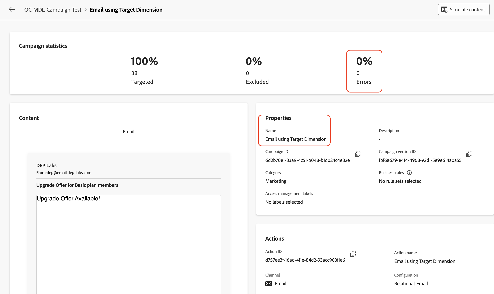

# Testen der Kampagne

## Ziel

In den nächsten Schritten führen Sie die Kampagne im Testmodus aus, um die Kampagnenfunktionen vor der Veröffentlichung der Kampagne wie erwartet zu bestätigen. In diesem Fall sendet der Testmodus zwar keine E-Mails, hilft aber bei der Überprüfung des gesamten Flusses und der frühzeitigen Erkennung von Problemen.

## Starten des Workflows

1. Nachdem die beiden E-Mail-Flüsse konfiguriert wurden, sieht die Kampagne wie folgt aus. Klicken Sie auf **Start**, um die Kampagne im **Testmodus“**

   

   >[!NOTE]
   >
   >Wie bereits erwähnt, können Sie mit dem Testmodus die Kampagnenausführung und die Ergebnisse der verschiedenen Aktivitäten überprüfen. Jede Aktivität wird sequenziell ausgeführt, bis das Ende des Flusses erreicht ist.

2. Die Testausführung aller Kampagnenaktivitäten wird gestartet. Überprüfen Sie die Ergebnisse

## E-Mail-#1

1. Um den E-Mail-Versand zu testen **klicken Sie auf die Aktivität E-Mail mit Profilattribut** und im rechten Bereich auf **Test ausführen**

   

2. Warten Sie auf die Bestätigungsnachricht und klicken Sie dann auf **Bericht anzeigen**, um die Details des E-Mail-Tests anzuzeigen

   

3. Auf der Seite E-Mail-Bericht werden die Kampagnenstatistiken und der Ausführungsstatus angezeigt. Beim E-Mail-Test wird die Aktivität überprüft, um Fehler zu vermeiden und keine E-Mails zu senden. Es dauert in der Regel etwa \~**5** Minuten bis zum Abschluss.

   

   >[!NOTE]
   >
   >Möglicherweise müssen Sie die Seite einige Male aktualisieren, um das endgültige Testergebnis anzuzeigen.

4. Sobald der E-Mail-Test abgeschlossen ist, werden die Ergebnisse angezeigt. Es gibt einen Prozentsatz von Fehlern. Klicken Sie auf **Mehr anzeigen** um den Grund zu erfahren.

   

5. Der Grund lautet `Email address not found in profile`

>[!NOTE]
>
>Da die **Versandadresse** für die E-Mail-Aktivität **E-Mail mit Profilattribut** für die Verwendung des Profilattributs `personalEmail.address` konfiguriert wurde, wurde eine Abhängigkeit vom **AEP-Profil erstellt**.
>
>Von den **38** qualifizierten Kunden-IDs aus dem relationalen Schema konnte das System nur **7** AEP-Profile finden. Für die restlichen **31** von ihnen waren keine AEP-Profile vorhanden, was zu der `Email address not found in profile` Fehlermeldung führte.
>
>Beachten Sie, dass die Daten im Data Lake und im relationalen Speicher bei der Verwendung von AEP **Profilattributen in orchestrierten Kampagnen konsistent** beibehalten werden.

## E-Mail-#2

1. Wiederholen Sie denselben Vorgang für die Aktivität **E-Mail mit Target Dimension** .

   

2. Warten Sie auf die Bestätigungsnachricht und klicken Sie dann auf **Bericht anzeigen**, um die Details des E-Mail-Tests anzuzeigen

   

3. Sobald der E-Mail-Test abgeschlossen ist, werden die Ergebnisse angezeigt. In diesem Fall liegen keine Fehler vor

>[!NOTE]
>
>Da die **Versandadresse** für die E-Mail **Aktivität „E-Mail mit Target Dimension** für die Verwendung der `dep_rel_customer_account.email` konfiguriert wurde, bestand aus dem relationalen Schema keine Abhängigkeit von AEP-Profilen oder deren Attributen.
>
>Für alle **38** qualifizierten Kunden-IDs wurden entsprechende E-Mails im relationalen Speicher gefunden, sodass sie ohne Fehler erfolgreich angesprochen werden konnten.

## Workflow anhalten

Klicken Sie auf die **Stopp**-Schaltfläche, um den **Testmodus** für die Kampagne zu stoppen

>[!TIP]
>
>Beide E-Mail-Kanalkonfigurationen wurden innerhalb derselben Kampagne getestet und es wurden Unterschiede zwischen der Verwendung eines AEP-Profilattributs und der Verwendung der Target-Dimension in der E-Mail-Kanalkonfiguration beobachtet.
>
>Herzlichen Glückwunsch! Damit ist das Labor für den Nachrichtenversand abgeschlossen.

## Zusammenfassung

Sie haben nun gesehen, wie Sie die erstellte Kampagne testen können, um den Fluss und das Verhalten zu verstehen. Hier wurden die Feinheiten der Verwendung der verschiedenen Einstellungen für die E-Mail-Kanal-Konfiguration während der Ausführung des Testflusses gut verstanden.

Weitere Informationen zum Testmodus der Kampagne finden [ (hier](https://experienceleague.adobe.com/en/docs/journey-optimizer/using/campaigns/orchestrated-campaigns/launch/start-monitor-campaigns), falls Sie Interesse haben.
