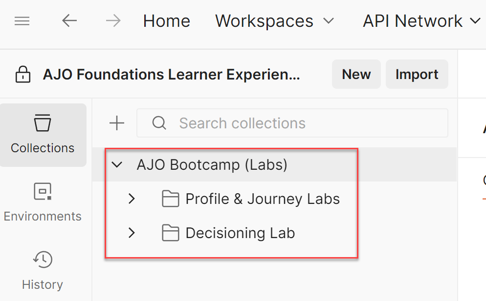
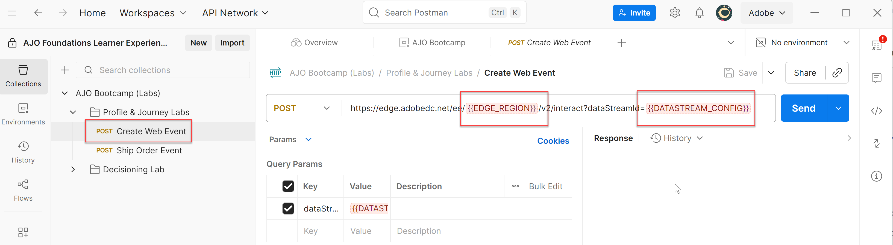
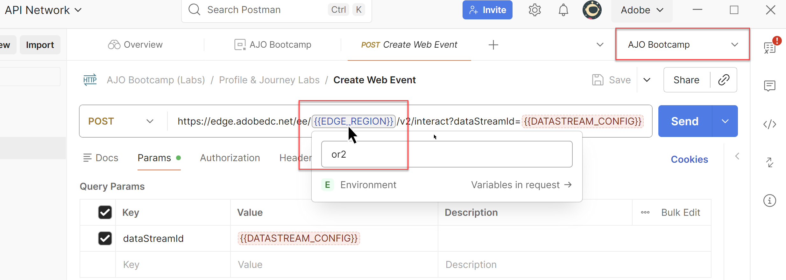

# API-Sammlung importieren

## Ziel

In diesem Schritt importieren Sie die API-Sammlung, die alle verschiedenen Anfragen enthält, die Sie im gesamten Bootcamp ausführen müssen.  Diese API-Anfragen sind von der soeben importierten Umgebungsdatei abhängig.

## Anforderungssammlung importieren

1. Laden Sie die Datei **AJO Bootcamp (Labs).postman\_collection.json** herunter:

Datei herunterladen - [AJO Bootcamp (Labs).postman_collection.json](assets/ajo-bootcamp-labs.postman_collection.json)

2. Klicken Sie wie zuvor auf die Schaltfläche **Importieren**.
3. Fügen Sie die lokale URL der Datei **AJO Bootcamp (Labs).postman\_collection.json** in das Textfeld „Modal importieren“ ein oder legen Sie sie im Dialogfeld „Importieren“ ab.  Dadurch wird ein automatischer Import Trigger.
4. Klicken Sie nach Abschluss des Importvorgangs in der linken **auf** Sammlungen“, erweitern Sie den Ordner **AJO Bootcamp (Labs** und Sie sehen die neu importierte Sammlung

>[!TIP]
>
>Herzlichen Glückwunsch!  Sie haben die Postman-Sammlung des Bootcamps erfolgreich importiert

## Validieren von Umgebungsvariablen

Die Sammlung, die Sie importiert haben, enthält alle notwendigen API-Aufrufe, die Sie für Labs im gesamten Bootcamp benötigen.  Jedes Labor ist in einen bestimmten Ordner mit eigenen Anforderungen unterteilt.

Details zu den einzelnen Ordnern finden Sie unten:

- **Profile &amp; Journey Labs** - Enthält eine Reihe von Anfragen zum Senden eines Web-Ereignisses und eines Ereignisses, das eine Versandbestätigung simuliert.
- **Decisioning Labs** - Enthält Anfragen für drei Besuchende, die die Aufrufe der oberen und unteren Seite imitieren, die normalerweise auf einer mit AEP Web SDK-Tags versehenen Site zu finden sind.

Um sicherzustellen, dass die Umgebung und die Sammlung korrekt funktionieren, führen Sie die folgenden Schritte aus.

1. Klicken Sie ggf. in der linken Leiste auf **Sammlungen** und erweitern Sie dann den Ordner **Profile &amp; Journey Labs** .
2. Klicken Sie auf die **Web-Ereignis erstellen**-Anfrage und Sie sehen, dass die Umgebungsvariablen **rot**

3. Klicken Sie oben rechts auf **Dropdown** Umgebung und wählen Sie die **AJO Bootcamp**-Umgebung.

4. Wenn Sie die richtige Umgebung ausgewählt haben, sehen Sie, dass die Variable EDGE\_REGION jetzt eine hellere blaue Farbe annimmt. Dies zeigt an, dass die Variable jetzt einen Wert für die ausgewählte Umgebung hat. Die Variable DATASTREAM\_CONFIG bleibt rot, da Sie den Datenstrom noch nicht erstellt haben, sodass Sie für diese Umgebungsvariable noch keinen Wert haben. Wenn Sie den Mauszeiger über die EDGE\_REGION bewegen, sehen Sie den Wert des Umgebungswerts.

Die Variable 

## Zusammenfassung

Sie haben jetzt die Umgebungs- und Sammlungsdateien importiert und wissen, wie Sie sie verwenden können.
