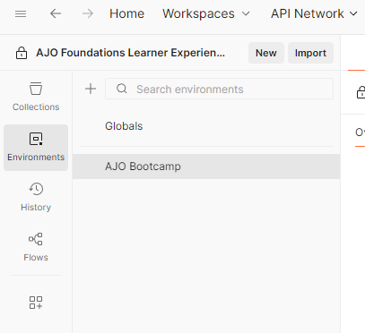
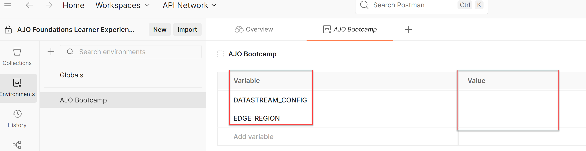
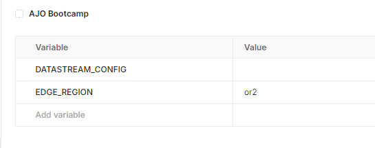

# Umgebungsdatei importieren

## Ziel

Auf dieser Seite importieren Sie die Postman-Umgebungsdatei.  Diese Datei enthält eine Reihe globaler Variablen, die in verschiedenen API-Aufrufen verwendet werden, die Sie in anderen Labs im gesamten Bootcamp ausführen.

## Umgebungsdatei importieren

1. Laden Sie die Datei **AJO Bootcamp.postman\_environment.json** herunter:

   Datei herunterladen - [AJO Bootcamp.postman_environment.json](assets/ajo-bootcamp.postman_environment.json)

2. Starten Sie Postman auf Ihrem lokalen Computer.
3. Wechseln Sie ggf. zu der Workspace, die Sie für diese Labs verwenden, und klicken Sie auf die Schaltfläche **Importieren**.

   

4. Fügen Sie die lokale URL der Datei **AJO Bootcamp.postman\_environment.json** in das Textfeld „Modal importieren“ ein oder legen Sie sie im Dialogfeld „Importieren“ ab.  Diese Aktion Trigger einen automatischen Import

   

   

5. Überprüfen Sie nach dem Import, ob die Umgebung vorhanden ist, indem Sie auf die Registerkarte **Umgebungen** in der linken Seitenleiste klicken. Sie sehen, dass die AJO Bootcamp-Umgebung jetzt für Sie verfügbar ist.

## Festlegen von Umgebungsvariablen

Postman wurde für Tests und die Interaktion mit APIs entwickelt. Dieses Labor verwendet sie jedoch zur Simulation von AEP Web SDK-Treffern über einen Browser oder für Server-seitige Echtzeit-Datenerfassungsaufrufe. Diese Anfragen sind zwar technisch gesehen API-Aufrufe, sie sind jedoch keine typischen API-Aufrufe, für die Dinge wie Autorisierungs-Token in der -Kopfzeile erforderlich sind. Die Umgebungsvariablen in diesen Labs werden hauptsächlich für Variablen in URL-Pfaden verwendet (wobei eine Variable in einer Kopfzeile verwendet wird).

1. Klicken Sie ggf. auf die Registerkarte **Umgebungen** in der linken Seitenleiste von Postman
2. Klicken Sie auf die Umgebungsdatei **AJO Bootcamp**. Es werden einige Werte angezeigt, die Sie ausfüllen müssen

   

3. Überspringen Sie vorerst den Wert DATASTREAM\_CONFIG . Sie erstellen eine Datenstromkonfiguration in einem späteren Labor.
4. Aktualisieren Sie das Feld **EDGE\_REGION** mit dem Regions-Code, der am nächsten zu Ihrem physischen Standort für dieses Bootcamp liegt. Verwenden Sie dazu die nachstehende Tabelle.

   | **Region** | **Regionscode** |
   | ---------- | --------------- |
   | westliche USA | oder2 |
   | Ost-USA | VA6 |
   | Europa | IRL1 |
   | Australien | aus3 |
   | Japan | jpn3 |
   | Asien | spg3 |

   Wenn Sie fertig sind, sieht Ihre Umgebungsdatei in etwa so aus:

   

5. Sie müssen jetzt Ihre Umgebungsvariablen speichern. Es gibt jedoch keine Schaltfläche zum Speichern in der Postman-Benutzeroberfläche. Verwenden Sie die Windows- oder Mac-Hotkeys zum Speichern (z. B. Strg+S unter Windows). Wenn unten rechts in der Benutzeroberfläche von Postman die Meldung **Änderungen gespeichert** angezeigt wird, wissen Sie, dass Ihre Änderungen gespeichert wurden:

>[!SUCCESS]
>
>Herzlichen Glückwunsch! Sie haben die Postman-Umgebungsdatei vervollständigt
