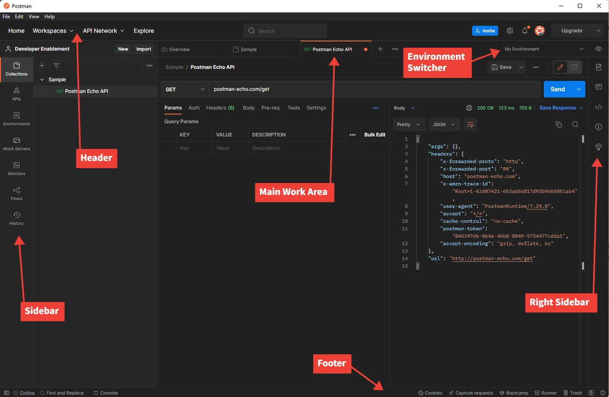

# Postman-Installation

## Ziel

Am Ende dieses Labors können Sie Postman installieren, einen einfachen Arbeitsbereich und eine Umgebung konfigurieren, damit Sie nachfolgende API-Aufrufe durchführen können, die von zukünftigen Labs benötigt werden.

> [!IMPORTANT]
>
>Postman ist für verschiedene Labore in diesem Kurs erforderlich.  Selbst wenn Sie Postman bereits installiert haben, müssen Sie dieses Lab abschließen, um sicherzustellen, dass die Umgebungsdateien und die API-Sammlung installiert und ordnungsgemäß eingerichtet sind.

## Installieren von Postman

Navigieren Sie zur Postman-Website und laden Sie entweder die Postman-App herunter oder verwenden Sie die Web-Version —> [https://www.postman.com/download/](https://www.postman.com/download/)

## Erstellen eines Postman-Arbeitsbereichs (optional)

Wenn Sie *neu bei Postman* sind und dies Ihre erste Installation ist, müssen Sie keinen neuen Arbeitsbereich erstellen. Wählen Sie beim ersten Start, den Vorgang ohne Anmeldung fortzusetzen, und verwenden Sie den schlanken Client, für den kein Arbeitsbereich erforderlich ist.

Wenn Sie *bereits mit Postman vertraut* und es installiert haben, waren Sie wahrscheinlich bereits angemeldet und verfügen über mehrere Arbeitsbereiche. In diesem Fall empfehlen wir die Erstellung eines neuen Arbeitsbereichs für *dieses Bootcamp*. Anweisungen finden Sie auf der [Postman-Website.](https://learning.postman.com/docs/collaborating-in-postman/using-workspaces/create-workspaces/)

## Postman-Benutzeroberfläche

Öffnen Sie Postman und machen Sie sich schnell mit einigen Bereichen des Programms vertraut. Um mit Experience Platform arbeiten zu können, müssen wir uns wirklich nur auf einige Schlüsselbereiche der Anwendung konzentrieren.

## Randleiste

Die Seitenleiste ermöglicht eine schnelle Navigation durch die verschiedenen Postman-Elemente. In den Labors verwenden Sie nur die beiden folgenden Elemente:

**Sammlungen** - Gruppen gespeicherter Anfragen, die von einem externen Speicherort importiert oder selbst erstellt werden können.

**Umgebungen** - eine Reihe von Variablen, die Sie in Ihren Postman-Anfragen referenzieren können. In Experience Platform können Sie sich Postman-Umgebungen als ein Synonym für Adobe-Sandboxes innerhalb einer IMS-Organisation vorstellen. Wir werden die Funktion der Umgebung in Postman verwenden

## Kopfzeile

Arbeitsbereiche : ermöglichen es Ihnen, Ihre Arbeit in verschiedene Gruppierungen (d. h. Projekte, Teams usw.) zu organisieren.

## Hauptarbeitsbereich

Der Hauptarbeitsbereich ist dort, wo Sie den Großteil Ihrer Arbeit in Postman erledigen. Alle API-Anfragen werden auf einer bestimmten Registerkarte im Hauptarbeitsbereich angezeigt.

**Rechte Seitenleiste** - bietet zusätzlichen Zugriff auf Tools basierend auf der aktuell ausgewählten Registerkarte. Beispiele sind die Dokumentation für die Anfrage, Kommentare und Code-Snippets, um nur einige Funktionen zu nennen.

**Umgebungsselektor** - ermöglicht es Ihnen, beim Arbeiten mit APIs schnell zwischen verschiedenen Umgebungen zu wechseln, um auf vorkonfigurierte Variablen zuzugreifen. Bei der Arbeit mit Experience Platform nutzen Sie diese Funktion, wenn Sie mit einer bestimmten AEP-Sandbox in Ihrer zugewiesenen IMS-Organisation arbeiten.

## Footer

Ganz unten in der Postman-Anwendung finden Sie eine Reihe von Funktionen, mit denen Sie die Protokolle für die von Ihnen ausgeführten Aufrufe schnell sehen können, den schnellen Zugriff auf Suchen und Ersetzen und verschiedene andere Funktionen.

## Zusammenfassung

Sie sollten jetzt Postman installiert haben und einige Grundlagen der Benutzeroberfläche verstehen
