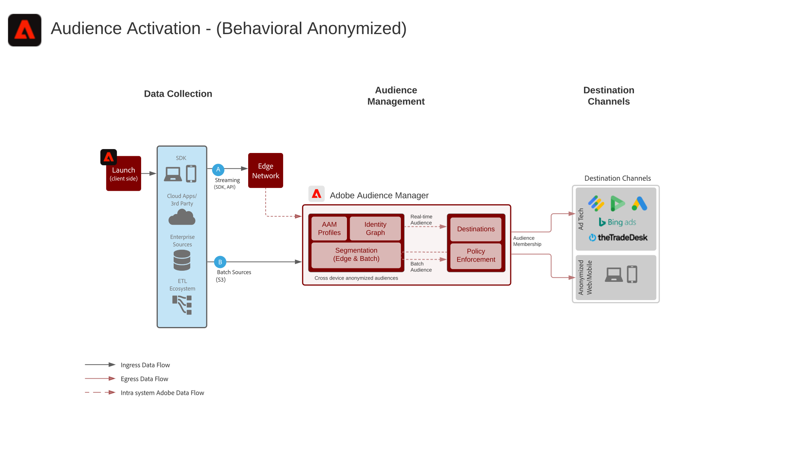
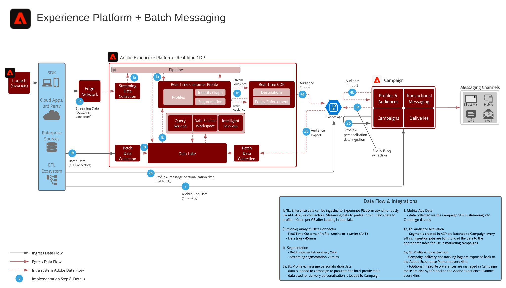

# Blueprints für digitale Erlebnisse

Digital Experience Blueprints sind wiederholbare Implementierungen, um Strategien zu entwickeln und bestehende Geschäftsprobleme zu lösen. Blueprints beschleunigen die Time-to-Value und bieten einen schnellen Weg zum Erfolg.

Jede Blueprint Angebots Adobe bietet eine Reihe von Artefakten, die das hochwertige Geschäftsproblem, Architekturen, Implementierungsschritte, technische Überlegungen und Links zur entsprechenden Dokumentation erklären.

## Neue Funktionen

* **[Blueprint für die Aktivierung von Audiencen und Profilen zu Unternehmenszielen](/help/blueprints/audience-activation/enterprise-destinations.md)**

   *Halten Sie die Profil Ihrer Kunden über alle Systeme auf dem Laufenden, um Ihre Vertriebs- und Supportteams zu unterstützen. &#x200B;*
* **[Hub-Blueprint zur Aktivität von Kunden](/help/blueprints/audience-activation/customer-activity.md)**

   *Stellen Sie einen Kontext für Support und Vertrieb durch Mitarbeiter bereit.*
* **[Data Analyse and Intelligence Blueprint](/help/blueprints/data-insights/analysis.md)**

   *Führen Sie die Abfrage und Analyse der Daten im Datensee durch.*

## Vorgestellte Blueprints

<table style="table-layout:fixed">
<tr>
  <td>
    
    
<a href="https://experienceleague.adobe.com/docs/blueprints-learn/architecture/web-personalization/overview.html"><strong>Web/Mobile Personalization Blueprint</strong></a>

    
<em>Stellen Sie personalisierte Web- und mobile Inhalte bereit.</em>

  </td>
  <td>
    
    
<a href="https://experienceleague.adobe.com/docs/blueprints-learn/architecture/audience-activation/overview.html"><strong>Audience Activation-Blueprint</strong></a>

    
<em>Stellen Sie Audience-aktivierte Cross-Kanal-Werbung bereit.</em>

  </td>
  <td>
    
    
<a href="https://experienceleague.adobe.com/docs/blueprints-learn/architecture/multi-channel-message-orchestration/overview.html"><strong>Blueprint für mehrere Kanal</strong></a>

    
<em>Stellen Sie individuelle, Just-in-time-Kundenerlebnisse auf allen Bildschirmen bereit.</em>

  </td>
</tr>
</table>

## Blog-Beiträge

* [[!DNL Introducing Adobe Experience Platform’s New Digital Experience Blueprints]](https://medium.com/adobetech/introducing-adobe-experience-platforms-new-digital-experience-blueprints-93a6b5f5da7c)
* [[!DNL Blueprint for Audience Activation in Adobe Experience Platform]](https://medium.com/adobetech/a-blueprint-for-audience-activation-in-adobe-experience-platform-b2b30fae90fd)
* [[!DNL Blueprint for Web Personalization using Adobe Experience Platform Real-Time Customer Profile]](https://medium.com/adobetech/blueprint-for-web-personalization-using-adobe-experience-platform-real-time-customer-profile-fef2ce7a4b2f)
* [[!DNL Blueprint for Multi-Channel Orchestration in Adobe Experience Platform]](https://medium.com/adobetech/blueprint-for-multi-channel-orchestration-in-adobe-experience-platform-c68317e94184)
