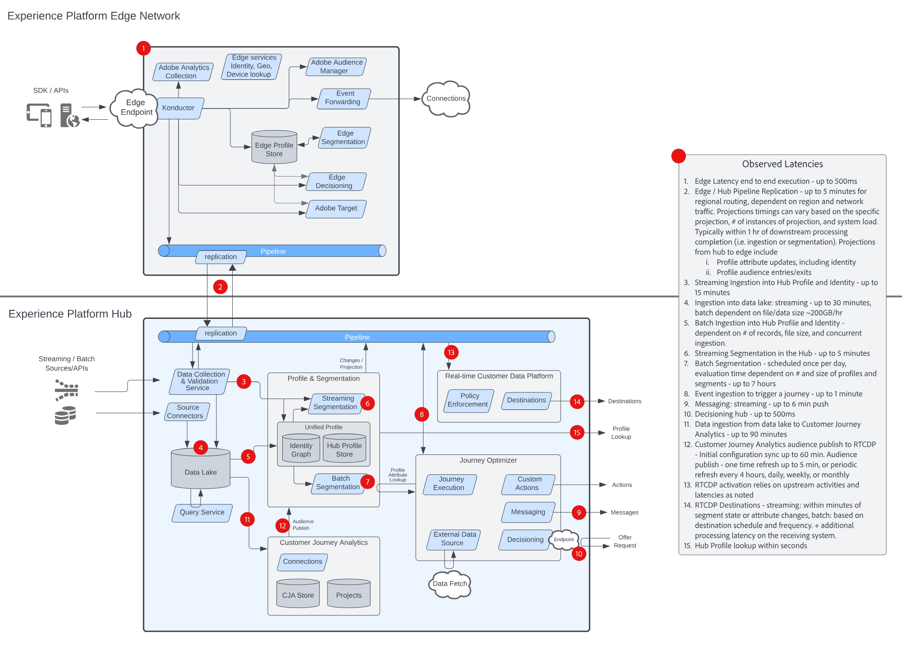

# Anwendungsfälle und Architekturdiagramme für Customer Experience Orchestration

Diese Website enthält **Wichtige Geschäftsziele** die Beispiele für den primären Geschäftswert und die Ziele beschreiben, die mit Adobe Experience Platform und Anwendungen erreicht werden können. **Anwendungsfallmuster** beschreiben allgemeine Plattform- und Anwendungsfunktionen mit wiederholbaren Implementierungsansätzen. **Anwendungsfälle für die Branche** Wenden Sie Muster auf vertikale Geschäftsszenarien an. **Architekturdiagramme und Blueprints** sind visuelle Architekturdiagramme und Datenflussreferenzdiagramme, die Systemintegrationspunkte, Daten- und Inhaltsflüsse sowie die Abfolge von Vorgängen veranschaulichen und eine technische Referenz für den Lösungsentwurf bieten. Gemeinsam verbinden diese Ebenen den geschäftlichen Nutzen mit Implementierungsabhängigkeiten und Architektur.

## Wichtige Geschäftsziele

Strategische Ergebnisse, die Unternehmen durch Initiativen für digitale Erlebnisse erzielen möchten. Jedes Ziel ist Anwendungsfallmustern zugeordnet, die die Implementierung von Adobe Experience Platform und Programmen beschreiben.

<table>
<tr>
  <td><a href="business-objectives/overview.md#acquisition--growth"><strong>Akquise und Wachstum</strong></a></td>
  <td><a href="business-objectives/overview.md#revenue--monetization"><strong>Umsatz und Monetarisierung</strong></a></td>
  <td><a href="business-objectives/overview.md#cost--efficiency"><strong>Kosten und Effizienz</strong></a></td>
</tr>
<tr>
  <td><a href="business-objectives/overview.md#customer-experience"><strong>Kundenerlebnis</strong></a></td>
  <td><a href="business-objectives/overview.md#analytics--insights"><strong>Analytics und Insights</strong></a></td>
  <td><a href="business-objectives/overview.md#qualification--sales-b2b"><strong>Qualifizierung und Vertrieb (B2B)</strong></a></td>
</tr>
</table>

[Alle Unternehmensziele anzeigen](business-objectives/overview.md)

## Anwendungsfallmuster

Wiederholbare Implementierungsansätze, die beschreiben, wie Sie mit den zugehörigen Funktionen und Anwendungskomponenten, die diese bereitstellen, spezifische Ergebnisse erzielen.

<table>
<tr>
  <td><a href="use-case-patterns/overview.md#audience-building--activation"><strong>Zielgruppenbildung und -aktivierung</strong></a></td>
  <td><a href="use-case-patterns/overview.md#personalization"><strong>Personalisierung</strong></a></td>
  <td><a href="use-case-patterns/overview.md#campaign-management--orchestration"><strong>Kampagnenverwaltung und -orchestrierung</strong></a></td>
</tr>
<tr>
  <td><a href="use-case-patterns/overview.md#analysis"><strong>Analyse</strong></a></td>
  <td><a href="use-case-patterns/overview.md#conversational-experience"><strong>Dialogerfahrung</strong></a></td>
  <td></td>
</tr>
</table>

[Alle Anwendungsfallmuster anzeigen](use-case-patterns/overview.md)

## Anwendungsbeispiele nach Branche erkunden

Anwendungsfälle, die auf bestimmte Branchen zugeschnitten sind und jeweils Implementierungsmustern und Geschäftszielen zugeordnet sind.

<table>
<tr>
  <td><a href="industry-use-cases/retail/retail-overview.md"><strong>Einzelhandel</strong></a></td>
  <td><a href="industry-use-cases/financial-services/financial-services-overview.md"><strong>Finanzdienstleistungen</strong></a></td>
  <td><a href="industry-use-cases/healthcare/healthcare-overview.md"><strong>Gesundheitswesen</strong></a></td>
</tr>
<tr>
  <td><a href="industry-use-cases/automotive/automotive-overview.md"><strong>Automobil</strong></a></td>
  <td><a href="industry-use-cases/travel-hospitality/travel-hospitality-overview.md"><strong>Reisen und Gastgewerbe</strong></a></td>
  <td><a href="industry-use-cases/telecommunications/telecommunications-overview.md"><strong>Telekommunikation</strong></a></td>
</tr>
<tr>
  <td><a href="industry-use-cases/media-entertainment/media-entertainment-overview.md"><strong>Medien und Unterhaltung</strong></a></td>
  <td><a href="industry-use-cases/insurance/insurance-overview.md"><strong>Versicherung</strong></a></td>
  <td><a href="industry-use-cases/b2b/b2b-overview.md"><strong>B2B</strong></a></td>
</tr>
</table>

[Alle Anwendungsfälle der Branche anzeigen](industry-use-cases/use-case-catalog.md)

## Architekturdiagramme und Blueprints

Visuelle Architektur- und Datenflussreferenzdiagramme, die Systemintegrationspunkte, Daten- und Inhaltsflüsse sowie die Abfolge von Vorgängen für Adobe Experience Platform und Programme veranschaulichen.

<table>
<tr>
  <td>
    
    

      <a href="experience-platform/guardrails.md">
    <strong>Diagramm zur Architektur und den Leitplanken von Experience Platform Hub und Edge</strong>
    </a>
    

  </td>
   <td>
    
    

      <a href="experience-platform/deployment/websdk.md">
    <strong>Web SDK und Edge Network-Sequenzdiagramm</strong>
    </a>
    

  </td>
  <td>
    
    

      <a href="customer-journeys/journey-optimizer/journey-optimizer-overview.md">
    <strong>Adobe Journey Optimizer-Übersichtsdiagramm</strong>
    </a>
    

  </td>
</tr>
</table>