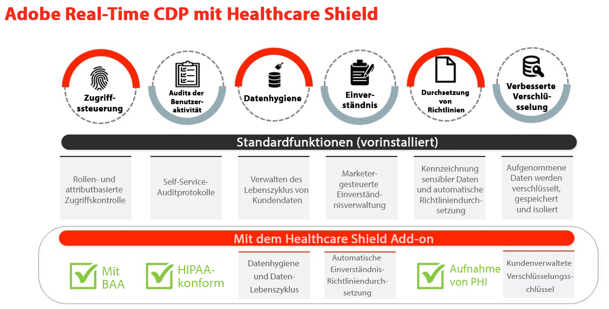
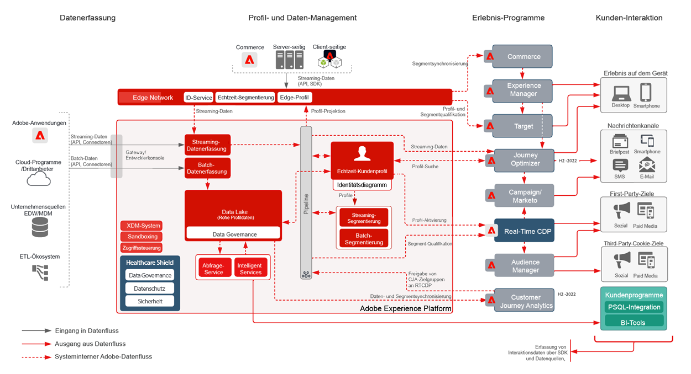
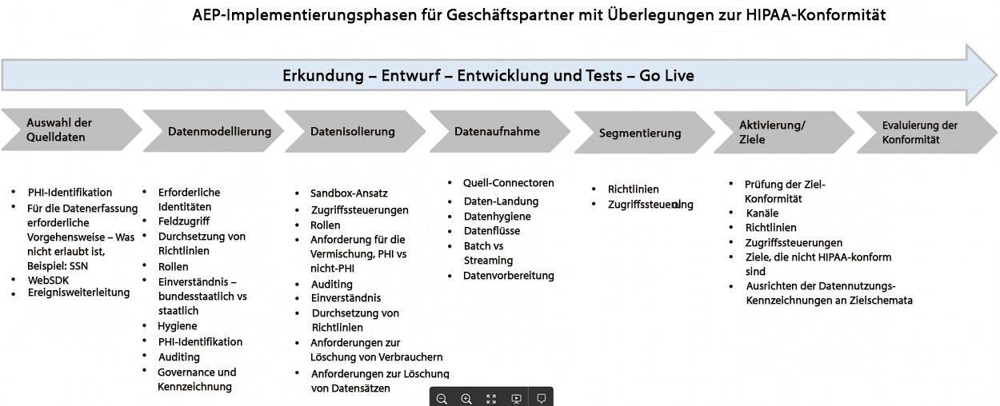
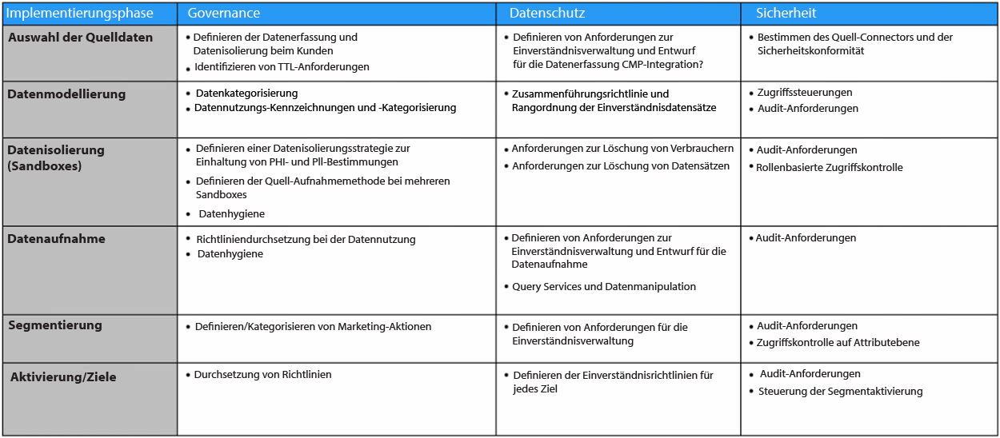

# Gesundheitsschild

Der Gesundheitsschild ist ein Adobe Experience Platform-Add-on zu Adobe Experience Platform-basierten Anwendungen wie Real-time Customer Data Platform, Customer Journey Analytics und Adobe Journey Optimizer. Es wurde entwickelt, um diese Anwendungen HIPAA-fähig zu machen und die Anforderungen an die Verarbeitung und Verwendung geschützter Gesundheitsinformationen (PHI) zu erfüllen.

## Häufig gestellte Fragen zum Gesundheitsschild

Die folgenden häufig gestellten Fragen beantworten häufig gestellte Fragen zum Gesundheitsschild.

### Was ist HIPAA?

HIPAA ist der Health Insurance Portability and Accounability Act. Es ist eine US-Verordnung, die wichtige Schutzmechanismen für Unternehmen schafft. Diese Schutzmaßnahmen beschränken die Verwendung und Offenlegung geschützter Gesundheitsinformationen (PHI) bei der Erstellung, dem Erhalt, der Pflege oder der Weitergabe durch eine von HIPAA erfasste Einrichtung oder Geschäftspartner (z. B. Adobe-Kunden) an einen Geschäftspartner (Technologiepartner wie Adobe).

Adobe ist als Geschäftspartner für die spezifischen HIPAA-fertigen Adobe-Lösungen und die Einhaltung der HIPAA-Sicherheits-, Datenschutz- und Verletzungsbenachrichtigungsregeln bereit.

### Was ist ein Business Associate Agreement (BAA) und warum ist es wichtig?

Wenn ein abgedeckter RECHTSTRÄGER oder ein Unternehmensverband (ein Adobe-Kunde) die Dienstleistungen eines Business Associate (z. B. eine Adobe) nutzt, um bestimmte Arten von Verbraucherdaten zu erstellen, zu empfangen, zu pflegen oder zu übertragen, bei denen es sich um geschützte Gesundheitsdaten (PHI) oder ePHI (elektronische Version des PHI) handelt, müssen das abgedeckte Unternehmen und das Business Associate einen Business Associate Agreement (BAA) schließen.

Die BAA benötigt vertraglich die Adobe als Business Associate, um PHI angemessen zu schützen, indem sie die Anforderungen der HIPAA-Datenschutzbestimmungen, der HIPAA-Sicherheits- und der Breach Notification Rules erfüllt.

Mit dem Healthcare Shield-Add-on für Real-Time CDP kann Adobe jetzt eine BAA mit Kunden ausführen, die diese Funktion gemeinsam mit Adobe Real-Time CDP B2C und den Verbraucherströmen der Adobe Real-Time CDP B2P Edition lizenzieren.

### Warum ist der Gesundheitsschild für Real-Time CDP (und zukünftige plattformbasierte Anwendungen) nur in den USA verfügbar?

Da HIPAA ein US-Gesetz ist, beschränken wir die Verfügbarkeit des Healthcare Shield für die USA und für Unternehmen, die HIPAA unterliegen. Adobe plant, den Geltungsbereich auf andere Rechtsordnungen auszuweiten, da wir lokale Anforderungen einbeziehen und zuversichtlich sind, dass wir diese erfüllen können.

### Was ist der Gesundheitsschild für Real-Time CDP?

Der Gesundheitsschild für Real-Time CDP richtet sich an Kunden, die ein abgedeckter Entitäts- oder Business Associate sind und PHI in Real-Time CDP zur Datenerfassung, Zielgruppenerstellung und kanalübergreifenden Aktivierung verwenden möchten und Adobe zur Ausführung einer BAA benötigen. Gesundheitsschild ist für abgedeckte Entitäten mit HIPAA erforderlich, um Anwendungsfälle für die Echtzeit-Kundendatenplattform zu ermöglichen.

### Warum sollten die Gesundheitsaussichten des Real-Time CDP-Kaufschilds im Gesundheitswesen verbessert werden?

Als Add-on zu Real-Time CDP aktualisiert der Gesundheitsschild die Anwendung auf den Status &quot;HIPAA-bereit&quot;. Dies bedeutet, dass der Antrag über die erforderlichen Garantien für die Verwendung von PHI gemäß den HIPAA-Anforderungen verfügt. Außerdem ist die Adobe mit dem Gesundheitsschild bereit und in der Lage, dem Kunden zu gestatten, bestimmte Arten von personenbezogenen Daten zu erlauben, die für HIPAA-fähige Anwendungen verwendet werden. Adobe unterzeichnet Business Associate Agreements (BAAs) mit Kunden, die den Gesundheitsschild für eine kompatible plattformbasierte Anwendung lizenzieren.

### Welche Datentypen sind für Real-Time CDP mit dem Gesundheitsschild zugelassen (und welche nicht)?

Mit dem Gesundheitsschild können Marken folgende PHI in plattformbasierte Anwendungen wie Real-Time CDP (Permitted Sensitive Personal Data) integrieren:

* Finanzinformationen einer Person
* Medizin
* Gesundheitsinformationen

Aber wir schließen ausdrücklich Daten aus, die Stoffmissbrauch, psychische Gesundheit, genetische Gesundheitsdaten oder Gesundheitsaufzeichnungen einer kleineren, vollständigen Kontonummer, vollständigen Kreditkartennummern, staatlichen Identifikatoren (wie SSN) und personenbezogenen Daten von Kindern identifizieren. Kinder sind durch Kinderschutzgesetze geschützt (wie die personenbezogenen Daten, die im US-Gesetz über die Privatsphäre von Kindern im Internet (COPPA) definiert sind).

### Können Real-Time CDP-Kunden mit dem Gesundheitsschild beliebige PHI-Typen zum Aufbau und zur Aktivierung von Zielgruppen verwenden?

Selbst wenn ein Kunde berechtigte vertrauliche personenbezogene Daten in Platform-native Anwendungen einbringen kann, müssen Kunden wissen, dass er allein dafür verantwortlich ist, dass er alle geltenden Vorschriften einhält und angemessene Berechtigungen, Einverständnisse, Genehmigungen und Genehmigungen von Verbrauchern erhält, um Daten auf die vorgesehene Weise zu nutzen.

### Welche Nuancen gibt es beim Erfassen und Aktivieren von Kundendaten mit nicht HIPAA-fähigen Adobe-Applikationen?

Ein Kunde, der eine Lizenz für das Gesundheitsschutzschild erteilt, darf personenbezogene Daten, die nicht für die HIPAA-Bereitschaft bestimmt sind, nicht in Anwendungen und Dienste der Adobe verwenden, erfassen, teilen oder integrieren.

Beispielsweise sollte ein Kunde keine Segmente aktivieren, die PHI in Anwendungen wie Audience Manager, Adobe Target und Adobe Analytics enthalten. Kunden, die den Gesundheitsschild lizenzieren, können zulässige vertrauliche personenbezogene Daten oder genehmigte PHI in HIPAA-fähige Adoben-Anwendungen aufnehmen, unabhängig davon, ob die Datenquelle als HIPAA-bereit gilt oder nicht.

### Welche Nuancen gibt es beim Erfassen und Aktivieren von Kundendaten mit Nicht-HIPAA-fähigen Nicht-Adobe-Anwendungen?

Ein Kunde, der einen Gesundheitsschild lizenziert, sollte nach bestem Wissen bestimmen, wo er Segmente aktiviert, die PHI außerhalb der Adobe Apps enthalten. Adobe kontrolliert (und ist nicht für) Drittanbieter und Daten, die von einem Kunden an einen Drittanbieter gesendet werden, der die Verarbeitung von Daten gemäß den Datennutzungsbezeichnungen der Adobe im Kundenschema möglicherweise nicht unterstützt. Darüber hinaus kann Adobe unseren Kunden keine Rechtsberatung anbieten.

## Anwendungsbeispiele für den Gesundheitsschild

| RTCDP B2C Edition Standard Anwendungsfälle | Beschreibung |
|-----|-----|
| Streaming-Datenerfassung | <ul><li>Normalisierte, flexible Datenmodelle, die über Adobe- und Nicht-Adobe-Verbindungen hinweg verwendet werden können<li>Personen- und kontobasierte Datenschemata für B2C-Marketing.<li>Tag-Management und Ereignisweiterleitung erfassen und verteilen Daten auf Ereignisebene in Echtzeit.<li> Optimierte Profile, die die Bereitstellung von Erlebnissen beschleunigen.</li></ul> |
| Vertrauenswürdige Profilverwaltung | <ul><li>Einheitliche Profile, die Verbraucherattribute, Verhaltens- und Präferenzdaten enthalten.<li> Das Data Governance-Framework ist flexibel, transparent und wird auf einheitliche Profile angewendet, wobei Richtlinien erstellt und automatisch durchgesetzt werden, um den Missbrauch von Daten zu verhindern. </li></ul> |
| Echtzeit-Aktivierung | <ul><li>Ziehen Sie die Segmentierung per Drag &amp; Drop für B2C-Marketer in den Arbeitsbereich.<li>Identitätsauflösung auf Benutzer- und Kontoebene und Profilanreicherung für kanalübergreifende Aktivierung.<li> Konsistente Kundenerlebnisse durch Zielgruppensorchestrierung und Echtzeit-Aktivierung über Kanäle und Umgebungen hinweg (Adobe und Nicht-Adobe).</li></ul> |
| Kundenakquise | <ul><li>Einblicke in die Konvertierung von nicht authentifizierten Benutzern in erkannte/authentifizierte Benutzer.<li>Ermutigen Sie nicht registrierte Benutzer, sich für die Mitgliedschaft anzumelden.<li> Erhöhen und/oder gewinnen Sie Abonnements zurück.<li> Analysieren Sie Kundenprofile, um die Tendenz zu verstehen (z. B. . Vergleich von Segmenten mit hohem Wert mit Segmenten mit geringer Performance und Optimierung der Akquise).</li></ul> |
| Kundeninteraktion | <ul><li>Targeting von Angeboten basierend auf der Neuigkeit des Kundenverhaltens und der Häufigkeit von Angeboten (online und offline).<li>Vereinheitlichung digitaler Eigenschaften für ein vernetztes Erlebnis (z. B. Förderung von Downloads mobiler Apps und Nutzung der kanalübergreifenden Segmentaktivierung, um Erlebnisse miteinander zu verbinden).</li></ul> |
| Personalisierung im Maßstab | <ul><li> Bewerten Sie Segmente am Edge für die Echtzeit-Personalisierung derselben Seite und der nächsten Seite.<li>Erhöhen Sie die Interaktion, indem Sie Besuchern, die eine Journey-übergreifende Sitzung abbrechen (z. B. Stehen gelassener Warenkorb oder wiederkehrende Besucher, die nicht konvertieren), eindeutige und zielgerichtete Erlebnisse bereitstellen.<li> Vereinheitlichen und verbinden Sie Offline- und Online-Verhaltensweisen, um Benutzer zu optimieren und zu binden.</li></ul> |
| Cross-Selling/Upsell | <ul><li>Halten Sie Kunden bei der Erweiterung und Pflege bestehender Beziehungen zu Benutzern.<li>Fördern Sie neue Umsatzströme durch geschäftsübergreifende Einheiten/Marken/Angebote, um den Wert der Kundenlebensdauer zu erhöhen.<li>Erhalten Sie Einblicke in AOV über Produkte und SKUs hinweg (z. B. häufige Bundles, Preisempfindlichkeit).</li></ul> |
| Kundentreue/Treue | <ul><li> Reaktivieren Sie Verbraucher, um die Loyalität zu steigern und Kundenabwanderungen zu vermeiden&lt;.li>Kuratieren Sie personalisierte Produktempfehlungen für hochwertige Kunden basierend auf Präferenzen und Tendenz.<li>Erstellen Sie eine Standardkadenz für Interaktion und spezielle Angebote für treue Verbraucher.<li> Verknüpfen Sie Online- und Offline-Voreinstellungen, um Angebote kanalübergreifend zu optimieren.</li></ul> |
| Datenzusammenarbeit | <ul><li> Erstellen Sie Handshakes in einer Benutzeroberfläche, um Workflows für die Datenzusammenarbeit zu erstellen.<li>(Nutzen Sie branchenübergreifende Überschneidungen bei Erstanbieterdaten, um strategische Geschäftsentscheidungen und Kampagnen zu treffen.<li>Schlüsseln Sie Datensilos auf und verstehen Sie ganzheitliche Journey.<li> Ehrenpräferenzen und Einverständnis nach Anwendungsfall.</li></ul> |
| Medien-/Marketing-Effizienz und -Optimierung | <ul><li> Profitieren Sie von organisatorischer Effizienz durch die Zentralisierung und Pflege von Kundendaten und Aktivierungskanälen in einem Datensatz-System.<li>Unterstützung von Unterdrückungskampagnen für effektive Ausgaben/Effizienz in Medien.<li> Abstimmung mit IT-Richtlinien über Governance und Richtliniendurchsetzung.<li>Gewähren Sie bei Bedarf Zugriff auf Daten in Echtzeit, um rechtzeitige Kampagnen zu unterstützen.</li></ul> |

## Relevante technische Fähigkeiten

### Unterschiede

| Typ | Vorkonfiguriert | Gesundheitsschild |
|-----|-----|-----|
| Verschlüsselung | [Datenverschlüsselung in AEP](https://experienceleague.adobe.com/docs/experience-platform/landing/governance-privacy-security/encryption.html?lang=en) | [Datenverschlüsselung in AEP](https://experienceleague.adobe.com/docs/experience-platform/landing/governance-privacy-security/encryption.html?lang=en) + Vom Kunden verwaltete Schlüssel |
| Datenhygiene | **Foundation:** Self-Service-Tool, mit dem Kunden den Datenlebenszyklus verwalten können. Dazu gehören das Löschen von Kundendaten, Aktualisierungen auf Feldebene und das Festlegen des Datenablaufs für Datensätze, um Daten nach Ablauf zu entfernen.<ul><li>Limit von **10.000 Löschanfragen** pro Monat<li>Limit von 2 Datensatz-TTLs</li></ul> | **Premium**: Erweitern Sie die tägliche Kapazität/Schwelle der Data Hygiene-Funktion, um größere Datensätze in kürzerer Zeit zu kuratieren.<ul><li>Limit von **2.000.000 Löschanfragen** monatlich im Rahmen des HealthCare Shield<li>Limit von 20 TTLs des Datensatzes</li></ul> |
| Einverständnis | **Foundation**: Präzise Zustimmung und Voreinstellungen durch manuelles Hinzufügen von Zustimmungs- und Präferenzattributen zur Zielgruppensegmentierung. | **Premium**: Erstellen und erzwingen Sie automatisch Richtlinien dazu, wie Kundendaten basierend auf der Zustimmung und den Voreinstellungen verwendet werden sollen. |

### Governance

**Datenhygiene**

* [Data Hygiene - Übersicht](https://experienceleague.adobe.com/docs/platform-learn/tutorials/data-hygiene/overview.html?lang=en)
* [Datenhygiene in Adobe Experience Platform](https://experienceleague.adobe.com/docs/experience-platform/hygiene/home.html?lang=en)

**Durchsetzung von Richtlinien**

* [Data Governance - Übersicht](https://experienceleague.adobe.com/docs/experience-platform/data-governance/home.html?lang=en)
* [Datennutzungsrichtlinien - Übersicht](https://experienceleague.adobe.com/docs/experience-platform/data-governance/policies/overview.html?lang=en)
* [Governance, Datenschutz und Sicherheit in Adobe Experience Platform](https://experienceleague.adobe.com/docs/experience-platform/landing/governance-privacy-security/overview.html?lang=en#consent)

### Datenschutz

**Einverständnis**

* [Automatische Richtliniendurchsetzung](https://experienceleague.adobe.com/docs/experience-platform/data-governance/enforcement/auto-enforcement.html?lang=en#consent-policy-evaluation)

### Sicherheit

**Verbesserte Verschlüsselung**

Nützliche Links:

* [Whitepaper zur Sicherheit von AEP](https://www.adobe.com/content/dam/cc/en/security/pdfs/AEP_SecurityOverview.pdf)

* [Datenverschlüsselung in Adobe Experience Platform](https://experienceleague.adobe.com/docs/experience-platform/landing/governance-privacy-security/encryption.html)

* [Hashing-Funktionen in der Datenvorbereitung](https://experienceleague.adobe.com/docs/experience-platform/data-prep/functions.html?lang=en#hashing)

* [Tags-Datenverschlüsselung](https://experienceleague.adobe.com/docs/experience-platform/tags/api/guides/encrypting-values.html?lang=en)

**Zugriffskontrollen**

* [Attributbasierte Zugriffskontrolle - Übersicht](https://experienceleague.adobe.com/docs/experience-platform/access-control/abac/overview.html)

**Audits zu Benutzeraktivitäten**

* [Auditprotokolle](https://experienceleague.adobe.com/docs/experience-platform/landing/governance-privacy-security/audit-logs/overview.html)

**Verbesserte Verschlüsselung**

* [Sicherheitsübersicht für Adobe Experience Platform](https://www.adobe.com/content/dam/cc/en/security/pdfs/AEP_SecurityOverview.pdf)
* [Verschlüsseln von Werten](https://experienceleague.adobe.com/docs/experience-platform/tags/api/guides/encrypting-values.html?lang=en)
* [Datenverschlüsselung in Adobe Experience Platform](https://experienceleague.adobe.com/docs/experience-platform/catalog/data-protection.html)
* [Zuordnungsfunktionen für Datenvorbereitung - Hashing](https://experienceleague.adobe.com/docs/experience-platform/data-prep/functions.html?lang=en#hashing)

**Experience Cloud**

* [Adobe Real-time Customer Data Platform und Gesundheitsschild](https://experienceleague.adobe.com/docs/customer-data-management-voices-events/events/governance/healthcare-shield.html?lang=en)

   Bereitstellung des Erlebnisversprechens mit Zugriff auf weniger Daten. In diesem Video erfahren Sie mehr über Adobe Real-Time CDP und das Adobe Experience Platform-Add-on zu Adobe Experience Platform-basierten Anwendungen, mit dem diese Anwendungen HIPAA-fähig gemacht und HIPAA-Anforderungen an die Verarbeitung und Verwendung geschützter Gesundheitsdaten (PHI) erfüllt werden können.

**Experience Platform**

* [Übersicht über Auditprotokolle](https://experienceleague.adobe.com/docs/experience-platform/landing/governance-privacy-security/audit-logs/overview.html)

   Erfahren Sie, wie Sie mithilfe von Audit-Protokollen sehen können, wer welche Aktionen in Adobe Experience Platform durchgeführt hat.

* [Übersicht über die Datenhygiene](https://experienceleague.adobe.com/docs/experience-platform/hygiene/home.html?lang=en)

   Mit Adobe Experience Platform Data Hygiene können Sie den Lebenszyklus Ihrer Daten verwalten, indem Sie veraltete oder ungenaue Datensätze aktualisieren oder bereinigen.

* [Automatische Durchsetzung von Richtlinien](https://experienceleague.adobe.com/docs/experience-platform/data-governance/enforcement/auto-enforcement.html?lang=en)

   In diesem Dokument wird beschrieben, wie Datennutzungsrichtlinien automatisch durchgesetzt werden, wenn Segmente in Experience Platform für Ziele aktiviert werden.

* [Attributbasierte Zugriffssteuerung - Übersicht](https://experienceleague.adobe.com/docs/experience-platform/access-control/abac/overview.html)

   Erfahren Sie mehr über die attributbasierte Zugriffskontrolle in Adobe Experience Platform.

## HIPAA und Adobe

Adobe ist weiterhin innovativ und passt sich an die Bedürfnisse unserer Kunden in der Gesundheitsbranche an, um ihre spezifischen Datenschutz- und Sicherheitsanforderungen zu erfüllen.

Siehe [HIPAA und Adobe - Produkte und Dienstleistungen](https://www.adobe.com/trust/compliance/hipaa-ready.html).

## Architekturdiagramm

Produkte, die HIPAA-bereit sind (und nicht):

**Marketingdiagramm**

* In Grau illustrierte Anwendungen sind noch nicht HIPAA-fähig.

## Ansatz

In diesem Abschnitt werden die Implementierungsschritte und die Interviewphase beschrieben.

### Implementierungsschritte

Bei jedem Schritt zu berücksichtigende Aspekte:

In diesem Abschnitt werden einige Best Practices beschrieben, die befolgt werden sollten. Dieser Abschnitt ist in drei Phasen unterteilt:

### Schnittphase

Der Prozess der Befragung mit Interessenträgern ist von zentraler Bedeutung, um die folgenden Aspekte zu verstehen:

* Zielsetzung: Art der Anwendungsfälle - Konversion, Perspektive, Interaktion usw.
* Leistung: Alle Target-Erwartungen auf Dienstebene
* Datenquellen: Web/Analytics, Offline/Online, CRM, Loyalität usw.
* Datenvolumen
* SLT-/SLA-Anforderungen
* Identitäten - Anzahl der Identitäten, authentifiziert vs. anonyme Datenverarbeitung
* Format der Daten: JSON, CSV usw.
* Datenqualität, Datenumwandlung erforderlich
* Alle Pläne für die Segmentübereinstimmung (Freigabe) mit Partnern
* Alle externen Zielgruppen, die importiert werden sollen
* Verschlüsselung: Standardschlüssel im Vergleich zum kundenverwalteten Schlüssel
* Zusammenführen von Daten: wird als e-PHI angesehen
* Einverständnisdatenerfassung - OneTrust, Consent SDK
* Zielanforderungen: Anforderungen hinsichtlich Häufigkeit und Latenz und Zugriffskontrolle
* Zugriffssteuerung
* Datenbereinigungsanforderungen
* Anforderungen an die Datenaktualisierung
* Warnmeldungen
* API-Zugriff

### Entwurfsphase

Auf der Grundlage des Interviewprozesses wird sich die Designphase mit folgenden Themen befassen: Selbstverständlich muss die Design-Dokumentation überarbeitet und unterzeichnet werden. Das Designdokument kann die folgenden Aspekte abdecken:

* Wert der Daten:
   * Volumen - Menge der aufgenommenen Daten
   * Zeitbereich - Länge der aufgenommenen Daten
   * Treue - Profilvielfalt
* Berücksichtigen Sie AEP-Limits zusammen mit SLT-/SLA-Anforderungen.
* Lizenzverwendung
* Anforderungen an die Datenisolierung - mehrere Sandboxes in einem oder mehreren Organisationen
* Datenfilter
* Anforderungen an die Datenhygiene (Datenmenge und Häufigkeit)
* Verfahren und Methoden zur Erfüllung der Anforderungen an die Löschung/Aktualisierung von Daten
* Anforderungen an die Datenumwandlung - Upstream, Data Prep, Query Service
* Primäre und andere Identitäten verstehen und bestimmen
* [XDM-Schema-Design](https://experienceleague.adobe.com/docs/experience-platform/xdm/schema/composition.html?lang=en)
* Bestimmen der Anzahl der Datensätze, der Profile und der Profile
* Zusammenführungsrichtliniendesign
* Einverständnisdatenverwaltung
* Governance: Rollen, Beschriftungen, Richtlinien, Marketing-Aktionen und Zugriffssteuerung
* [Profilanreicherung](https://experienceleague.adobe.com/docs/experience-platform/profile/guardrails.html?lang=de)
* Segmentierungsdesign-Anforderungen für Edge/Streaming/Batch
* Erwartete Ziele und Aktivierungspläne. Nur HIPAA-bereite Zielanforderungen berücksichtigen
* Pläne für Analytics
* Warnhinweise
* API-Zugriffsanforderungen hinzufügen

### Implementierungsphase

Sobald das Design-Dokument überprüft und unterzeichnet wurde, kann die Implementierungsphase beginnen, die folgenden Bereiche zu behandeln:

* Anzahl erforderlicher Sandboxes: Entwicklung/Test/Produktion
* Zugriffssteuerung für Sandboxes
* Bereitstellungsmethode
* TTL-Anforderungen und -Häufigkeit (Data Hygiene)
* XDM-Schema und Zugriffskontrolle
* Einverständnisdurchsetzung
* Governance: Rollen, Bezeichnungen, Richtlinien und Marketing-Aktionen
* Segmentierung
* Datensätze und Zugriffskontrolle
* Einrichtung der Datenhygiene
* Einrichten von Zielen und Zugriffssteuerung
* Warnhinweise einrichten
* API-Zugriffsanforderungen implementieren
* Testen von Ende bis Ende mit nachgeahmten Daten
