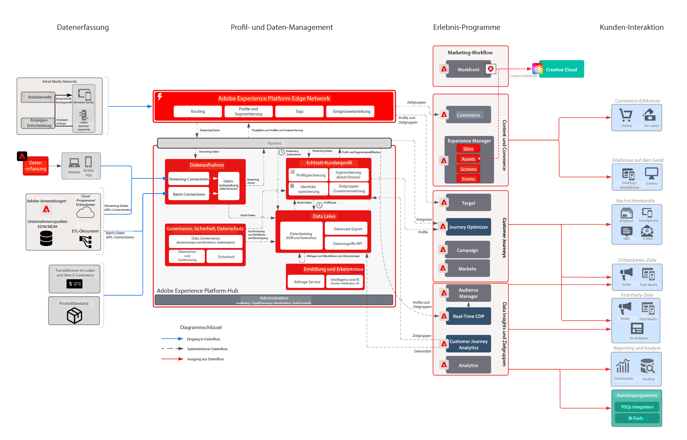

# Einzelhandelsbranche – geschäftliche Herausforderung

Dieses integrierte Experience Business wollte die gesamte Customer Journey personalisieren, um die Kundentreue zu festigen, Upselling an Bestandskunden zu betreiben und die Marketing-Ausgaben für Kampagnen sinnvoller einzusetzen. Die Strategie, die das Unternehmen wählte, zielte darauf ab, seine digitalen Fähigkeiten zu verbessern, damit es die Daten von Offline-Kunden und Transaktionen einbeziehen und so das Unternehmenswachstum steigern konnte.

## Lösungsansatz von Adobe

* Erstellen eines einheitlichen Kundenprofils, das alle relevanten Online-/Offline-Daten enthält, die in Echtzeit aktiviert werden können
* Orchestrieren von Kundeninteraktionen auf Web-, Social-Media- und Push-Kanälen, um Erstkäufe und wiederholte Käufe anzuregen.

## Realisierter geschäftlicher Wert

| Ziele | Taktik | Erzielter Wert |
|---|---|---|
| **Orchestrierung der Customer Journeys in Echtzeit **  ** Anregen wiederholter Einkäufe durch neue Kunden **  ** Verbesserung der Marketing-Effizienz und Senkung der Medienkosten**</ul> | <ul><li>Zuverlässige Daten- und Identitätsstrategie, um ein umfassendes Echtzeit-Profil zu erstellen.</li><li>Kunden- und Transaktionsdaten-Streaming in Echtzeit, einschließlich historischer Daten über einen Zeitraum von 90 Tagen</li><li>Streaming-Segmentierung für Anzeigennetzwerke und Adobe Target, um Medienausgaben und Personalisierung zu optimieren.</li><li>Customer Journeys in Echtzeit über Adobe Campaign einschließlich einer Strategie zur Performance-Messung</li></ul> | <ul><li><strong>Real-time Customer Data Platform:</strong> Bereitstellung von Echtzeit-Kundenerlebnissen auf den Social-Media-, E-Mail-, Push- und Web-Kanälen</li><li><strong>Datenquellen:</strong> Streaming von Daten von den Profildatenbanken, vom Bestellsystem, vom Produktkatalog und von den Einzelhandelsgeschäften dieses Einzelhändlers.</li><li><strong>Echtzeit-Medienaktivierung:</strong>Streaming von Segmenten an Anzeigennetzwerke zur Attribution und Anzeigenunterdrückung</li><li><strong>Echtzeit-Web-Personalisierung:</strong>Streaming von Segmenten an Adobe Target zur Aktivierung des Web-Kanals des Einzelhändlers.</li><li><strong>Journey Orchestration im benötigten Umfang:</strong>Automatisch ausgelöstes Messaging in Echtzeit, angereichert mit verfügbaren Kundendaten und Echtzeit-Aktivierung von E-Mail- und Push-Kanälen</li></ul> |

## Anwendungsfälle

| Kategorie | Ziel | Anwendungsfall | Beschreibung |
|:----|:----|:----|:----|
| Customer Journeys | Akquise | Begrüßungsreihe | Begrüßung neuer Abonnentinnen und Abonnenten mit Einführung in das Unternehmen sowie die Produkte und Services |
| | | Programm für Erstkaufende | |
| | Verbesserter Vertrieb | Abgebrochener Warenkorb/abgebrochene Suche | Rückgewinnung potenzieller Käuferinnen und Käufer und Umsatzsteigerung |
| | | Produktprüfung/Crossselling | Steigern Sie das Crossselling mit Produktrezensionen. |
| | | Produkt-Promotions |  |
| | | Zeit für die Neuanordnung | Wiederkehrende Erinnerung für zyklische Produkte/Services |
| | Markentreue | Zurückgewinnung | Gewinnen Sie Kundinnen und Kunden zurück, die inaktiv waren. |
| | | Geburtstagserinnerungen | Fördern Sie eine persönlichere Beziehung zu Ihren Kundinnen und Kunden, indem Sie an ihrem Geburtstag präsent sind! |
| Merchandising | Inventar-Verwaltung | Wieder auf Lager | Verbessern Sie das Inventar, indem Sie Kundschaft zeigen, dass die gewünschten Produkte wieder vorrätig sind |
| | | Nächste beste Kategorie | Identifizieren Sie die besten Kategorien/Verkäufe für Benutzende |
| | | Bestseller | |
| | | Erinnerungen an Preisreduktionen | Zeigen Sie Benutzenden an, dass ihre bevorzugten Produkte reduziert sind |
| | | Ähnliche Produkte |  |
| Personalisieren | Steigerung der Konversion | Coupons/Angebote | Anzeige der besten Angebote/Gutscheine für Kundschaft |
| | | Personalisierte Produktsuche | Verbesserung des Sucherlebnisses |
| | | Produktempfehlungen | Verbesserung des Browser-Erlebnisses |
| | | Omni-Channel-Erlebnis | Erreichen Sie Kundschaft über alle Kanäle hinweg |
| Messung | Grundlagen zu Customer Journeys | Cross-Channel-Kampagne | Messung von Cross-Channel-Kampagnen |
| | | Segmentleistung | Grundlagen zu Segmentleistung und Beitrag |
| | | Fallout-Berichte | Visualisierung der Konversionen in jeder Phase |
| | | Kohortenanalyse | Messung der Interaktion zwischen Segmentgruppen |
| | | Click-to-Brick-Berichte | Erfahren Sie, wie Kundenkonversionen zu einem In-Store-Erlebnis führen |
| | | Attribution | Zeigen Sie an, welcher Touchpoint/welches Erlebnis den größten Einfluss auf die Kaufkonversion hat |
| | | Prädiktive Erkenntnisse | Weitere Informationen zu Kundenneigungen |

## Architektur

## Verwandte Blueprints

| Anwendungsfall/Integration  | Link |
|:----|:----|
| CJA + AEP | [Übersicht über Blueprints zu Customer Journey Analytics](https://experienceleague.adobe.com/docs/blueprints-learn/architecture/customer-journey-analytics/overview.html?lang=de) |
| | [Customer Journey Analytics –Anwendungsfälle ](https://experienceleague.adobe.com/docs/analytics-platform/using/cja-usecases/cja-usecases.html?lang=de) |
| AJO + AEP | [Adobe Journey Optimizer – Anwendungsfälle](https://experienceleague.adobe.com/docs/blueprints-learn/architecture/customer-journeys/journey-optimizer/journey-optimizer.html?lang=de) |
| | [Entscheidungs-Management](https://experienceleague.adobe.com/docs/blueprints-learn/architecture/customer-journeys/journey-optimizer/decision-management/decision-management-overview.html?lang=de) |
| RTCDP + AEP | [Online-/Offline-Zielgruppenaktivierung](https://experienceleague.adobe.com/docs/blueprints-learn/architecture/audience-activation/known-customer-audience-activation/known.html?lang=de) |
| | [Experience Platform + Programmaktivierung](https://experienceleague.adobe.com/docs/blueprints-learn/architecture/audience-activation/platform-and-applications.html?lang=de) |
| Marketo + AEP | [B2B: Aktivierung und Marketing](https://experienceleague.adobe.com/docs/blueprints-learn/architecture/b2b-activation/overview.html?lang=de) | |
| Target + AEP | [Adobe Target-Anwendungsfall – verhaltensbasierte Personalisierung für Web/Mobile](https://experienceleague.adobe.com/docs/blueprints-learn/architecture/web-personalization/behavioral.html?lang=de) | [Web-/Mobile-Personalisierung mit bekannten Kundendaten](https://experienceleague.adobe.com/docs/blueprints-learn/architecture/web-personalization/known-personalization.html?lang=de) | |
