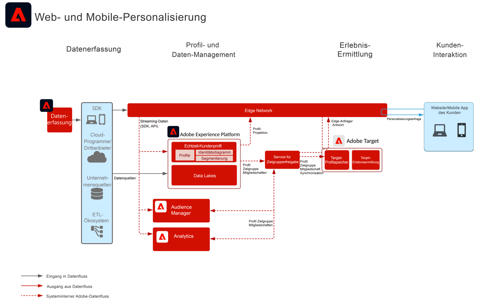
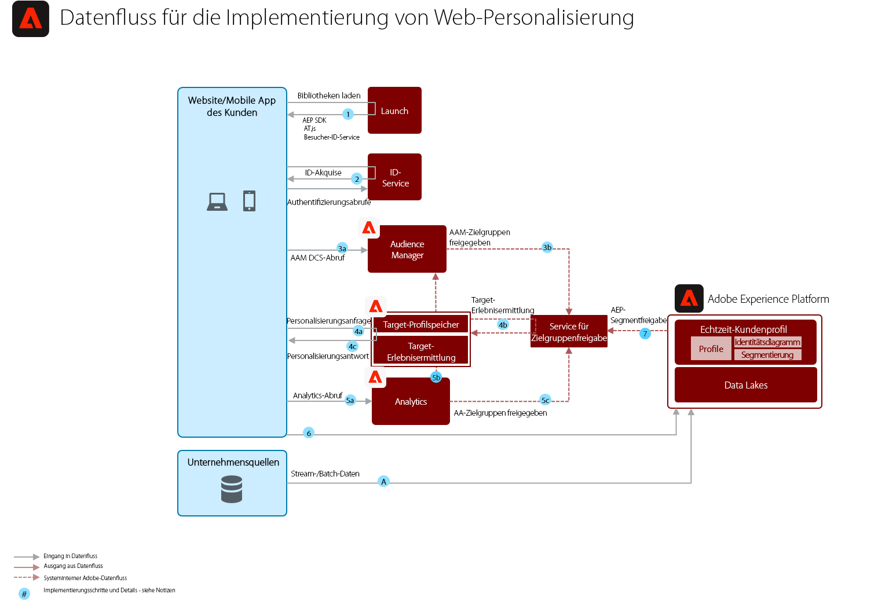

# Blueprint: Web-/Mobile-Personalisierung basierend auf Verhaltensdaten

Personalisieren Sie basierend auf Daten zu Online-Verhalten und Zielgruppen.

## Anwendungsfälle

* Landingpage-Optimierung
* Behavioral Targeting
* Personalisierung basierend auf früheren Produkt-/Content-Ansichten, Produkt-/Content-Affinität, Umgebungsattributen, Third-Party-Zielgruppendaten und demografischen Daten

## Programme

* Adobe Target
* Adobe Analytics (optional)
* Adobe Audience Manager (optional)

## Architektur

## Leitlinien

Standardmäßig ermöglicht der Segmentfreigabe-Service die Freigabe von maximal 75 Zielgruppen pro Adobe Analytics-Report-Suite. Wenn Audience Manager für die Zielgruppenfreigabe verwendet wird, ist die Anzahl der Zielgruppen, die geteilt werden kann, nicht begrenzt. 

## Implementierungsmuster

Die Blueprint „Web-/Mobile-Personalisierung“ lässt sich wie folgt implementieren:

1. Verwendung des [!UICONTROL Platform Web SDK] oder [!UICONTROL Platform Mobile SDK] und [!UICONTROL Edge Network].
1. Verwendung herkömmlicher programmspezifischer SDKs (z. B. AppMeasurement.js)

### 1. Herangehensweise für Platform Web/Mobile SDK und Edge

### 2. Herangehensweise für programmspezifische SDKs

## Voraussetzungen für die Implementierung

| Programm/Service | Erforderliche Bibliothek | Hinweise |
|---|---|---|
| Adobe Target | [!UICONTROL Platform Web SDK]*, at.js 0.9.1+ oder mbox.js 61+ | at.js wird bevorzugt, da mbox.js nicht mehr entwickelt wird. |
| Adobe Audience Manager (optional) | [!UICONTROL Platform Web SDK]* oder dil.js 5.0+ |  |
| Adobe Analytics (optional) | [!UICONTROL Platform Web SDK]* oder AppMeasurement.js 1.6.4+ |  |
| Experience Cloud Identity Service | [!UICONTROL Platform Web SDK]* oder VisitorAPI.js 2.0+ |  |
| Experience Platform Mobile SDK (optional) | 4.11 oder höher für iOS und Android™ |  |
| Experience Platform Web SDK | 1.0, die aktuelle Experience Platform SDK-Version verfügt über [diverse Anwendungsfälle, die noch nicht für die Experience Cloud-Programme unterstützt werden](https://github.com/adobe/alloy/projects/5) |  |

## Implementierungsschritte

1. [Implementieren Sie Adobe Target](https://experienceleague.adobe.com/docs/target/using/implement-target/implementing-target.html?lang=de) für Ihre Web-Anwendungen oder Mobile Apps

   Bei Verwendung von Audience Manager oder Adobe Analytics:

1. [Implementieren Sie Adobe Audience Manager ](https://experienceleague.adobe.com/docs/audience-manager/user-guide/implementation-integration-guides/implement-audience-manager.html?lang=de)
1. [Implementieren Sie Adobe Analytics](https://experienceleague.adobe.com/docs/analytics/implementation/home.html?lang=de)
1. [Implementieren Sie Experience Cloud Identity Service ](https://experienceleague.adobe.com/docs/id-service/using/implementation/implementation-guides.html?lang=de)

   >[!NOTE]
   >
   >Jedes Programm muss die Experience Cloud-ID nutzen und Teil derselben Experience Cloud-Organisation sein, damit die Zielgruppenfreigabe zwischen Programmen möglich ist.

1. [Fordern Sie die Bereitstellung für die Services „People“ und „Audience Sharing“ an (Freigegebene Zielgruppen)](https://www.adobe.com/go/audiences)
1. Erstellen Sie Segmente in [Adobe Analytics](https://experienceleague.adobe.com/docs/analytics/components/segmentation/segmentation-workflow/seg-build.html?lang=de) oder [Adobe Audience Manager](https://experienceleague.adobe.com/docs/audience-manager/user-guide/features/segments/segment-builder.html?lang=de) und [konfigurieren Sie diese Zielgruppen für die Freigabe in Experience Cloud](https://experienceleague.adobe.com/docs/analytics/components/segmentation/segmentation-workflow/seg-publish.html?lang=de) (bei Verwendung von Audience Manager oder Adobe Analytics)
1. Sobald die Zielgruppen in Adobe Target verfügbar sind, können sie für das [Erlebnis-Targeting mit Adobe Target](https://experienceleague.adobe.com/docs/target/using/audiences/target.html?lang=de) verwendet werden

## Verwandte Dokumentation

* [Experience Cloud-Zielgruppen](https://experienceleague.adobe.com/docs/core-services/interface/audiences/audience-library.html?lang=de)
* [Integration von Audience Manager mit Adobe Target](https://experienceleague.adobe.com/docs/audience-manager/user-guide/implementation-integration-guides/integration-other-solutions/aam-target-integration.html?lang=de)
* [Segmentfreigabe in Adobe Analytics über Adobe Audience Manager](https://experienceleague.adobe.com/docs/analytics/components/segmentation/segmentation-workflow/seg-publish.html)

## Verwandte Blog-Posts

* [[!DNL Blueprint for Web Personalization using Adobe Experience Platform Real-Time Customer Profile]](https://medium.com/adobetech/blueprint-for-web-personalization-using-adobe-experience-platform-real-time-customer-profile-fef2ce7a4b2f)
* [[!DNL Integrating Adobe Experience Platform Decisioning Engine with AEM Websites]](https://jaeness.medium.com/integrating-adobe-experience-platform-decisioning-engine-with-aem-websites-9c222acd12e2)
* [[!DNL How Adobe Experience Platform Predictive Audiences improves Personalized Experiences]](https://medium.com/adobetech/how-adobe-experience-platform-predictive-audiences-improves-personalized-experiences-1f75a60cb7a3)
* [[!DNL Adobe Experience Platform Web SDK for Audience Management]](https://medium.com/adobetech/adobe-experience-platform-web-sdk-for-audience-management-751fa6d063bc)
* [[!DNL Implementing Adobe Experience Platform Real-Time Customer Profile through our “Customer Zero” Program]](https://medium.com/adobetech/implementing-adobe-experience-platform-real-time-customer-profile-through-our-customer-zero-32e7cd952896)
* [[!DNL How Adobe Experience Platform Can Help Customers Personalize Their Mobile Messaging in Real-Time with Journey Orchestration Service and a Mobile Messaging Vendor]](https://medium.com/adobetech/how-adobe-experience-platform-helped-a-client-personalize-their-mobile-messaging-in-real-time-with-7d634aefa098)
* [[!DNL Segmentation in Seconds: How Adobe Experience Platform Made Real-time Customer Profiles a Reality]](https://medium.com/adobetech/segmentation-in-seconds-how-adobe-experience-platform-made-real-time-customer-profiles-a-reality-a7a8552b0847)
