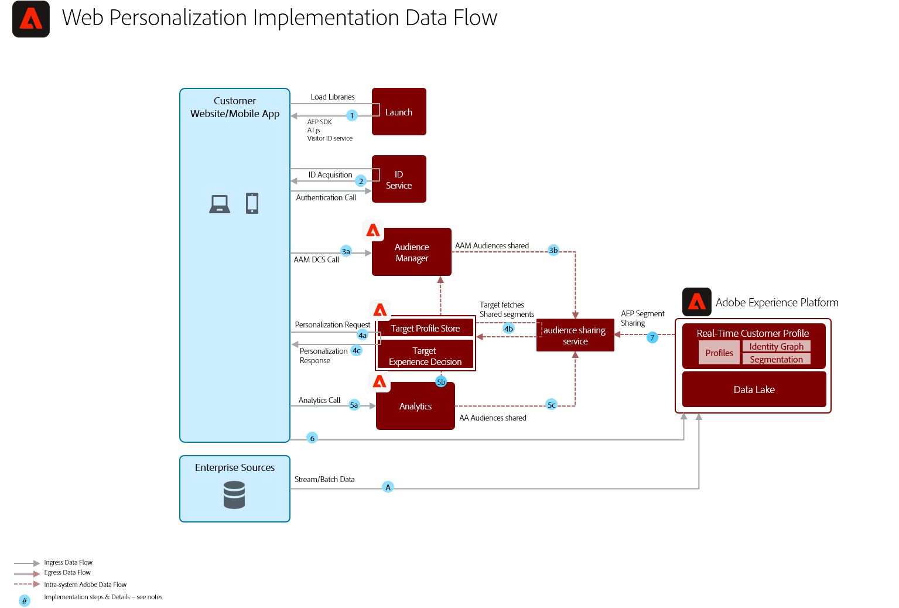

# Verhaltensbasiertes Web-Personalisierungskonzept

Personalisieren Sie diese auf Grundlage von Online-Verhaltensdaten und Daten zur Audience.

## Anwendungsfälle

* Optimierung der Landingpage
* Verhaltensbasiertes Targeting
* Personalisierung basierend auf früheren Ansichten von Produkten/Inhalten, Affinität von Produkten/Inhalten, Umweltattributen, Daten zur Audience von Drittanbieterdaten und demografischen 

## Anwendungen

* Adobe Target
* Adobe Analytics (optional)
* Adobe Audience Manager (optional)

## Architektur

## Guardraht

Der Segmentfreigabedienst ermöglicht standardmäßig die Freigabe von maximal 75 Audiencen für jede Adobe Analytics Report Suite. Wenn Audience Manager für die Freigabe von Audiencen verwendet wird, gibt es keine Beschränkung für die Anzahl der Audiencen, die freigegeben werden können. 

## Implementierungsmuster

Der Personalisierungsentwurf für Web/Mobile lässt sich wie folgt implementieren:

1. Verwenden des Platform Web SDK/Mobile SDK und Edge Network.
1. Verwenden herkömmlicher anwendungsspezifischer SDKs (z. B. AppMeasurement.js)

### 1. Plattform-Web/Mobile-SDK und Edge-Ansatz

### 2. Anwendungsspezifischer SDK-Ansatz

## Voraussetzungen für die Implementierung

| Anwendung/Dienst | Erforderliche Bibliothek | Hinweise |
|---|---|---|
| Adobe Target | Platform Web SDK*, at.js 0.9.1+ oder mbox.js 61+ | &quot;at.js&quot;wird bevorzugt, da &quot;mbox.js&quot;nicht mehr entwickelt wird. |
| Adobe Audience Manager (optional) | Platform Web SDK* oder dil.js 5.0+ |  |
| Adobe Analytics (optional) | Platform Web SDK* oder AppMeasurement.js 1.6.4+ |  |
| Experience Cloud-Identitätsdienst | Platform Web SDK* oder VisitorAPI.js 2.0+ |  |
| Experience Platform Mobile SDK (optional) | 4.11 oder höher für iOS und Android™ |  |
| Experience Platform Web SDK | 1.0, aktuelle Experience Platform SDK-Version hat [verschiedene Anwendungsfälle, die noch nicht für Experience Cloud-Anwendungen](https://github.com/adobe/alloy/projects/5) unterstützt werden |  |

## Implementierungsschritte

1. [Implementieren Sie Adobe ](https://experienceleague.adobe.com/docs/target/using/implement-target/implementing-target.html) Target für Ihre Web- oder Mobilanwendungen.

   Bei Verwendung von Audience Manager oder Analytics:

1. [Implementierung von Adobe Audience Manager](https://experienceleague.adobe.com/docs/audience-manager/user-guide/implementation-integration-guides/implement-audience-manager.html)
1. [Implementierung von Adobe Analytics](https://experienceleague.adobe.com/docs/analytics/implementation/home.html)
1. [Experience Cloud-Identitätsdienst implementieren](https://experienceleague.adobe.com/docs/id-service/using/implementation/implementation-guides.html)

   >[!NOTE]
   >
   >Jede Anwendung muss die Experience Cloud-ID verwenden und zum selben Experience Cloud-Org gehören, damit die Audience zwischen den Anwendungen freigegeben werden kann.

1. [Anfordern der Bereitstellung für die Freigabe von Personen und Audiencen (Freigegebene Audiencen)](https://www.adobe.com/go/audiences)
1. Erstellen Sie Segmente in [Adobe Analytics](https://experienceleague.adobe.com/docs/analytics/components/segmentation/segmentation-workflow/seg-build.html) oder [Adobe Audience Manager](https://experienceleague.adobe.com/docs/audience-manager/user-guide/features/segments/segment-builder.html) und [konfigurieren Sie diese Audiencen für die Freigabe für das Experience Cloud](https://experienceleague.adobe.com/docs/analytics/components/segmentation/segmentation-workflow/seg-publish.html) (bei Audience Manager oder Adobe Analytics).
1. Sobald die Audiencen in Adobe Target verfügbar sind, können sie für [Targeting-Erlebnisse mit Adobe Target](https://experienceleague.adobe.com/docs/target/using/audiences/target.html) verwendet werden

## Verwandte Dokumentation

* [Experience Cloud-Audiencen](https://experienceleague.adobe.com/docs/core-services/interface/audiences/audience-library.html)
* [Audience Manager mit Adobe Target integrieren](https://experienceleague.adobe.com/docs/audience-manager/user-guide/implementation-integration-guides/integration-other-solutions/aam-target-integration.html)
* [Adobe Analytics-Segmentfreigabe über Adobe Audience Manager](https://experienceleague.adobe.com/docs/analytics/components/segmentation/segmentation-workflow/seg-publish.html)

## Verwandte Blog-Beiträge

* [[!DNL Blueprint for Web Personalization using Adobe Experience Platform Real-Time Customer Profile]](https://medium.com/adobetech/blueprint-for-web-personalization-using-adobe-experience-platform-real-time-customer-profile-fef2ce7a4b2f)
* [[!DNL Integrating Adobe Experience Platform Decisioning Engine with AEM Websites]](https://jaeness.medium.com/integrating-adobe-experience-platform-decisioning-engine-with-aem-websites-9c222acd12e2)
* [[!DNL How Adobe Experience Platform Predictive Audiences improves Personalized Experiences]](https://medium.com/adobetech/how-adobe-experience-platform-predictive-audiences-improves-personalized-experiences-1f75a60cb7a3)
* [[!DNL Adobe Experience Platform Web SDK for Audience Management]](https://medium.com/adobetech/adobe-experience-platform-web-sdk-for-audience-management-751fa6d063bc)
* [[!DNL Implementing Adobe Experience Platform Real-Time Customer Profile through our “Customer Zero” Program]](https://medium.com/adobetech/implementing-adobe-experience-platform-real-time-customer-profile-through-our-customer-zero-32e7cd952896)
* [[!DNL How Adobe Experience Platform Can Help Customers Personalize Their Mobile Messaging in Real-Time with Journey Orchestration Service and a Mobile Messaging Vendor]](https://medium.com/adobetech/how-adobe-experience-platform-helped-a-client-personalize-their-mobile-messaging-in-real-time-with-7d634aefa098)
* [[!DNL Segmentation in Seconds: How Adobe Experience Platform Made Real-time Customer Profiles a Reality]](https://medium.com/adobetech/segmentation-in-seconds-how-adobe-experience-platform-made-real-time-customer-profiles-a-reality-a7a8552b0847)
