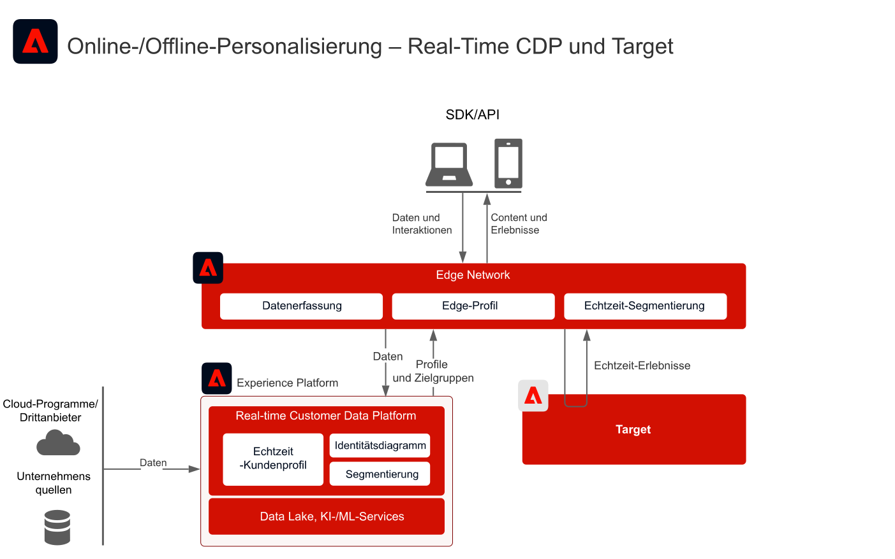
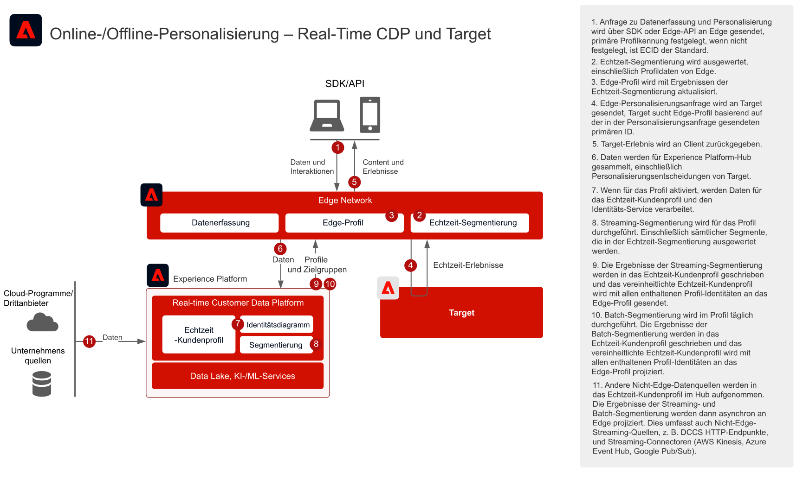
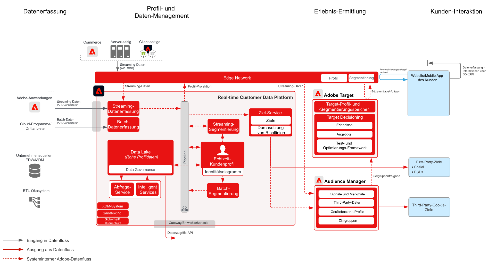

# Web-/Mobile-Personalisierung mit bekannten Kundendaten    Blueprint

## Anwendungsfälle

* Online-Personalisierung mit bekannten Kundendaten
* Landingpage-Optimierung
* Personalisierung basierend auf vorherigen Produkt-/Content-Ansichten, Produkt-/Content-Affinität, Umgebungsattributen und Demografie neben Offline-Daten, wie Transaktionen, Treue- und CRM-Daten und Modellerkenntnissen
* Freigeben und Targeting von in Real-time Customer Data Platform definierten Zielgruppen auf Websites und in Mobile Apps mithilfe von Adobe Target.

## Programme

* [!UICONTROL Real-Time Customer Data Platform]
* Adobe Target
* Adobe Audience Manager (optional): Fügt Third-Party-Zielgruppendaten hinzu
* Adobe Analytics oder Customer Journey Analytics (optional): ermöglicht die Erstellung von granularen Segmenten anhand von historischen Kunden- und Verhaltensdaten

## Integrationsmuster

| Integrationsmuster | Fähigkeit | Voraussetzungen |
|---|---|---|
| Echtzeit-Segmentauswertung im Edge, von Real-time Customer Data Platform für Target freigegeben | <ul><li>Evaluieren von Zielgruppen in Echtzeit im Edge Network zur Personalisierung derselben oder der nächsten Seite.</li><li>Darüber hinaus werden alle im Streaming- oder Batch-Modus ausgewerteten Segmente auch in das Edge-Netzwerk projiziert, damit sie in die Auswertung und Personalisierung von Edge-Segmenten einbezogen werden.</li></ul> | <ul><li>Das Web/Mobile SDK oder die Edge Network Server-API muss implementiert sein.</li><li>Datenstrom muss in Experience Edge bei aktivierter Target- und Experience Platform-Erweiterung konfiguriert werden.</li><li>Target-Ziel muss in den Real-time Customer Data Platform-Zielen konfiguriert sein.</li><li>Zur Integration mit Target ist dieselbe IMS-Org wie für die Experience Platform-Instanz erforderlich.</li></ul> |
| Streaming- und Batch-Zielgruppenfreigabe von Real-time Customer Data Platform für Target über den Edge-Ansatz | <ul><li>Freigeben von Streaming- und Batch-Zielgruppen aus Real-time Customer Data Platform für Target über das Edge Network In Echtzeit evaluierte Zielgruppen erfordern die Web SDK- und Edge Network-Implementierung.</li></ul> | <ul><li>Web/Mobile SDK oder die Edge API-Implementierung von Target ist nicht erforderlich für die Freigabe von Streaming- und Batch-RTCDP-Zielgruppen für Target. Es ist aber erforderlich, um Edge-Segmente wie oben beschrieben in Echtzeit auszuwerten.</li><li>Bei Verwendung von AT.js wird nur die Profilintegration mit dem ECID-Identity-Namespace unterstützt.</li><li>Für die Suche nach benutzerdefinierten Identity-Namespaces im Edge Network ist die Web SDK/Edge API-Implementierung erforderlich. Außerdem muss jede Identität in der Identity Map als Identität festgelegt sein.</li><li>Das Target-Ziel muss in den Zielen von Real-time Customer Data Platform konfiguriert werden. In Real-time Customer Data Platform wird nur die standardmäßige Produktions-Sandbox unterstützt.</li><li>Zur Integration mit Target ist dieselbe IMS-Org wie für die Experience Platform-Instanz erforderlich.</li></ul> |
| Freigeben von Streaming- und Batch-Zielgruppen aus Real-time Customer Data Platform für Target und Audience Manager über den Zielgruppenfreigabe-Service-Ansatz | <ul><li>Dieses Integrationsmuster kann genutzt werden, wenn eine zusätzliche Anreicherung mit Third-Party-Daten und -Zielgruppen in Audience Manager gewünscht wird.</li></ul> | <ul><li>Web/Mobile SDK ist nicht erforderlich für die Freigabe von Streaming- und Batch-Zielgruppen für Target. Es ist aber erforderlich, um Edge-Segmente in Echtzeit auszuwerten.</li><li>Bei Verwendung von AT.js wird nur die Profilintegration mit dem ECID-Identity-Namespace unterstützt.</li><li>Für die Suche nach benutzerdefinierten Identity-Namespaces im Edge Network ist die Web SDK/Edge API-Implementierung erforderlich. Außerdem muss jede Identität in der Identity Map als Identität festgelegt sein.</li><li>Die Zielgruppenprognose per Zielgruppenfreigabe-Service muss bereitgestellt werden.</li><li>Zur Integration mit Target ist dieselbe IMS-Org wie für die Experience Platform-Instanz erforderlich.</li><li>Nur Zielgruppen aus der standardmäßigen Produktions-Sandbox unterstützen den zentralen Service zur Zielgruppenfreigabe.</li></ul> |

## Echtzeit-, Streaming- und Batch-Zielgruppenfreigabe für Adobe Target

Architektur

Sequenzdetails

Übersicht – Architektur

## Implementierungsmuster

Die Personalisierung bekannter Kundinnen und Kunden wird über verschiedene Implementierungsverfahren unterstützt.

### Implementierungsmuster 1 – Edge-Netzwerk mit Web/Mobile SDK oder Edge Network-API (empfohlener Ansatz)

* Verwendung von Edge Network mit dem Web/Mobile SDK. Für die Edge-Echtzeit-Segmentierung ist das Implementierungsverfahren mit Web/Mobile SDKs oder der Edge-API erforderlich.
* [Weitere Informationen finden Sie in der Blueprint „Experience Platform Web and Mobile SDK“](../experience-platform/deployment/websdk.md)          für die SDK-basierte Implementierung.
* Zur Verwendung im Mobile SDK muss die [Decisioning-Erweiterung von Adobe Journey Optimizer](https://aep-sdks.gitbook.io/docs/using-mobile-extensions/adobe-journey-optimizer-decisioning) im Mobile SDK installiert sein.
* [Unter der Edge Network Server-API](https://experienceleague.adobe.com/docs/experience-platform/edge-network-server-api/overview.html?lang=de) finden Sie Informationen zur API-basierten Implementierung von Adobe Target mit Edge-Profil.

### Implementierungsmuster 2 – Anwendungsspezifische SDKs

Verwendung herkömmlicher anwendungsspezifischer SDKs (z. B. AT.js und AppMeasurement.js). Die Edge-Echtzeit-Segmentevaluierung wird bei diesem Implementierungsverfahren nicht unterstützt. Doch das Streaming und die Batch-Zielgruppenfreigabe über den Experience Platform-Hub werden durch dieses Implementierungsverfahren unterstützt.

[Weitere Informationen finden Sie im Blueprint für anwendungsspezifische SDKs.](../experience-platform/deployment/appsdk.md)

### Implementierungsschritte

1. [Implementieren Sie Adobe Target](https://experienceleague.adobe.com/docs/target/using/implement-target/implementing-target.html?lang=de) für Ihre Web-Anwendungen oder Mobile Apps
1. [Implementieren Sie Experience Platform und [!UICONTROL Echtzeit-Kundenprofil]](https://experienceleague.adobe.com/docs/platform-learn/getting-started-for-data-architects-and-data-engineers/overview.html?lang=de) Stellen Sie sicher, dass erstellte Zielgruppen für Edge aktiviert werden, indem Sie die entsprechenden [Zusammenführungsrichtlinie](https://experienceleague.adobe.com/docs/experience-platform/profile/merge-policies/ui-guide.html?lang=de#create-a-merge-policy) im Edge als aktiv konfigurieren.
1. Implementieren Sie das [Experience Platform Web SDK](https://experienceleague.adobe.com/docs/experience-platform/edge/home.html?lang=de) oder das [Experience Platform Mobile SDK](https://aep-sdks.gitbook.io/docs/), wobei die richtige Erweiterung (Target oder Adobe Journey Optimizer – Decisioning) installiert sein muss. Das Experience Platform Web/Mobile SDK oder die EDGE API sind für die Echtzeit-Edge-Segmentierung erforderlich, aber nicht für die Freigabe von Streaming- und Batch-Zielgruppen von Real-time Customer Data Platform an Target.
1. [Konfigurieren Sie das Edge Network mit einem Edge-Datenstrom](https://experienceleague.adobe.com/docs/experience-platform/edge/fundamentals/datastreams.html?lang=de)
1. [Aktivieren Sie Adobe Target als Ziel in Real-time Customer Data Platform](https://experienceleague.adobe.com/docs/experience-platform/destinations/catalog/personalization/adobe-target-connection.html?lang=de)
1. (Optional) [Implementieren Sie Adobe Audience Manager](https://experienceleague.adobe.com/docs/audience-manager/user-guide/implementation-integration-guides/implement-audience-manager.html?lang=de).
1. (Optional) [Fordern Sie die Bereitstellung der Zielgruppenfreigabe zwischen Experience Platform und Adobe Target an (freigegebene Zielgruppen)](https://www.adobe.com/go/audiences), um Zielgruppen in Experience Platform für Target freizugeben.

## Leitlinien

[Beachten Sie die Leitlinien auf der Übersichtsseite zu den Blueprints für die Web- und Mobile-Personalisierung.](overview.md)

* Edge-Profile werden nur erstellt, wenn ein Benutzer im Edge aktiv ist. Das bedeutet, dass sein Profil Streaming-Ereignisse über das Web/Mobile SDK oder die Edge Server-API an das Edge gesendet hat. Dies entspricht im Allgemeinen einem Benutzer, der auf einer Website oder in einer Mobile App aktiv ist.
* Edge-Profile haben eine standardmäßige Live-Dauer von 14 Tagen. Wenn für den Benutzer keine aktiven Edge-Ereignisse erfasst wurden, läuft das Profil im Edge nach 14 Tagen Inaktivität ab. Das Profil bleibt im Hub gültig und wird mit dem Edge synchronisiert, sobald der Benutzer wieder im Edge aktiv wird.
* Wenn ein neues Profil im Edge erstellt wird, wird asynchron ein Synchronisierungsaufruf an den Hub gesendet, um alle Zielgruppen und Attribute abzurufen, die für die Edge-Projektion über ein Ziel konfiguriert sind. Da es sich um einen asynchronen Prozess handelt, kann es zwischen einer Sekunde und mehreren Minuten dauern, bis das Hub-Profil mit dem Edge synchronisiert wird. Daher kann nicht garantiert werden, dass neue Profile bei den ersten Seitenerlebnissen über den Profilkontext vom Hub verfügen. Dies gilt auch für neu im Hub gesammelte Daten. Diese Daten werden asynchron an das Edge projiziert. Daher ist der Zeitpunkt, zu dem die Daten das entsprechende Edge erreichen, unabhängig von der Edge-Aktivität. Nur Profile, die im Edge aktiv sind, behalten Attribute und Zielgruppen bei, die vom Hub projiziert werden.

## Überlegungen bei der Implementierung

Voraussetzungen für Identitäten

* Jede primäre Identität kann genutzt werden, wenn das oben erläuterte Implementierungsmuster 1 mit Edge Network und Web SDK verwendet wird. Personalisierung beim ersten Login erfordert, dass die in der Personalisierungsanfrage festgelegte primäre Identität mit der primären Identität des Profils in Real-time Customer Data Platform übereinstimmt. Identitäts-Stitching zwischen anonymen Geräten und bekannten Kunden wird im Hub verarbeitet und nachfolgend an das Edge projiziert.
* Beachten Sie, dass Daten nicht sofort zur Personalisierung verfügbar sind, wenn sie in den Hub hochgeladen wurden, bevor ein Besuch oder eine Anmeldung eines Verbrauchers bei einer Website stattgefunden hat. Zuerst muss ein aktives Edge-Profil vorhanden sein, damit Hub-Daten damit synchronisiert werden können. Nachdem eines erstellt wurde, wird das Edge-Profil asynchron mit dem Hub-Profil synchronisiert, was eine Personalisierung der nächsten Seite zur Folge hat.
* Die Freigabe von Zielgruppen in Adobe Experience Platform für Adobe Target erfordert die Verwendung von ECID als Identität, wenn der Zielgruppenfreigabe-Service wie im Integrationsmuster 2 und 3 oben verwendet wird.
* Alternative Identitäten können auch verwendet werden, um Experience Platform-Zielgruppen über Audience Manager für Adobe Target freizugeben. Experience Platform aktiviert Zielgruppen für Audience Manager über die folgenden unterstützten Namespaces: IDFA, GAID, AdCloud, Google, ECID, EMAIL_LC_SHA256. Beachten Sie, dass Audience Manager und Target die Zielgruppenzugehörigkeit über die ECID-Identität auflösen. Daher muss ECID weiterhin im Identitätsdiagramm für den Verbraucher vorhanden sein, damit die endgültige Zielgruppenfreigabe an Adobe Target erfolgen kann.

## Verwandte Dokumentation

### SDK-Dokumentation

* [Dokumentation zu Experience Platform Web SDK](https://experienceleague.adobe.com/docs/experience-platform/edge/home.html?lang=de)
* [Dokumentation zu Experience Platform Tags ](https://experienceleague.adobe.com/docs/experience-platform/tags/home.html?lang=de)
* [Dokumentation zu Experience Cloud-ID-Service](https://experienceleague.adobe.com/docs/id-service/using/home.html?lang=de)

### Dokumentation zur Verbindung

* [Adobe Target-Verbindung für Real-time Customer Data Platform](https://experienceleague.adobe.com/docs/experience-platform/destinations/catalog/personalization/adobe-target-connection.html?lang=de)
* [Edge-Datenstrom-Konfiguration](https://experienceleague.adobe.com/docs/experience-platform/edge/fundamentals/datastreams.html?lang=de)
* [Segmentfreigabe für Experience Platform über Audience Manager und andere Experience Cloud-Lösungen](https://experienceleague.adobe.com/docs/audience-manager/user-guide/implementation-integration-guides/integration-experience-platform/aam-aep-audience-sharing.html?lang=de)

### Dokumentation zur Segmentierung

* [Überblick über Segmentierung in Experience Platform ](https://experienceleague.adobe.com/docs/experience-platform/segmentation/home.html?lang=de)
* [Echtzeit-Segmentierung](https://experienceleague.adobe.com/docs/experience-platform/segmentation/ui/edge-segmentation.html?lang=de)
* [Streaming-Segmentierung](https://experienceleague.adobe.com/docs/experience-platform/segmentation/api/streaming-segmentation.html?lang=de)
* [Segmentfreigabe in Adobe Analytics über Adobe Audience Manager](https://experienceleague.adobe.com/docs/analytics/components/segmentation/segmentation-workflow/seg-publish.html?lang=de)
* [Konfiguration der Zusammenführungsrichtlinie](https://experienceleague.adobe.com/docs/experience-platform/profile/merge-policies/ui-guide.html?lang=de#create-a-merge-policy)

### Tutorials

* [Personalisierung des nächsten Treffers mit Real-Time CDP und Adobe Target](https://experienceleague.adobe.com/docs/platform-learn/tutorials/experience-cloud/next-hit-personalization.html?lang=de)

### Verwandte Blog-Posts

* [Adobe kündigt verbesserte Personalisierung auf derselben Seite mit Adobe Target und Real-time Customer Data Platform an](https://blog.adobe.com/en/publish/2021/10/05/adobe-announces-same-page-enhanced-personalization-with-adobe-target-real-time-customer-data-platform)
* [[!DNL Blueprint for Web Personalization using Adobe Experience Platform Real-Time Customer Profile]](https://medium.com/adobetech/blueprint-for-web-personalization-using-adobe-experience-platform-real-time-customer-profile-fef2ce7a4b2f)
* [[!DNL Adobe Experience Platform's Identity Service — How to Solve the Customer Identity Conundrum]](https://medium.com/adobetech/adobe-experience-platforms-identity-service-how-to-solve-the-customer-identity-conundrum-f95e22d16ea9)
* [[!DNL Adobe Experience Platform Web SDK for Audience Management]](https://medium.com/adobetech/adobe-experience-platform-web-sdk-for-audience-management-751fa6d063bc)
* [[!DNL Implementing Adobe Experience Platform Real-Time Customer Profile through our "Customer Zero" Program]](https://medium.com/adobetech/implementing-adobe-experience-platform-real-time-customer-profile-through-our-customer-zero-32e7cd952896)
* [[!DNL Segmentation in Seconds: How Adobe Experience Platform Made Real-time Customer Profiles a Reality]](https://medium.com/adobetech/segmentation-in-seconds-how-adobe-experience-platform-made-real-time-customer-profiles-a-reality-a7a8552b0847)
