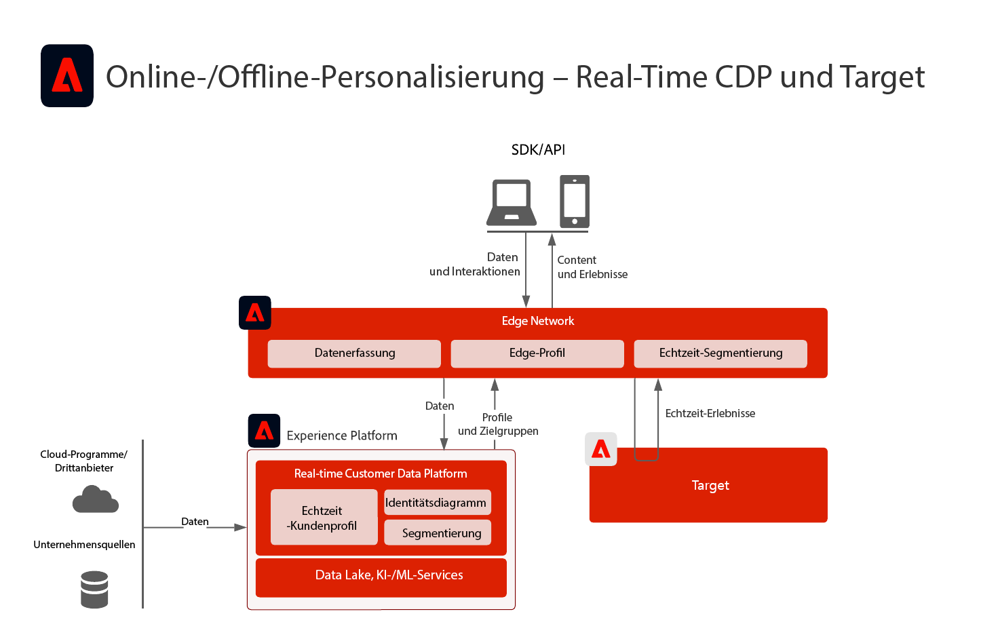
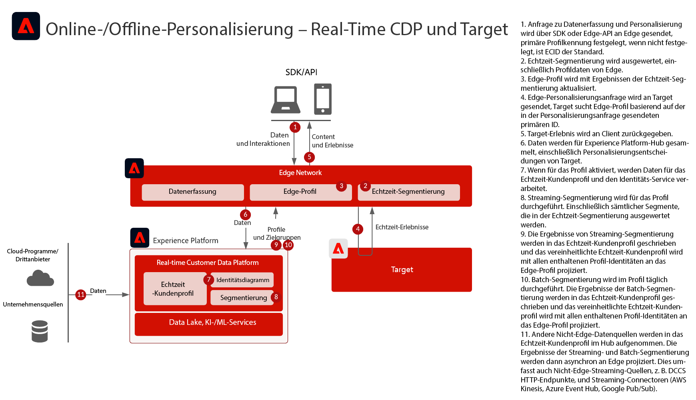
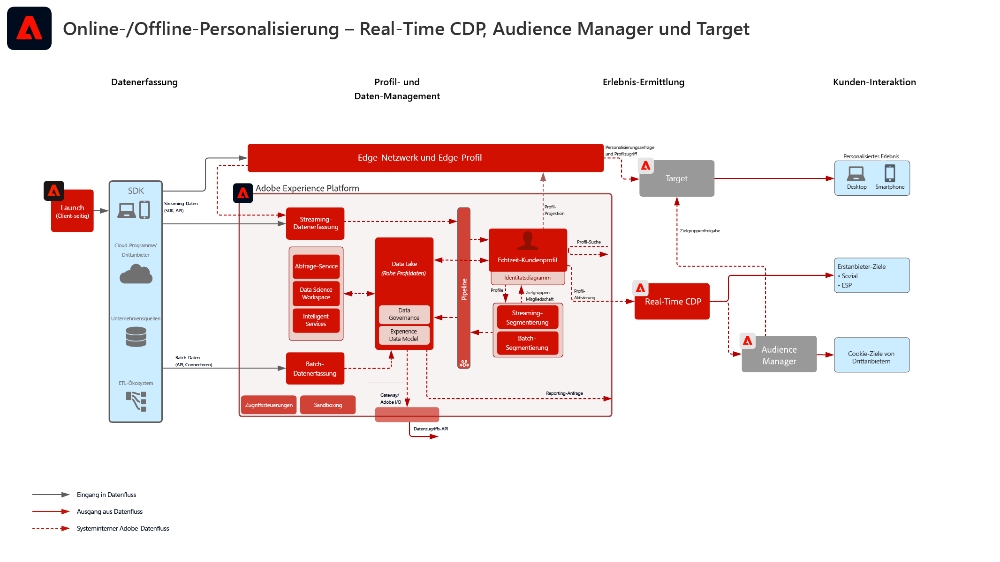
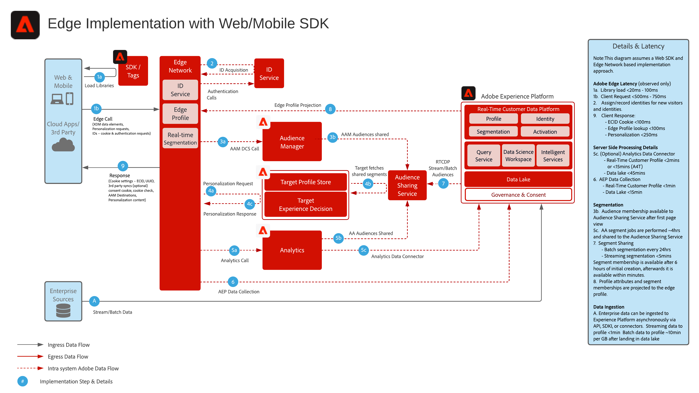
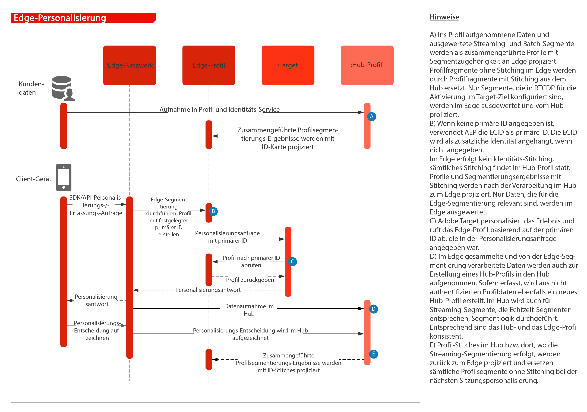

# Web-/Mobile-Personalisierung mit Online- und Offline-Daten

## Anwendungsfälle

* Online-Personalisierung mit Online- und Offline-Daten und bekannten Profilen
* Landingpage-Optimierung
* Personalisierung basierend auf vorherigen Produkt-/Content-Ansichten, Produkt-/Content-Affinität, Umgebungsattributen und Demografie neben Offline-Daten, wie Transaktionen, Treue- und CRM-Daten und Modellerkenntnissen
* Freigeben und Targeting von in Real-time Customer Data Platform definierten Zielgruppen auf Websites und in Mobile Apps mithilfe von Adobe Target.

## Programme

* [!UICONTROL Real-Time Customer Data Platform]
* Adobe Target
* Adobe Audience Manager (optional): Fügt Drittanbieter-Zielgruppendaten, Co-op-basierte Gerätediagramme und die Möglichkeit hinzu, Zielgruppen aus Real-time Customer Data Platform in Adobe Analytics und Zielgruppen aus Adobe Analytics in Real-time Customer Data Platform zu ermitteln
* Adobe Analytics (optional): Fügt die Möglichkeit hinzu, Segmente basierend auf historischen Verhaltensdaten und detaillierter Segmentierung aus Adobe Analytics-Daten aufzubauen

## Nutzungsszenarien

<table class="tg" style="undefined;table-layout: fixed; width: 790px">
<colgroup>
<col style="width: 20px">
<col style="width: 276px">
<col style="width: 229px">
<col style="width: 265px">
</colgroup>
<thead>
  <tr>
    <th class="tg-y6fn">Nr.</th>
    <th class="tg-f7v4">Nutzungsszenarien</th>
    <th class="tg-y6fn">Fähigkeit</th>
    <th class="tg-f7v4">Voraussetzungen</th>
  </tr>
</thead>
<tbody>
  <tr>
    <td class="tg-0lax">1</td>
<td class="tg-73oq">Echtzeit-Segmentauswertung im Edge, von Real-time Customer Data Platform für Target freigegeben</td>
    <td class="tg-0lax">- Evaluieren von Zielgruppen in Echtzeit im Edge Network zur Personalisierung derselben oder der nächsten Seite. - Darüber hinaus werden alle im Streaming- oder Batch-Modus ausgewerteten Segmente auch in das Edge-Netzwerk projiziert, damit sie in die Auswertung und Personalisierung von Edge-Segmenten einbezogen werden.</td>
    <td class="tg-73oq">- Implementierungsmuster 1, wie unten beschrieben. - Web/Mobile SDK muss implementiert sein. - Beachten Sie, dass die Mobile SDK- und API-basierte Unterstützung für die Echtzeit-Segmentierung derzeit nicht verfügbar ist - Datenstrom muss im Experience-Edge mit aktivierter Target- und Experience Platform-Erweiterung konfiguriert werden. Die Datastream-ID wird in der Target-Zielkonfiguration bereitgestellt. - Target-Ziel muss in den Real-time Customer Data Platform-Zielen konfiguriert sein. - Zur Integration mit Target ist dieselbe IMS-Org wie für die Experience Platform-Instanz erforderlich.</td> 
  </tr>
  <tr>
    <td class="tg-0lax">2</td>
    <td class="tg-73oq">Streaming- und Batch-Zielgruppenfreigabe von Real-time Customer Data Platform für Target über den Edge-Ansatz</td>
    <td class="tg-0lax">- Teilen von Streaming- und Batch-Zielgruppen aus Real-time Customer Data Platform an Target über das Edge Network Die Auswertung von Zielgruppen in Echtzeit erfordert das WebSDK und die Echtzeitauswertung der Zielgruppe, wie im Integrationsmuster 1 beschrieben. - Diese Integration wird normalerweise genutzt, um Streaming- und Batch-Zielgruppen mithilfe herkömmlicher SDKs freizugeben, anstatt zu Edge Collection und WebSDK zu migrieren, die Echtzeit- sowie Streaming- und Batch-Zielgruppen unterstützen, wie im Integrationsmuster 1 beschrieben.</td>
    <td class="tg-73oq">- Implementierungsmuster 1 oder 2, wie unten beschrieben. - Web/Mobile SDK ist nicht erforderlich für die Freigabe von Streaming- und Batch-Zielgruppen für Target, obwohl die Segmentauswertung in Echtzeit gemäß Integrationsmuster 1 aktiviert werden muss.  - Bei Verwendung von AT.js wird nur die Profilintegration mit dem ECID-Namespace unterstützt.  - Für die Suche nach benutzerdefinierten ID-Namespaces in Edge Network ist die WebSDK-Bereitstellung erforderlich und jede Identität muss in der Identitätszuordnung als Identität festgelegt werden. - Der Datenstrom muss im Experience-Edge konfiguriert werden. Die Datenstrom-ID wird in der Target-Zielkonfiguration bereitgestellt. - Target-Ziel muss in den Real-time Customer Data Platform-Zielen konfiguriert sein. - Zur Integration mit Target ist dieselbe IMS-Org wie für die Experience Platform-Instanz erforderlich.</td>
  </tr>
  <tr>
    <td class="tg-0lax">3</td>
    <td class="tg-73oq">Freigeben von Streaming- und Batch-Zielgruppen aus Real-time Customer Data Platform für Target und Audience Manager über den Zielgruppenfreigabe-Service-Ansatz</td>
    <td class="tg-0lax">- Freigeben von Streaming- und Batch-Zielgruppen aus Real-time Customer Data Platform für Target und Audience Manager über den Audience Sharing Service. - Dieses Integrationsmuster kann genutzt werden, wenn eine zusätzliche Anreicherung mit Third-Party-Daten und -Zielgruppen in Audience Manager gewünscht wird. Andernfalls werden Integrationsmuster 1 und 2 bevorzugt. Die Auswertung von Zielgruppen in Echtzeit erfordert das WebSDK und die Echtzeitauswertung der Zielgruppe, wie im Integrationsmuster 1 beschrieben.</td>
    <td class="tg-73oq">- Implementierungsmuster 1 oder 2, wie unten beschrieben. - Für diese Integration ist keine Web/Mobile SDK-Implementierung erforderlich. - Die Zielgruppenprognose per Audience Sharing Service muss bereitgestellt werden. - Zur Integration mit Target ist dieselbe IMS-Org wie für die Experience Platform-Instanz erforderlich. - Die Identität muss in ECID aufgelöst werden, damit sie im Edge Network zur Nutzung für Target freigegeben werden kann.</td>
  </tr>
</tbody>
</table>

## Szenario 1 und 2: Echtzeit-, Streaming- und Batch-Zielgruppenfreigabe für Adobe Target

Architektur

Sequenzdetails

Übersichtsarchitektur für Nutzungsszenario 1 und 2

### Implementierungsschritte für Nutzungsszenario 1, unterstützt auch Nutzungsszenario 2

1. [Implementieren Sie Adobe Target](https://experienceleague.adobe.com/docs/target/using/implement-target/implementing-target.html?lang=de) für Ihre Web-Anwendungen oder Mobile Apps
1. [Implementieren Sie Experience Platform und [!UICONTROL Echtzet-Kundenprofil]](https://experienceleague.adobe.com/docs/platform-learn/getting-started-for-data-architects-and-data-engineers/overview.html?lang=de) Stellen Sie sicher, dass erstellte Zielgruppen für Edge aktiviert werden, indem Sie die entsprechenden [Zusammenführungsrichtlinie](https://experienceleague.adobe.com/docs/experience-platform/profile/merge-policies/ui-guide.html?lang=de#create-a-merge-policy) im Edge als aktiv konfigurieren.
1. Implementieren Sie das [Experience Platform Web SDK](https://experienceleague.adobe.com/docs/experience-platform/edge/home.html?lang=de). Experience Platform Web SDK ist für die Echtzeit-Edge-Segmentierung erforderlich, aber nicht für die Freigabe von Streaming- und Batch-Zielgruppen von Real-time Customer Data Platform an Target. Beachten Sie, dass die Unterstützung für die Echtzeit-Segmentierung über Mobile SDK und API derzeit noch nicht verfügbar ist.
1. [Konfigurieren Sie das Edge Network mit einem Edge-Datenstrom](https://experienceleague.adobe.com/docs/experience-platform/edge/fundamentals/datastreams.html?lang=de)
1. [Aktivieren Sie Adobe Target als Ziel in Real-time Customer Data Platform](https://experienceleague.adobe.com/docs/experience-platform/destinations/catalog/personalization/adobe-target-connection.html?lang=de)

 

## Szenario 3: Streaming und Batch-Zielgruppenfreigabe über den Zielgruppenfreigabe-Service für Adobe Target und Audience Manager

Architektur

### Implementierungsschritte für Szenario 3 unterstützen auch Szenario 2

1. [Implementieren Sie Adobe Target](https://experienceleague.adobe.com/docs/target/using/implement-target/implementing-target.html) für Ihre Web-Anwendungen oder Mobile Apps
1. [Implementieren Sie Adobe Audience Manager](https://experienceleague.adobe.com/docs/audience-manager/user-guide/implementation-integration-guides/implement-audience-manager.html?lang=de) (optional)
1. [Implementieren Sie Adobe Analytics](https://experienceleague.adobe.com/docs/analytics/implementation/home.html?lang=de) (optional)
1. [Implementieren Sie Experience Platform und das [!UICONTROL Echtzeit-Kundenprofil]](https://experienceleague.adobe.com/docs/platform-learn/getting-started-for-data-architects-and-data-engineers/overview.html)
1. Implementieren Sie [Experience Cloud Identity Service ](https://experienceleague.adobe.com/docs/id-service/using/implementation/implementation-guides.html?lang=de)
1. [Fordern Sie die Bereitstellung der Zielgruppenfreigabe zwischen Experience Platform und Adobe Target an (freigegebene Zielgruppen)](https://www.adobe.com/go/audiences), um Zielgruppen aus Experience Platform für Target freizugeben.
1. (Optional) [Konfigurieren Sie das Edge Network mit einem Edge-Datenstrom](https://experienceleague.adobe.com/docs/experience-platform/edge/fundamentals/datastreams.html) (Dies ist nur für das Integrationsmuster 2 erforderlich, bei dem die Zielgruppen nicht für Audience Manager freigegeben oder durch Zielgruppen oder Daten aus Audience Managers angereichert werden müssen.)
1. (Optional) [Aktivieren Sie Adobe Target als Ziel in Real-time Customer Data Platform](https://experienceleague.adobe.com/docs/experience-platform/destinations/catalog/personalization/adobe-target-connection.html?lang=en), um Streaming- und Batch-Zielgruppen aus Real-time Customer Data Platform direkt für Edge und nicht über den Zielgruppenfreigabe-Service und Audience Manager freizugeben.

 

## Implementierungsmuster

Die Online- und Offline-Personalisierung wird über verschiedene Implementierungsansätze unterstützt.

### Implementierungsmuster 1 - Unterstützt Nutzungszenario 1 und 2. Edge Netzwerk mit Web/Mobile SDK (empfohlener Ansatz)

Verwendung des Edge Network mit dem Web/Mobile SDK

Sequenzdiagramm

 

### Implementierungsmuster 2 - Unterstützt Nutzungszenario 2 und 3. Programmspezifische SDKs

Verwendung herkömmlicher programmspezifischer SDKs (z. B. AT.js und AppMeasurement.js)

 

## Leitlinien

[Beachten Sie die Leitlinien auf der Übersichtsseite zu den Blueprints für die Web- und Mobile-Personalisierung.](overview.md)

## Überlegungen bei der Implementierung

Voraussetzungen für Identitäten

* Jede primäre Identität kann genutzt werden, wenn das oben erläuterte Implementierungsmuster 1 mit Edge Network und WebSDK verwendet wird. Personalisierung beim ersten Login erfordert, dass die in der Personalisierungsanfrage festgelegte primäre Identität mit der primären Identität des Profils in Real-time Customer Data Platform übereinstimmt. Identitäts-Stitching zwischen anonymen Geräten und bekannten Kunden wird im Hub verarbeitet und nachfolgend an das Edge projiziert.
* Die Freigabe von Zielgruppen aus Adobe Experience Platform für Adobe Target erfordert die Verwendung von ECID als Identität, wenn der Zielgruppenfreigabe-Service wie im Nutzungsszenario 3 oben verwendet wird.
* Alternative Identitäten können auch verwendet werden, um Experience Platform-Zielgruppen über Audience Manager für Adobe Target freizugeben. Experience Platform aktiviert Zielgruppen für Audience Manager über die folgenden unterstützten Namespaces: IDFA, GAID, AdCloud, Google, ECID, EMAIL_LC_SHA256. Beachten Sie, dass Audience Manager und Target Zielgruppenzugehörigkeiten über die ECID-Identität auflösen. Daher ist die ECID weiterhin für die endgültige Zielgruppenfreigabe für Adobe Target erforderlich.

## Verwandte Dokumentation

### SDK-Dokumentation

* [Dokumentation zu Experience Platform Web SDK](https://experienceleague.adobe.com/docs/experience-platform/edge/home.html)
* [Dokumentation zu Experience Platform Tags ](https://experienceleague.adobe.com/docs/experience-platform/tags/home.html?lang=de)
* [Dokumentation zu Experience Cloud-ID-Service](https://experienceleague.adobe.com/docs/id-service/using/home.html?lang=de)

### Dokumentation zur Verbindung

* [Adobe Target-Verbindung für Real-time Customer Data Platform](https://experienceleague.adobe.com/docs/experience-platform/destinations/catalog/personalization/adobe-target-connection.html?lang=en)
* [Edge-Datenstrom-Konfiguration](https://experienceleague.adobe.com/docs/experience-platform/edge/fundamentals/datastreams.html)
* [Segmentfreigabe für Experience Platform über Audience Manager und andere Experience Cloud-Lösungen](https://experienceleague.adobe.com/docs/audience-manager/user-guide/implementation-integration-guides/integration-experience-platform/aam-aep-audience-sharing.html?lang=de)

### Dokumentation zur Segmentierung

* [Überblick über Segmentierung in Experience Platform ](https://experienceleague.adobe.com/docs/experience-platform/segmentation/home.html?lang=de)
* [Echtzeit-Segmentierung](https://experienceleague.adobe.com/docs/experience-platform/segmentation/ui/edge-segmentation.html?lang=de)
* [Streaming-Segmentierung](https://experienceleague.adobe.com/docs/experience-platform/segmentation/api/streaming-segmentation.html?lang=de)
* [Segmentfreigabe in Adobe Analytics über Adobe Audience Manager](https://experienceleague.adobe.com/docs/analytics/components/segmentation/segmentation-workflow/seg-publish.html?lang=de)
* [Konfiguration der Zusammenführungsrichtlinie](https://experienceleague.adobe.com/docs/experience-platform/profile/merge-policies/ui-guide.html?lang=en#create-a-merge-policy)

### Tutorials

* [Personalisierung des nächsten Treffers mit Real-Time CDP und Adobe Target](https://experienceleague.adobe.com/docs/platform-learn/tutorials/experience-cloud/next-hit-personalization.html?lang=de)

### Verwandte Blog-Posts

* [Adobe kündigt verbesserte Personalisierung auf derselben Seite mit Adobe Target und Real-time Customer Data Platform an](https://blog.adobe.com/en/publish/2021/10/05/adobe-announces-same-page-enhanced-personalization-with-adobe-target-real-time-customer-data-platform)
* [[!DNL Blueprint for Web Personalization using Adobe Experience Platform Real-Time Customer Profile]](https://medium.com/adobetech/blueprint-for-web-personalization-using-adobe-experience-platform-real-time-customer-profile-fef2ce7a4b2f)
* [[!DNL Adobe Experience Platform’s Identity Service — How to Solve the Customer Identity Conundrum]](https://medium.com/adobetech/adobe-experience-platforms-identity-service-how-to-solve-the-customer-identity-conundrum-f95e22d16ea9)
* [[!DNL Adobe Experience Platform Web SDK for Audience Management]](https://medium.com/adobetech/adobe-experience-platform-web-sdk-for-audience-management-751fa6d063bc)
* [[!DNL Implementing Adobe Experience Platform Real-Time Customer Profile through our “Customer Zero” Program]](https://medium.com/adobetech/implementing-adobe-experience-platform-real-time-customer-profile-through-our-customer-zero-32e7cd952896)
* [[!DNL Segmentation in Seconds: How Adobe Experience Platform Made Real-time Customer Profiles a Reality]](https://medium.com/adobetech/segmentation-in-seconds-how-adobe-experience-platform-made-real-time-customer-profiles-a-reality-a7a8552b0847)
