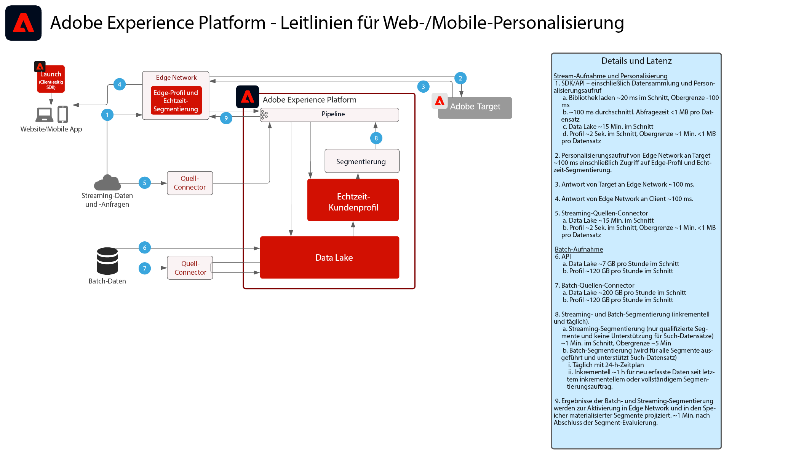

# Web- und Mobile-Personalisierung

Die Web- und Mobile-Personalisierung zeigt auf, wie Profil- und Zielgruppensegmentierung in mehreren Programmen zur Personalisierung und Optimierung von Kundenerlebnissen verwendet werden kann. Kundenverhalten, Demografie, Treuestufe und frühere Transaktionen können genutzt werden, um Layouts, Aktionsaufrufe und Inhalte zu personalisieren.

 

| Blueprint | Beschreibung | Experience Cloud-Programme |
|---|---|---|
| **[Web-/Mobile-Personalisierung basierend auf Verhaltensdaten](behavioral.md)** | <ul><li>Personalisierung basierend auf Online-Verhalten und Zielgruppendaten</li></ul> | <ul><li>Adobe Target</li><li>Adobe Real-time Customer Data Platform *(optional)*</li><li>Adobe Analytics *(optional)*</li><li>Adobe Audience Manager *(optional)*</li></ul> |
| **[Web/Mobile Personalization mit bekannten Kundendaten](known-personalization.md)** | <ul><li>Umfassende Kundenprofile und verbesserte Segmentierung bieten verbesserte personalisierte Erlebnisse.</li><li>Personalisierung mit Offline-Attributen und Ereignissen (Transaktionen, Reservierungen, CRM und Treuedaten).</li><li>Synchronisierung der Personalisierung über Web, E-Mails und andere bekannte Kanäle.</li></ul> | <ul><li>Adobe Target</li><li>[!UICONTROL Real-Time Customer Data Platform]</li><li>Adobe Analytics *(optional)*</li><li>Adobe Audience Manager *(optional)*</li></ul> |

 

## Leitlinien für die Web- und Mobile-Personalisierung

[Leitlinien zu Zielgruppen- und Profilaktivierung finden Sie in der Dokumentation zu den Leitlinien bei Profilen und Segmentierung.](https://experienceleague.adobe.com/docs/experience-platform/profile/guardrails.html?lang=de)

 

### Bekanntes Personalization-Schutzdiagramm für Kunden

## Verwandte Blog-Posts

* [[!DNL Blueprint for Web Personalization using Adobe Experience Platform Real-Time Customer Profile]](https://medium.com/adobetech/blueprint-for-web-personalization-using-adobe-experience-platform-real-time-customer-profile-fef2ce7a4b2f)
* [[!DNL Integrating Adobe Experience Platform Decisioning Engine with AEM Websites]](https://jaeness.medium.com/integrating-adobe-experience-platform-decisioning-engine-with-aem-websites-9c222acd12e2)
* [[!DNL Content and Commerce AI: Personalizing Your Interactions with Customers Through Content Intelligence]](https://medium.com/adobetech/content-and-commerce-ai-personalizing-your-interactions-with-customers-through-content-intelligence-dc182601deab)
* [[!DNL How Adobe Experience Platform Predictive Audiences improves Personalized Experiences]](https://medium.com/adobetech/how-adobe-experience-platform-predictive-audiences-improves-personalized-experiences-1f75a60cb7a3)
* [[!DNL Adobe Experience Platform Web SDK for Audience Management]](https://medium.com/adobetech/adobe-experience-platform-web-sdk-for-audience-management-751fa6d063bc)
* [[!DNL Implementing Adobe Experience Platform Real-Time Customer Profile through our “Customer Zero” Program]](https://medium.com/adobetech/implementing-adobe-experience-platform-real-time-customer-profile-through-our-customer-zero-32e7cd952896)
* [[!DNL Segmentation in Seconds: How Adobe Experience Platform Made Real-time Customer Profiles a Reality]](https://medium.com/adobetech/segmentation-in-seconds-how-adobe-experience-platform-made-real-time-customer-profiles-a-reality-a7a8552b0847)
* [[!DNL Build an Optimal Online Experience: Enrich Unified Profile with Query Service]](https://medium.com/adobetech/build-an-optimal-online-experience-enrich-unified-profile-with-query-service-8027c196ab33)
